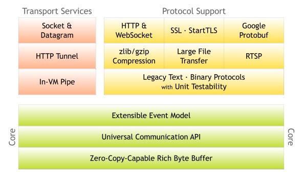

| 序号 | 项目              | 内容                                                         |
| ---- | ----------------- | ------------------------------------------------------------ |
| 1    | 调试环境          |                                                              |
| 2    | NIO基础           | 1.简介 2.**Channel** 3.**Buffer** 4.**Selector** 5.示例 |
| 3    | Netty简介         | 1.项目结构 2.核心组件                                    |
| 4    | 启动（Bootstrap） | 1.服务端 2.客户端                                        |
| 5    | EventLoop         | 1.Reactor模型 2.EventLoopGroup 3.EventLoop初始化 4.EventLoop运行 5.EventLoop处理IO事件 6.EventLoop处理普通任务 7.EventLoop处理定时任务 8.EventLoop优雅关闭 |
| 6    | ChannelPipeline   | 1.初始化 2.添加ChannelHandler 3.移除ChannelHandler 4.Outbound事件的传播 5.Inbound事件的传播 6.异常事件的传播 |
| 7    | Channel           | 1.简介 2.accept操作 3.read操作 4.write操作 5.flush操作 6.writeAndFlush操作 7.close操作 8.disconnect操作 |
| 8    | Buffer            | ByteBuf 1.简介 2.核心子类 3.内存泄漏检测 4.其他子类 ByteBufAllocator 1.UnpooledByteBufAllocator 2.PooledByteBufAllocator jemalloc 1.简介 2.PoolChunk 3.PoolSubpage 4.PoolChunkList 5.PoolArena 6.PolThreadCache |
| 9    | ChannelHandler    | 1.简介 2.ChannelInitizlizer 3.SimpleChannelInboundHandler 4.LoggingHandler 5.IdleStateHandler 6.AbstractTrafficShapingHandler |
| 10   | Codec             | 1.ByteToMessageDecoder-Cumulator 2.ByteToMessageDecoder-FrameDecoder 3.MessageToByteEncoder 4.ByteToMessageCodec 5.MessageToMessageCodec |
| 11   | Util              | 1.Future 2.FastThreadLocal 3.Recycler 4.HashedWheelTimer 5.MpscUnboundedArrayQueue |

# Netty简介

## 项目结构

### 3 架构图

* Core 核心部分，是底层网络通用抽象和部分实现
  * Extensible Event Model  可拓展的事件模型。Netty是基于事件模型的网络应用框架
  * Universal Communication  API 通用的通信API层。Netty定义了一套通用的通信层API
  * Zero-Copy-Capable Rich Byte Buffer  支持零拷贝的Byte Buffer实现
* Transport Services 传输（通信）服务，具体的网络传输的定义与实现
  * Socket & Datagram  TCP和UDP的传输实现
  * HTTP Tunnel  HTTP通道的传输实现
  * In-VM Piple  JVM内部的传输实现。
* Protocol Support 协议支持。Netty对于一些通用协议的编码实现。例如：HTTP、Redis、DNS等

5 Common

`Common`项目，该项目是一个通用的工具类项目，几乎被所有的其他项目依赖使用，它提供了一些数据类型处理工具类，并发编程以及多线程的扩展，计数器等等通用工具类。

### 6 Buffer

> 该项目实现了Netty架构图中的Zero-Copy-Capable Rich Byte Buffer

该项目下是Netty自行实现的一个Byte Buffer字节缓冲区。该包的实现相对于JDK自带的ByteBuffer有很多优点：无论是API功能，使用体验，性能都更加优秀，它提供了一系列（多种）的抽象定义以及实现，以满足不同场景下的需要

### 7.transport

> 该项目是核心项目，实现了Netty架构中的Transport Services、Universal Communication API的Extensible Event Model等多部分内容

该项目是网络传输通道的具体抽象和实现。它定义通信的统一通信API，统一了JDK的OIO、NIO（不包括AIO）等多种和编程接口。

另外，它提供了多个子项目，实现不同的传输类型，如：transport-native-epoll、transport-native-kqueue、transport-rxtx、transport-udt和transport-ectp等等

### 8.codec

> 该项目实现了Netty架构图中的Protocol Support

该项目是协议编解码的抽象与部分实现：JSON、Google Protocol、Base64、XML等

### 9.handler

该项目是提供内置的连接通道处理器（ChannelHandler）实现类。如SSL处理器、日志处理器等等

## 核心组件

### 概述

### Netty核心组件

* Bootstrap & ServerBootstrap
* Channel
* ChannelFuture
* EventLoop & EventLoopGroup
* ChannelHandler
* ChannelPipeline

# EventLoop

## Reactor模型

### 概述

Reactor模型的核心思想

> 将关注的I/O实践注册到多路复用器上，一旦有I/O事件触发，将事件分发到事件处理器中，执行就绪I/O事件对应的处理函数中。模型有三个重要的组件
>
> * 多路复用器：由操作系统提供接口，Linux提供的I/O服用接口有select、poll、epoll
> * 事件分离器：将多路复用器返回的就绪事件分发到事件处理器中
> * 事件处理器：处理就绪事件处理函数

### 单Reactor单线程模型

### 单Reactor多线程模型

### 多Reactor多线程模型

将Reactor分成两部分：

1.mainReactor负责监听ServerSocketChannel，用来处理客户端新连接的建立，并将建立的客户端的Socket Channel指定注册给subReactor；通常只需要一个，因为它一个线程就可以处理

2.subReactor维护自己的Selector，基于mainReactor建立的客户端的SocketChannel多路分离IO读写事件，读写网络数据。对业务处理的功能，另外扔给worker线程池来完成；通常个数和CPU个数相等，每个subReactor独占一个线程来处理

### Netty NIO客户端

### Netty NIO服务端

## EventLoopGroup

## Outbound事件的传播

* Outbound事件是【请求】事件（connect发起一个请求，并最终由Unsafe处理这个请求）
* Outbound事件的发起者是Channel
* Outbound事件的处理者是Unsafe
* Outbound事件在pipeline中的传输方向是tail->head
* 在ChannelHandler处理事件时，如果这个Handler不是最后一个Handler，则需要调用ctx.xxx（如ctx.connect）将此事件继续传播下去，如果不这样做，那么此事件的传播会提前终止

注意还有一个ChannelHandler叫做DuplexChannelHandler，继承了InboundHandler实现了OutboundHandler，本身属性由调用的方法属于哪个ChannelHandler决定

## Inbound事件的传播

* Inbound事件是【通知】事件,当某件事已经就绪后，通知上层
* Inbound发起者是Unsafe
* Inbound事件的处理者是TailContext，如果用户没有实现自定义的处理方法，那么Inbound事件默认的处理者是TailContext，并且其处理方法是空实现
* Inbound事件在pipeline中传输方向是head->tail

# ChannelPipeline

## 初始化

### 概述

> ChannelPipeline作为ChannelHandler的链，提供了一个容器并定义了用于沿用链传播入站he出站事件流的API。一个数据或者事件可能会被多个Handler处理，在这个过程中，数据或者事件经流ChannelPipeline，由ChannelHandler处理。在这个处理过程中，一个ChannelHandler接收数据后处理完成后交给下一个ChannelHandler，或者什么都不做直接交给下个ChannelHandler。

# ChannelHandler

## 简介

> ChannelHandler，连接通道处理器，我们使用Netty中最常用的组件。ChannelHandler主要用来处理各种事件，这里的事件很广泛，比如可以是连接、数据接收、异常、数据转换等

