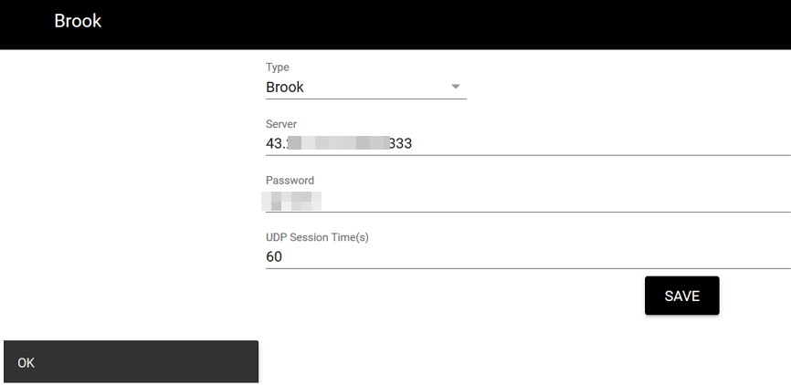
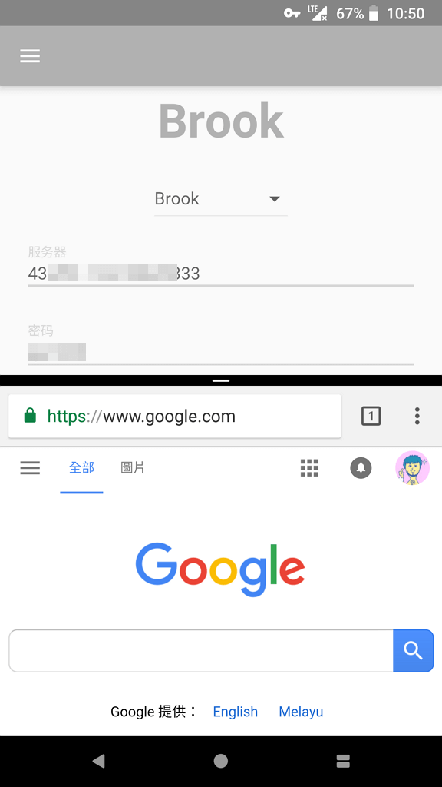

# Brook代理部署及使用教程

[2018年2月2日](https://www.xzymoe.com/brook/)[软件教程](https://www.xzymoe.com/category/how-to/)

之前收到CloudCone的邮件，讲述了一堆关于酸酸乳的东西。除此之外，没过多久我的Bandwagon VPS的IP就已经无法连接了。越来越感觉严峻，所以新的代理还是想要做一个备份，以防万一。V2Ray部署略麻烦，而Brook略为简单，无论配置和使用都很简单。

[](https://www.xzymoe.com/wp-content/uploads/2018/02/great-firef-wall.png)

### 一、关于Brook

Brook是一款很不错的不可描述的软件，项目主页在GitHub上，在当前形势下可以当做酸酸乳的一款备用工具，部署和使用教程都比较简单，适合懒人使用，但软件现在依旧不是那么完美。本文仅仅写了VPS上部署和客户端的使用教程，更多更详细的使用方法，见Brook项目主页。

> https://github.com/txthinking/brook

### 二、Server端部署

Server端的配置较为简单，仅需下载设置权限再设置密码与端口即可。我这里使用的的Ubuntu17.04 X64。

1.下载Brook，并配置其权限。

```
wget -N --no-check-certificate https://github.com/txthinking/brook/releases/download/v20180112/brook && chmod +x brook
```

2.设置Brook的密码及端口，并设置后台运行。

```
nohup ./brook server -l :23333 -p xzymoe > /dev/null 2>&1 &
```

将命令中的23333设置为你启用的端口；将xzymoe替换为你设置的密码。

### 三、客服端配置

Brook为各个Linux、Windows、Mac、Android和IOS均提供了客户端。在桌面平台提供了CLI和GUI的客户端，不过Linux端仅有CLI的客户端。日常为了方便使用，我还是选用了Windows下的GUI的客户端。下载地址：

> https://github.com/txthinking/brook#download

 

**Windows**

我使用的是Windows10 X64，下载Brook.exe即可，双击即可启动程序，右键右下角Brook客户端的黑色钥匙即可，浏览器打开设置界面，继续设置类型（Brook）、服务器IP及端口、账号和密码即可。

[](https://www.xzymoe.com/wp-content/uploads/2018/02/brook-setting.png)

（点击放大）

点击SAVE后，左下角弹出OK说明填写没问题，如果你的账号信息没错，那么你打开那些被被屏蔽的网站即可访问。

**Android**

Android端我使用的是搭载Android 8.1.0的Pixel XL（Marlin）。

Android客户端的使用和电脑上的设置差不多，都很简单，填写的信息都一样。

[](https://www.xzymoe.com/wp-content/uploads/2018/02/brook-android.png)

（点击放大）

不过Brook的Android客户端和酸酸乳相比略有欠缺，首先是没有相关的状态栏上的按钮，不方便一键启用和关闭Brook，其次在关闭Brook的时候，速度略显慢，客户端上也写了最长可能需要一分钟的时间。