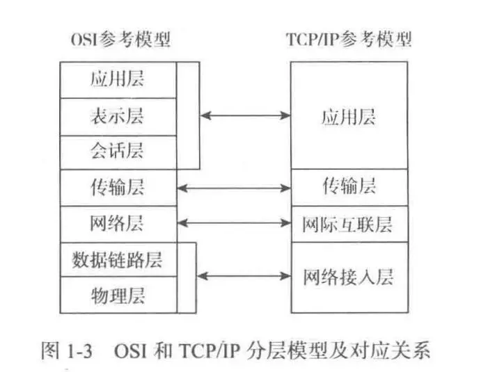
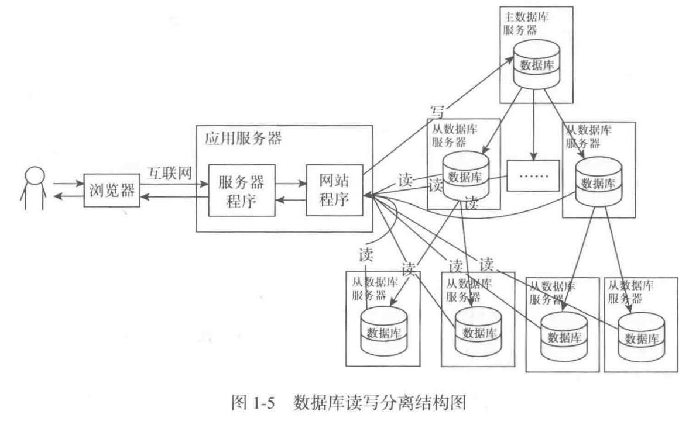
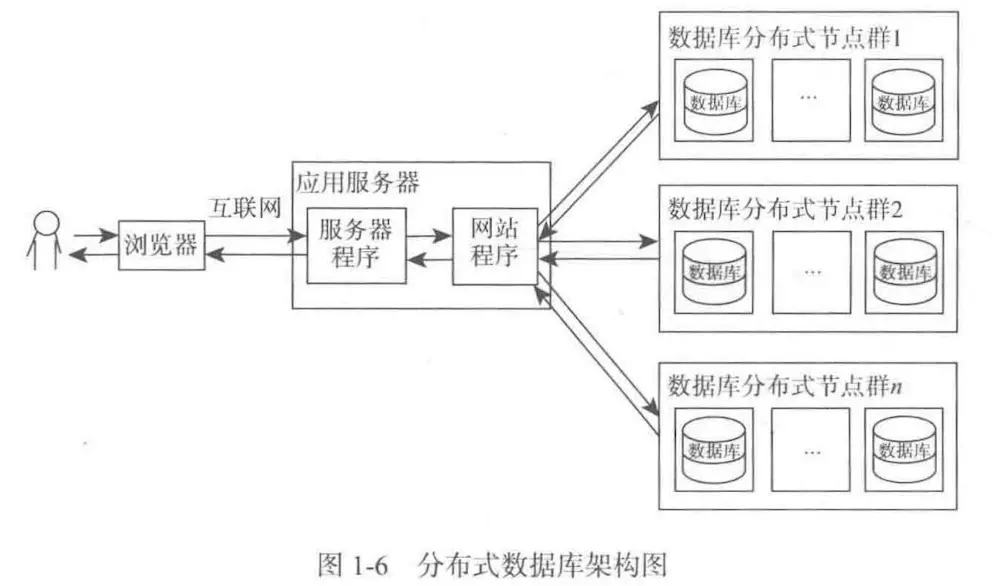
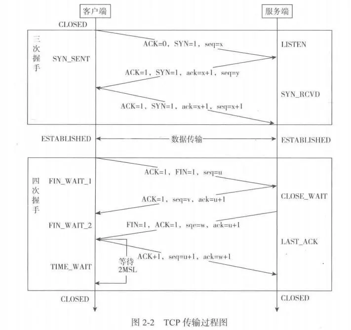
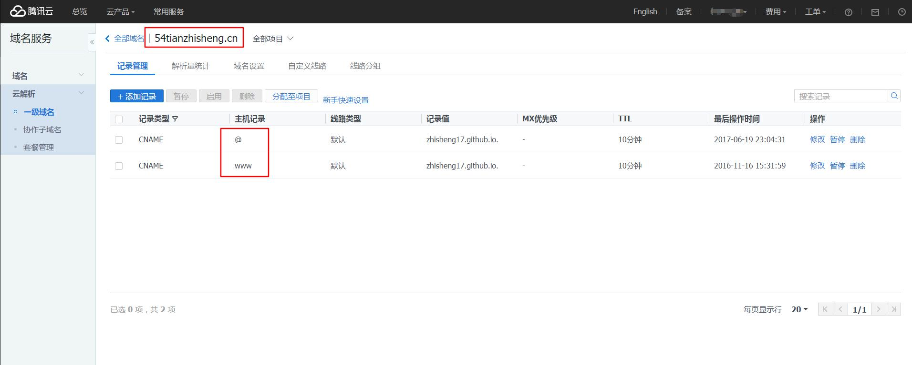
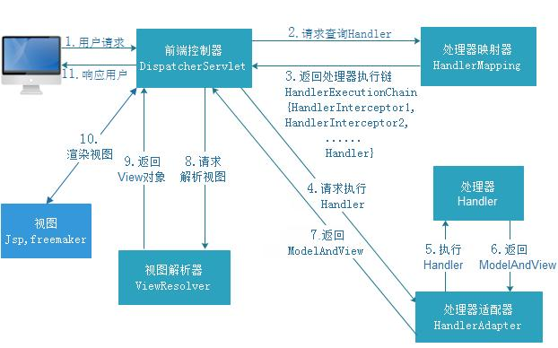
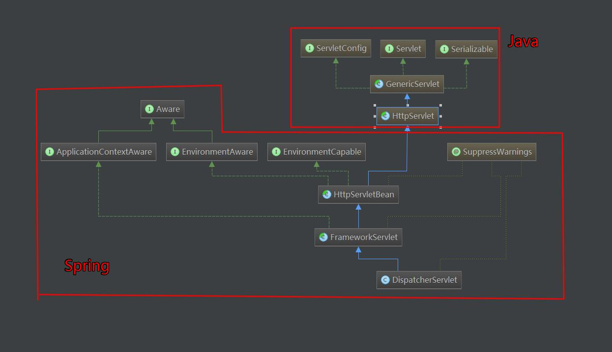
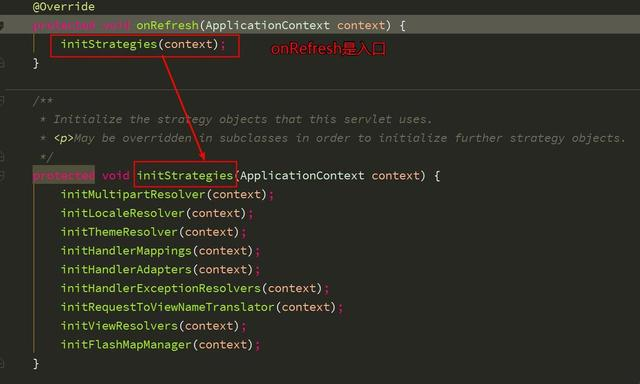

# [【zhisheng】看透 Spring MVC 源代码分析与实践 —— 网站基础知识](http://www.iocoder.cn/Spring-MVC/zhisheng/Spring-MVC01//)


 总阅读量:652次

[自我表扬：《Dubbo 实现原理与源码解析 —— 精品合集》](http://www.iocoder.cn/Dubbo/good-collection/?title) 
[表扬自己：《D数据库实体设计合集》](http://www.iocoder.cn/Entity/good-collection/?title)

摘要: 原创出处 http://www.54tianzhisheng.cn/2017/07/14/Spring-MVC01/ 「zhisheng」欢迎转载，保留摘要，谢谢！

- 网站架构及其演变过程
  - [基础结构](http://www.iocoder.cn/Spring-MVC/zhisheng/)
  - [海量数据的解决方案](http://www.iocoder.cn/Spring-MVC/zhisheng/)
  - [高并发的解决方案](http://www.iocoder.cn/Spring-MVC/zhisheng/)
- 常见协议和标准
  - [TCP/IP 协议](http://www.iocoder.cn/Spring-MVC/zhisheng/)
- DNS 的设置
  - [DNS 解析](http://www.iocoder.cn/Spring-MVC/zhisheng/)
- Java 中 Socket 的用法
  - [普通 SOKET 的用法](http://www.iocoder.cn/Spring-MVC/zhisheng/)
  - [NIOSOCKET 的用法](http://www.iocoder.cn/Spring-MVC/zhisheng/)

------

------

### 网站架构及其演变过程

#### 基础结构

网络传输分解方式：

- 标准的 OSI 参考模型
- TCP/IP 参考模型




#### 海量数据的解决方案

- 缓存和页面静态化

  - 缓存
    - 通过程序直接保存在内存中
    - 使用缓存框架 （Encache、Redis、Memcache）
  - 页面静态化
    - 使用模板技术生成（Velocity、FreeMaker等）

- 数据库优化

  - 表结构优化
  - SQL 语句优化
  - 分区
  - 分表
  - 索引优化
  - 使用存储过程代替直接操作过程

- 分离活跃数据

- 批量读取和延迟修改

- 读写分离

  

- 分布式数据库

  

- NoSQL 和 Hadoop

#### 高并发的解决方案

- 应用和静态资源的分离：静态文件（图片、视频、JS、CSS等）放在专门的服务器上
- 页面缓存（Nginx 服务器、Squid 服务器）
- 集群与分布式
- 反向代理
- CDN
- 底层优化：网络传输协议

### 常见协议和标准

#### TCP/IP 协议

IP：查找地址，对应着国际互联网

TCP：规范传输规则，对应着传输层

TCP 在传输之前会进行三次沟通，称 “三次握手”，传完数据断开的时候要进行四次沟通，称 “四次挥手”。

TCP 两个序号，三个标志位含义：

- seq：表示所传数据的序号。TCP 传输时每一个字节都有一个序号，发送数据的时候会将数据的第一个序号发送给对方，接收方会按序号检查是否接收完整了，如果没接收完整就需要重新传送，这样就可以保证数据的完整性。
- ack：表示确认号。接收端用它来给发送端反馈已经成功接收到的数据信息，它的值为希望接收的下一个数据包起始序号。
- ACK：确认位，只有 ACK = 1 的时候 ack 才起作用。正常通信时 ACK 为 1，第一次发起请求时因为没有需要确认接收的数据所以 ACK 为 0。
- SYN：同步位，用于在建立连接时同步序号。刚开始建立连接时并没有历史接收的数据，所以 ack 也就没有办法设置，这是按照正常的机制就无法运行了，SYN 的作用就是解决这个问题的，当接收端接收到 SYN = 1 的报文时就会直接将 ack 设置为接收到的 seq + 1 的值，注意这里的值并不是检验后设置的，而是根据 SYN 直接设置的，这样正常的机制就可以运行了，所以 SYN 叫同步位。SYN 会在前两次握手时都为 1，这是因为通信的双方的 ack 都需要设置一个初始值。
- FIN：终止位，用来在数据传输完毕后释放连接。



### DNS 的设置

#### DNS 解析

参考域名设置，如下是我在腾讯云域名的设置



记录类型：

**A记录：** 将域名指向一个IPv4地址（例如：8.8.8.8） **CNAME**：将域名指向另一个域名（例如 www.54tianzhisheng.cn） **MX**： 将域名指向邮件服务器地址 **TXT**： 可任意填写，长度限制255，通常做SPF记录（反垃圾邮件） **NS**： 域名服务器记录，将子域名指定其他DNS服务器解析 **AAAA**：将域名指向一个iPv6地址（例如：ff06:0:0:0:0:0:0:c3） **SRV**：记录提供特定服务的服务器（例如_xmpp-server._tcp） **显性URL**：将域名301重定向到另一个地址 **隐性URL**：类似显性URL，但是会隐藏真实目标地址

主机记录：

**要解析 www.54tianzhisheng.cn，请填写 www。** **主机记录就是域名前缀，常见用法有：**

**www:** 解析后的域名为 www.54tianzhisheng.cn。 **@:** 直接解析主域名 54tianzhisheng.cn。 ***:** 泛解析，匹配其他所有域名 *.54tianzhisheng.cn。\*mail:* 将域名解析为 mail.54tianzhisheng.cn，通常用于解析邮箱服务器。**二级域名:**如：abc.54tianzhisheng.cn，填写abc。*手机网站:* 如：m.54tianzhisheng.cn，填写m。

### Java 中 Socket 的用法

#### 普通 SOKET 的用法

Socket 分为 ServerSocket 和 Socket 两大类。

ServerSocket 用于服务器端，可以通过 accept 方法监听请求，监听到请求后返回 Socket；

Socket 用户具体完成数据传输，客户端直接使用 Socket 发送请求并传输数据。

随便写了个单方面发送消息的 demo：

客户端：

```java
import java.io.IOException;
import java.io.OutputStream;
import java.net.Socket;

/**
 * Created by 10412 on 2017/5/2.
 * TCP客户端：
 ①：建立tcp的socket服务，最好明确具体的地址和端口。这个对象在创建时，就已经可以对指定ip和端口进行连接(三次握手)。
 ②：如果连接成功，就意味着通道建立了，socket流就已经产生了。只要获取到socket流中的读取流和写入流即可，只要通过getInputStream和getOutputStream就可以获取两个流对象。
 ③：关闭资源。
 */
//单方面的输入！
public class TcpClient
{
    public static void main(String[] args) {
        try {
            Socket s = new Socket("127.0.0.1", 9999);
            OutputStream o = s.getOutputStream();
            o.write("tcp sssss".getBytes());
            s.close();
        } catch (IOException e) {
            e.printStackTrace();
        }
    }
}
```

服务器端：

```java
import java.io.IOException;
import java.io.InputStream;
import java.net.ServerSocket;
import java.net.Socket;

/**
 * Created by 10412 on 2017/5/2.
 */
public class TcpServer
{
    public static void main(String[] args) {
        try {
            ServerSocket ss = new ServerSocket(9999);//建立服务端的socket服务
            Socket s = ss.accept();//获取客户端对象
            String ip = s.getInetAddress().getHostAddress();
            int port = s.getPort();
            System.out.println(ip + " : " + port + " connected");

            // 可以通过获取到的socket对象中的socket流和具体的客户端进行通讯。
            InputStream ins = s.getInputStream();//读取客户端的数据，使用客户端对象的socket读取流
            byte[] bytes = new byte[1024];
            int len = ins.read(bytes);
            String text = new String(bytes, 0, len);
            System.out.println(text);
            //关闭资源
            s.close();
            ss.close();
        } catch (IOException e) {
            e.printStackTrace();
        }
    }
}
```

#### NIOSOCKET 的用法

见以前的一篇文章：[Java NIO 系列教程](http://www.54tianzhisheng.cn/2017/03/28/Java%20NIO%20%E7%B3%BB%E5%88%97%E6%95%99%E7%A8%8B/)

书中第五章简单的讲了下实现 HTTP 协议。第六章主要讲 Servlet，写了 Servlet 接口和其实现类。第七章把 Tomcat 分析的很不错，如果有读者感兴趣的话，可以去看看。

## 666. 彩蛋

如果你对 Java 感兴趣，欢迎加入我的知识星球一起交流。

# [【zhisheng】看透 Spring MVC 源代码分析与实践 —— 俯视 Spring MVC](http://www.iocoder.cn/Spring-MVC/zhisheng/Spring-MVC02//)


 总阅读量:427次

[自我表扬：《Dubbo 实现原理与源码解析 —— 精品合集》](http://www.iocoder.cn/Dubbo/good-collection/?title) 
[表扬自己：《D数据库实体设计合集》](http://www.iocoder.cn/Entity/good-collection/?title)

摘要: 原创出处 http://www.54tianzhisheng.cn/2017/07/14/Spring-MVC02/ 「zhisheng」欢迎转载，保留摘要，谢谢！

- Spring MVC 之初体验
  - [环境搭建](http://www.iocoder.cn/Spring-MVC/laotian/)
  - [SPRING MVC 简单配置](http://www.iocoder.cn/Spring-MVC/laotian/)
- 创建 Spring MVC 之器
  - [小结](http://www.iocoder.cn/Spring-MVC/laotian/)
- Spring MVC 之用
  - [小结](http://www.iocoder.cn/Spring-MVC/laotian/)

------

------



### Spring MVC 之初体验

#### 环境搭建

在 IDEA 中新建一个 web 项目，用 Maven 管理项目的话，在 pom.xml 中加入 Spring MVC 和 Servlet 依赖即可。

```xml
<!-- https://mvnrepository.com/artifact/org.springframework/spring-webmvc -->
<dependency>
    <groupId>org.springframework</groupId>
    <artifactId>spring-webmvc</artifactId>
    <version>4.3.9.RELEASE</version>
</dependency>
<!-- https://mvnrepository.com/artifact/javax.servlet/javax.servlet-api -->
<dependency>
    <groupId>javax.servlet</groupId>
    <artifactId>javax.servlet-api</artifactId>
    <version>3.1.0</version>
    <scope>provided</scope>
</dependency>
```

#### SPRING MVC 简单配置

- 在 web.xml 中配置 Servlet
- 创建 Spring MVC 的 xml 配置文件
- 创建 Controller 和 View

1、web.xml

```xml
<!-- Spring MVC配置 -->
<!-- ====================================== -->
<servlet>
    <servlet-name>spring</servlet-name>
    <servlet-class>org.springframework.web.servlet.DispatcherServlet</servlet-class>
    <!-- 可以自定义servlet.xml配置文件的位置和名称，默认为WEB-INF目录下，名称为[<servlet-name>]-servlet.xml，如spring-servlet.xml
    <init-param>
        <param-name>contextConfigLocation</param-name>
        <param-value>/WEB-INF/spring-servlet.xml</param-value>&nbsp; 默认
    </init-param>
    -->
    <load-on-startup>1</load-on-startup>
</servlet>

<servlet-mapping>
    <servlet-name>spring</servlet-name>
    <url-pattern>*.do</url-pattern>
</servlet-mapping>


<!-- Spring配置 -->
<!-- ====================================== -->
<listener>
   <listenerclass>
     org.springframework.web.context.ContextLoaderListener
   </listener-class>
</listener>


<!-- 指定Spring Bean的配置文件所在目录。默认配置在WEB-INF目录下 -->
<context-param>
    <param-name>contextConfigLocation</param-name>
    <param-value>classpath:config/applicationContext.xml</param-value>
</context-param>
```

2、spring-servlet.xml

```xml
<?xml version="1.0" encoding="UTF-8"?>
<beans xmlns="http://www.springframework.org/schema/beans"
       xmlns:xsi="http://www.w3.org/2001/XMLSchema-instance" xmlns:p="http://www.springframework.org/schema/p"
        xmlns:context="http://www.springframework.org/schema/context"
   xsi:schemaLocation="http://www.springframework.org/schema/beans http://www.springframework.org/schema/beans/spring-beans-3.0.xsd
       http://www.springframework.org/schema/aop http://www.springframework.org/schema/aop/spring-aop-3.0.xsd
       http://www.springframework.org/schema/tx http://www.springframework.org/schema/tx/spring-tx-3.0.xsd
       http://www.springframework.org/schema/context <a href="http://www.springframework.org/schema/context/spring-context-3.0.xsd">http://www.springframework.org/schema/context/spring-context-3.0.xsd</a>">

    <!-- 启用spring mvc 注解 -->
    <context:annotation-config />

    <!-- 设置使用注解的类所在的jar包 -->
    <context:component-scan base-package="controller"></context:component-scan>

    <!-- 完成请求和注解POJO的映射 -->
    <bean class="org.springframework.web.servlet.mvc.annotation.AnnotationMethodHandlerAdapter" />
　　
    <!-- 对转向页面的路径解析。prefix：前缀， suffix：后缀 -->
    <bean class="org.springframework.web.servlet.view.InternalResourceViewResolver" p:prefix="/jsp/" p:suffix=".jsp" />
</beans>
```

3、Controller

```java
package controller;

import javax.servlet.http.HttpServletRequest;

import org.springframework.stereotype.Controller;
import org.springframework.web.bind.annotation.RequestMapping;
import org.springframework.web.bind.annotation.RequestParam;

import entity.User;

@Controller  //类似Struts的Action
public class TestController {

    @RequestMapping("/test/login.do")  // 请求url地址映射，类似Struts的action-mapping
    public String testLogin(@RequestParam(value="username")String username, String password, HttpServletRequest request) {
        // @RequestParam是指请求url地址映射中必须含有的参数(除非属性 required=false, 默认为 true)
        // @RequestParam可简写为：@RequestParam("username")

        if (!"admin".equals(username) || !"admin".equals(password)) {
            return "loginError"; // 跳转页面路径（默认为转发），该路径不需要包含spring-servlet配置文件中配置的前缀和后缀
        }
        return "loginSuccess";
    }

    @RequestMapping("/test/login2.do")
    public ModelAndView testLogin2(String username, String password, int age){
        // request和response不必非要出现在方法中，如果用不上的话可以去掉
        // 参数的名称是与页面控件的name相匹配，参数类型会自动被转换

        if (!"admin".equals(username) || !"admin".equals(password) || age < 5) {
            return new ModelAndView("loginError"); // 手动实例化ModelAndView完成跳转页面（转发），效果等同于上面的方法返回字符串
        }
        return new ModelAndView(new RedirectView("../index.jsp"));  // 采用重定向方式跳转页面
        // 重定向还有一种简单写法
        // return new ModelAndView("redirect:../index.jsp");
    }

    @RequestMapping("/test/login3.do")
    public ModelAndView testLogin3(User user) {
        // 同样支持参数为表单对象，类似于Struts的ActionForm，User不需要任何配置，直接写即可
        String username = user.getUsername();
        String password = user.getPassword();
        int age = user.getAge();

        if (!"admin".equals(username) || !"admin".equals(password) || age < 5) {
            return new ModelAndView("loginError");
        }
        return new ModelAndView("loginSuccess");
    }

    @Resource(name = "loginService")  // 获取applicationContext.xml中bean的id为loginService的，并注入
    private LoginService loginService;  //等价于spring传统注入方式写get和set方法，这样的好处是简洁工整，省去了不必要得代码

    @RequestMapping("/test/login4.do")
    public String testLogin4(User user) {
        if (loginService.login(user) == false) {
            return "loginError";
        }
        return "loginSuccess";
    }
}
```

@RequestMapping 可以写在方法上，也可以写在类上，上面代码方法上的 RequestMapping 都含有 `/test` ， 那么我们就可以将其抽出直接写在类上，那么方法里面就不需要写 `/test` 了。

如下即可：

```java
@Controller
@RequestMapping("/test")
public class TestController {

    @RequestMapping("/login.do")  // 请求url地址映射，类似Struts的action-mapping
    public String testLogin(@RequestParam(value="username")String username, String password, HttpServletRequest request) {
        // @RequestParam是指请求url地址映射中必须含有的参数(除非属性 required=false, 默认为 true)
        // @RequestParam可简写为：@RequestParam("username")

        if (!"admin".equals(username) || !"admin".equals(password)) {
            return "loginError"; // 跳转页面路径（默认为转发），该路径不需要包含spring-servlet配置文件中配置的前缀和后缀
        }
        return "loginSuccess";
    }
    //省略其他的
}
```

上面的代码方法的参数中可以看到有一个 `@RequestParam` 注解，其实还有 `@PathVariable` 。这两个的区别是啥呢？

- `@PathVariable` 标记在方法的参数上，利用它标记的参数可以利用请求路径传值。
- @RequestParam是指请求url地址映射中必须含有的参数(除非属性 required=false, 默认为 true)

看如下例子：

```java
@RequestMapping("/user/{userId}")  // 请求url地址映射
public String userinfo(Model model, @PathVariable("userId") int userId,  HttpSession session) {
         System.out.println("进入  userinfo  页面");
        //判断是否有用户登录
        User user1 = (User) session.getAttribute("user");
        if (user1 == null) {
            return "login";
        }
        User user = userService.selectUserById(userId);
        model.addAttribute("user", user);
        return "userinfo";
    }
```

上面例子中如果浏览器请求的是 `/user/1` 的时候，就表示此时的用户 id 为 1，此时就会先从 session 中查找是否有 “user” 属性，如果有的话，就代表用户此时处于登录的状态，如果没有的话，就会让用户返回到登录页面，这种机制在各种网站经常会使用的，然后根据这个 id = 1 ，去查找用户的信息，然后把查找的 “user” 放在 model 中，然后返回用户详情页面，最后在页面中用 `$!{user.name}` 获取用户的名字，同样的方式可以获取用户的其他信息，把所有的用户详情信息展示出来。

### 创建 Spring MVC 之器

Spring MVC 核心 Servlet 架构图如下：



Java 中常用的 Servlet 我在另外一篇文章写的很清楚了，有兴趣的请看：[通过源码详解 Servlet](http://www.54tianzhisheng.cn/2017/07/09/servlet/) ，这里我就不再解释了。

这里主要讲 Spring 中的 HttpServletBean、FrameworkServlet、DispatcherServlet 这三个类的创建过程。

通过上面的图，可以看到这三个类直接实现三个接口：EnvironmentCapable、EnvironmentAware、ApplicationContextAware。下面我们直接看下这三个接口的内部是怎样写的。

EnvironmentCapable.java

```java
public interface EnvironmentCapable {
    //返回组件的环境，可能返回 null 或者默认环境
    @Nullable
    Environment getEnvironment();
}
```

EnvironmentAware.java

```java
public interface EnvironmentAware extends Aware {
    //设置组件的运行环境
    void setEnvironment(Environment environment);
}
```

ApplicationContextAware.java

```java
public interface ApplicationContextAware extends Aware {
    //设置运行对象的应用上下文
    //当类实现这个接口后，这个类可以获取ApplicationContext中所有的bean，也就是说这个类可以直接获取Spring配置文件中所有有引用到的bean对象
    void setApplicationContext(ApplicationContext applicationContext) throws BeansException;
}
```

怎么使用这个这个接口呢？

参考文章：[org.springframework.context.ApplicationContextAware使用理解](http://blog.csdn.net/kaiwii/article/details/6872642)

**HttpServletBean**

这里就直接看其中最重要的 init() 方法的代码了：

```java
/**
 * 将配置参数映射到此servlet的bean属性，并调用子类初始化。
 *  如果 bean 配置不合法（或者需要的参数丢失）或者子类初始化发生错误，那么就会抛出 ServletException 异常
 */
@Override
public final void init() throws ServletException {
   //日志代码删除了

   // 从init参数设置bean属性。
   //获得web.xml中的contextConfigLocation配置属性，就是spring MVC的配置文件
   PropertyValues pvs = new ServletConfigPropertyValues(getServletConfig(), this.requiredProperties);
   if (!pvs.isEmpty()) {
      try {
         BeanWrapper bw = PropertyAccessorFactory.forBeanPropertyAccess(this);
         //获取服务器的各种信息
         ResourceLoader resourceLoader = new ServletContextResourceLoader(getServletContext());
         bw.registerCustomEditor(Resource.class, new ResourceEditor(resourceLoader, getEnvironment()));
         //模板方法，可以在子类中调用，做一些初始化工作，bw代表DispatcherServelt
         initBeanWrapper(bw);
         //将配置的初始化值设置到DispatcherServlet中
         bw.setPropertyValues(pvs, true);
      }
      catch (BeansException ex) {
         //日志代码
         throw ex;
      }
   }

   // Let subclasses do whatever initialization they like.
   //模板方法，子类初始化的入口方法
   initServletBean();

   //日志代码删除了
}
```

**FrameworkServlet**

其中重要方法如下：里面也就两句关键代码，日志代码我直接删掉了

```java
protected final void initServletBean() throws ServletException {
        //日志代码删除了
        long startTime = System.currentTimeMillis();

        //就是 try 语句里面有两句关键代码
        try {
            //初始化 webApplicationContext
            this.webApplicationContext = initWebApplicationContext();
            //模板方法，
            initFrameworkServlet();
        }
        catch (ServletException ex) {
            this.logger.error("Context initialization failed", ex);
            throw ex;
        }
        catch (RuntimeException ex) {
            this.logger.error("Context initialization failed", ex);
            throw ex;
        }

        //日志代码删除了
    }
```

再来看看上面代码中调用的 initWebApplicationContext() 方法

```java
protected WebApplicationContext initWebApplicationContext() {
        //获取 rootContext
        WebApplicationContext rootContext =
                WebApplicationContextUtils.getWebApplicationContext(getServletContext());
        WebApplicationContext wac = null;

        if (this.webApplicationContext != null) {
            // 上下文实例在构造时注入 - >使用它
            wac = this.webApplicationContext;
            if (wac instanceof ConfigurableWebApplicationContext) {
                ConfigurableWebApplicationContext cwac = (ConfigurableWebApplicationContext) wac;
                if (!cwac.isActive()) {
                // 如果上下文尚未刷新 -> 提供诸如设置父上下文，设置应用程序上下文ID等服务
                    if (cwac.getParent() == null) {
            // 上下文实例被注入没有显式的父类 -> 将根应用程序上下文（如果有的话可能为null）设置为父级
                        cwac.setParent(rootContext);
                    }
                    configureAndRefreshWebApplicationContext(cwac);
                }
            }
        }
        if (wac == null) {
    // 当 WebApplicationContext 已经存在 ServletContext 中时，通过配置在 servlet 中的 ContextAttribute 参数获取
            wac = findWebApplicationContext();
        }
        if (wac == null) {
            // 如果 WebApplicationContext 还没有创建，则创建一个
            wac = createWebApplicationContext(rootContext);
        }
        if (!this.refreshEventReceived) {
            // 当 ContextRefreshedEvent 事件没有触发时调用此方法，模板方法，可以在子类重写
            onRefresh(wac);
        }
        if (this.publishContext) {
            // 将 ApplicationContext 保存到 ServletContext 中去
            String attrName = getServletContextAttributeName();
            getServletContext().setAttribute(attrName, wac);
            if (this.logger.isDebugEnabled()) {
                this.logger.debug("Published WebApplicationContext of servlet '" + getServletName() +
                        "' as ServletContext attribute with name [" + attrName + "]");
            }
        }
        return wac;
    }
```

initWebApplicationContext 方法做了三件事：

- 获取 Spring 的根容器 rootContext
- 设置 webApplicationContext 并根据情况调用 onRefresh 方法
- 将 webApplicationContext 设置到 ServletContext 中

这里在讲讲上面代码中的 wac == null 的几种情况：

1）、当 WebApplicationContext 已经存在 ServletContext 中时，通过配置在 servlet 中的 ContextAttribute 参数获取，调用的是 findWebApplicationContext() 方法

```java
protected WebApplicationContext findWebApplicationContext() {
        String attrName = getContextAttribute();
        if (attrName == null) {
            return null;
        }
        WebApplicationContext wac =
                WebApplicationContextUtils.getWebApplicationContext(getServletContext(), attrName);
        if (wac == null) {
            throw new IllegalStateException("No WebApplicationContext found: initializer not registered?");
        }
        return wac;
    }
```

2)、如果 WebApplicationContext 还没有创建，调用的是 createWebApplicationContext 方法

```java
protected WebApplicationContext createWebApplicationContext(@Nullable ApplicationContext parent) {
        //获取创建类型
        Class<?> contextClass = getContextClass();
        //删除了打印日志代码

        //检查创建类型
        if (!ConfigurableWebApplicationContext.class.isAssignableFrom(contextClass)) {
            throw new ApplicationContextException(
                    "Fatal initialization error in servlet with name '" + getServletName() +
                    "': custom WebApplicationContext class [" + contextClass.getName() +
                    "] is not of type ConfigurableWebApplicationContext");
        }
        //具体创建
        ConfigurableWebApplicationContext wac =
                (ConfigurableWebApplicationContext) BeanUtils.instantiateClass(contextClass);

        wac.setEnvironment(getEnvironment());
        wac.setParent(parent);
  //并设置的 contextConfigLocation 参数传给 wac，默认是 WEB-INFO/[ServletName]-Servlet.xml
        wac.setConfigLocation(getContextConfigLocation());

        //调用的是下面的方法
        configureAndRefreshWebApplicationContext(wac);

        return wac;
    }

protected void configureAndRefreshWebApplicationContext(ConfigurableWebApplicationContext wac) {
        if (ObjectUtils.identityToString(wac).equals(wac.getId())) {
            // The application context id is still set to its original default value
            // -> assign a more useful id based on available information
            if (this.contextId != null) {
                wac.setId(this.contextId);
            }
            else {
                // Generate default id...
                wac.setId(ConfigurableWebApplicationContext.APPLICATION_CONTEXT_ID_PREFIX +
                        ObjectUtils.getDisplayString(getServletContext().getContextPath()) + '/' + getServletName());
            }
        }

        wac.setServletContext(getServletContext());
        wac.setServletConfig(getServletConfig());
        wac.setNamespace(getNamespace());
        wac.addApplicationListener(new SourceFilteringListener(wac, new ContextRefreshListener()));

        // The wac environment's #initPropertySources will be called in any case when the context
        // is refreshed; do it eagerly here to ensure servlet property sources are in place for
        // use in any post-processing or initialization that occurs below prior to #refresh
        ConfigurableEnvironment env = wac.getEnvironment();
        if (env instanceof ConfigurableWebEnvironment) {
            ((ConfigurableWebEnvironment) env).initPropertySources(getServletContext(), getServletConfig());
        }

        postProcessWebApplicationContext(wac);
        applyInitializers(wac);
        wac.refresh();
    }
```

里面还有 doXXX() 方法，大家感兴趣的可以去看看。

**DispatcherServlet**

DispatcherServlet 继承自 FrameworkServlet，onRefresh 方法是 DispatcherServlet 的入口方法，在 initStrategies 方法中调用了 9 个初始化的方法。



这里分析其中一个初始化方法：initLocaleResolver() 方法

```java
private void initLocaleResolver(ApplicationContext context) {
        try {
            //在 context 中获取
            this.localeResolver = context.getBean(LOCALE_RESOLVER_BEAN_NAME, LocaleResolver.class);
            //删除了打印日志的代码
        }
        catch (NoSuchBeanDefinitionException ex) {
            //使用默认的策略
            this.localeResolver = getDefaultStrategy(context, LocaleResolver.class);
            //删除了打印日志的代码
        }
    }
```

查看默认策略代码：


```java
protected <T> T getDefaultStrategy(ApplicationContext context, Class<T> strategyInterface) {
        //调用 getDefaultStrategies 方法
        List<T> strategies = getDefaultStrategies(context, strategyInterface);
        if (strategies.size() != 1) {
            throw new BeanInitializationException(
                    "DispatcherServlet needs exactly 1 strategy for interface [" + strategyInterface.getName() + "]");
        }
        return strategies.get(0);
    }

    /**
     * Create a List of default strategy objects for the given strategy interface.
     * <p>The default implementation uses the "DispatcherServlet.properties" file (in the same
     * package as the DispatcherServlet class) to determine the class names. It instantiates
     * the strategy objects through the context's BeanFactory.
     */
    @SuppressWarnings("unchecked")
    protected <T> List<T> getDefaultStrategies(ApplicationContext context, Class<T> strategyInterface) {
        String key = strategyInterface.getName();
        //根据策略接口的名字从 defaultStrategies 获取所需策略的类型
        String value = defaultStrategies.getProperty(key);
        if (value != null) {
            //如果有多个默认值的话，就以逗号分隔为数组
            String[] classNames = StringUtils.commaDelimitedListToStringArray(value);
            List<T> strategies = new ArrayList<>(classNames.length);
            //按获取到的类型初始化策略
            for (String className : classNames) {
                try {
                    Class<?> clazz = ClassUtils.forName(className, DispatcherServlet.class.getClassLoader());
                    Object strategy = createDefaultStrategy(context, clazz);
                    strategies.add((T) strategy);
                }
                catch (ClassNotFoundException ex) {
                    throw new BeanInitializationException(
                            "Could not find DispatcherServlet's default strategy class [" + className + "] for interface [" + key + "]", ex);
                }
                catch (LinkageError err) {
                    throw new BeanInitializationException(
                            "Error loading DispatcherServlet's default strategy class [" + className + "] for interface [" + key + "]: problem with class file or dependent class", err);
                }
            }
            return strategies;
        }
        else {
            return new LinkedList<>();
        }
    }
```

其他几个方法大概也类似，我就不再写了。

#### 小结

主要讲了 Spring MVC 自身创建过程，分析了 Spring MVC 中 Servlet 的三个层次：HttpServletBean、FrameworkServlet 和 DispatcherServlet。HttpServletBean 继承自 Java 的 HttpServlet，其作用是将配置的参数设置到相应的属性上；FrameworkServlet 初始化了 WebApplicationContext；DispatcherServlet 初始化了自身的 9 个组件。

### Spring MVC 之用

分析 Spring MVC 是怎么处理请求的。首先分析 HttpServletBean、FrameworkServlet 和 DispatcherServlet 这三个 Servlet 的处理过程，最后分析 doDispatcher 的结构。

**HttpServletBean**

参与了创建工作，并没有涉及请求的处理。

**FrameworkServlet**

在类中的 service() 、doGet()、doPost()、doPut()、doDelete()、doOptions()、doTrace() 这些方法中可以看到都调用了一个共同的方法 processRequest() ，它是类在处理请求中最核心的方法。

```java
protected final void processRequest(HttpServletRequest request, HttpServletResponse response)
            throws ServletException, IOException {

        long startTime = System.currentTimeMillis();
        Throwable failureCause = null;
        //获取 LocaleContextHolder 中原来保存的 LocaleContext
        LocaleContext previousLocaleContext = LocaleContextHolder.getLocaleContext();
        //获取当前请求的 LocaleContext
        LocaleContext localeContext = buildLocaleContext(request);
        //获取 RequestContextHolder 中原来保存的 RequestAttributes
        RequestAttributes previousAttributes = RequestContextHolder.getRequestAttributes();
        //获取当前请求的 ServletRequestAttributes
        ServletRequestAttributes requestAttributes = buildRequestAttributes(request, response, previousAttributes);

        WebAsyncManager asyncManager = WebAsyncUtils.getAsyncManager(request);
        asyncManager.registerCallableInterceptor(FrameworkServlet.class.getName(), new RequestBindingInterceptor());
        //将当前请求的 LocaleContext 和 ServletRequestAttributes 设置到 LocaleContextHolder 和 RequestContextHolder
        initContextHolders(request, localeContext, requestAttributes);

        try {
            //实际处理请求的入口，这是一个模板方法，在 Dispatcher 类中才有具体实现
            doService(request, response);
        }catch (ServletException ex) {
            failureCause = ex;
            throw ex;
        }catch (IOException ex) {
            failureCause = ex;
            throw ex;
        }catch (Throwable ex) {
            failureCause = ex;
            throw new NestedServletException("Request processing failed", ex);
        }finally {
            //将 previousLocaleContext，previousAttributes 恢复到 LocaleContextHolder 和 RequestContextHolder 中
            resetContextHolders(request, previousLocaleContext, previousAttributes);
            if (requestAttributes != null) {
                requestAttributes.requestCompleted();
            }
            //删除了日志打印代码
            //发布了一个 ServletRequestHandledEvent 类型的消息
            publishRequestHandledEvent(request, response, startTime, failureCause);
        }
    }
```

**DispatcherServlet**

上一章中其实还没把该类讲清楚，在这个类中，里面的智行处理的入口方法应该是 doService 方法，方法里面调用了 doDispatch 进行具体的处理，在调用 doDispatch 方法之前 doService 做了一些事情：首先判断是不是 include 请求，如果是则对 request 的 Attribute 做个快照备份，等 doDispatcher 处理完之后（如果不是异步调用且未完成）进行还原 ，在做完快照后又对 request 设置了一些属性。

```java
protected void doService(HttpServletRequest request, HttpServletResponse response) throws Exception {
        // Keep a snapshot of the request attributes in case of an include,
        // to be able to restore the original attributes after the include.
        Map<String, Object> attributesSnapshot = null;
        if (WebUtils.isIncludeRequest(request)) {
            attributesSnapshot = new HashMap<>();
            Enumeration<?> attrNames = request.getAttributeNames();
            while (attrNames.hasMoreElements()) {
                String attrName = (String) attrNames.nextElement();
                if (this.cleanupAfterInclude || attrName.startsWith(DEFAULT_STRATEGIES_PREFIX)){
                    attributesSnapshot.put(attrName, request.getAttribute(attrName));
                }
            }
        }
        // Make framework objects available to handlers and view objects.
        request.setAttribute(WEB_APPLICATION_CONTEXT_ATTRIBUTE, getWebApplicationContext());
        request.setAttribute(LOCALE_RESOLVER_ATTRIBUTE, this.localeResolver);
        request.setAttribute(THEME_RESOLVER_ATTRIBUTE, this.themeResolver);
        request.setAttribute(THEME_SOURCE_ATTRIBUTE, getThemeSource());

        FlashMap inputFlashMap = this.flashMapManager.retrieveAndUpdate(request, response);
        if (inputFlashMap != null) {
            request.setAttribute(INPUT_FLASH_MAP_ATTRIBUTE, Collections.unmodifiableMap(inputFlashMap));
        }
        request.setAttribute(OUTPUT_FLASH_MAP_ATTRIBUTE, new FlashMap());
        request.setAttribute(FLASH_MAP_MANAGER_ATTRIBUTE, this.flashMapManager);

        try {
            //调用 doDispatch 方法
            doDispatch(request, response);
        }finally {
            if (!WebAsyncUtils.getAsyncManager(request).isConcurrentHandlingStarted()) {
                // Restore the original attribute snapshot, in case of an include.
                if (attributesSnapshot != null) {
                    restoreAttributesAfterInclude(request, attributesSnapshot);
                }
            }
        }
    }
```

doDispatch() 方法：

```java
protected void doDispatch(HttpServletRequest request, HttpServletResponse response) throws Exception {
        HttpServletRequest processedRequest = request;
        HandlerExecutionChain mappedHandler = null;
        boolean multipartRequestParsed = false;

        WebAsyncManager asyncManager = WebAsyncUtils.getAsyncManager(request);
        try {
            ModelAndView mv = null;
            Exception dispatchException = null;
            try {
                //检查是不是上传请求
                processedRequest = checkMultipart(request);
                multipartRequestParsed = (processedRequest != request);

                // Determine handler for the current request.  根据 request 找到 Handler
                mappedHandler = getHandler(processedRequest);
                if (mappedHandler == null || mappedHandler.getHandler() == null) {
                    noHandlerFound(processedRequest, response);
                    return;
                }

    // Determine handler adapter for the current request.根据 Handler 找到对应的 HandlerAdapter
                HandlerAdapter ha = getHandlerAdapter(mappedHandler.getHandler());
                // Process last-modified header, if supported by the handler.
                //处理 GET 、 HEAD 请求的 LastModified
                String method = request.getMethod();
                boolean isGet = "GET".equals(method);
                if (isGet || "HEAD".equals(method)) {
                    long lastModified = ha.getLastModified(request, mappedHandler.getHandler());
                    if (logger.isDebugEnabled()) {
                        logger.debug("Last-Modified value for [" + getRequestUri(request) + "] is: " + lastModified);
                    }
                    if (new ServletWebRequest(request, response).checkNotModified(lastModified) && isGet) {
                        return;
                    }
                }
                //执行相应的 Interceptor 的 preHandle
                if (!mappedHandler.applyPreHandle(processedRequest, response)) {
                    return;
                }
                // Actually invoke the handler. HandlerAdapter 使用 Handler 处理请求
                mv = ha.handle(processedRequest, response, mappedHandler.getHandler());
                //如果需要异步处理，直接返回
                if (asyncManager.isConcurrentHandlingStarted()) {
                    return;
                }
                //当 view 为空时，根据 request 设置默认 view
                applyDefaultViewName(processedRequest, mv);
                //执行相应 Interceptor 的 postHandler
                mappedHandler.applyPostHandle(processedRequest, response, mv);
            }catch (Exception ex) {
                dispatchException = ex;
            }catch (Throwable err) {
                // As of 4.3, we're processing Errors thrown from handler methods as well,
                // making them available for @ExceptionHandler methods and other scenarios.
                dispatchException = new NestedServletException("Handler dispatch failed", err);
            }
            //调用 processDispatchResult 方法处理上面处理之后的结果（包括处理异常，渲染页面，发出完成通知触发 Interceptor 的 afterCompletion）
            processDispatchResult(processedRequest, response, mappedHandler, mv, dispatchException);
        }catch (Exception ex) {
            triggerAfterCompletion(processedRequest, response, mappedHandler, ex);
        }catch (Throwable err) {
            triggerAfterCompletion(processedRequest, response, mappedHandler,
                    new NestedServletException("Handler processing failed", err));
        }finally {
          //判断是否执行异步请求
            if (asyncManager.isConcurrentHandlingStarted()) {
                // Instead of postHandle and afterCompletion
                if (mappedHandler != null) {
                    mappedHandler.applyAfterConcurrentHandlingStarted(processedRequest, response);
                }
            }else {
                // Clean up any resources used by a multipart request. 删除上传请求的资源
                if (multipartRequestParsed) {
                    cleanupMultipart(processedRequest);
                }
            }
        }
    }
```

Handler，HandlerMapping，HandlerAdapter 三个区别：

- Handler：处理器，对应 MVC 的 C层，也就是 Controller 层，具体表现形式有很多种，可以是类，方法，它的类型是 Object，只要可以处理实际请求就可以是 Handler。
- HandlerMapping：用来查找 Handler 的。
- HandlerAdapter ：Handler 适配器，

另外 View 和 ViewResolver 的原理与 Handler 和 HandlerMapping 的原理类似。


#### 小结

本章分析了 Spring MVC 的请求处理的过程。

## 666. 彩蛋

如果你对 Java 感兴趣，欢迎加入我的知识星球一起交流。

# [【zhisheng】看透 Spring MVC 源代码分析与实践 —— Spring MVC 组件分析](http://www.iocoder.cn/Spring-MVC/zhisheng/Spring-MVC03//)


 总阅读量:168次

[自我表扬：《Dubbo 实现原理与源码解析 —— 精品合集》](http://www.iocoder.cn/Dubbo/good-collection/?title) 
[表扬自己：《D数据库实体设计合集》](http://www.iocoder.cn/Entity/good-collection/?title)

摘要: 原创出处 http://www.54tianzhisheng.cn/2017/07/21/Spring-MVC03/ 「zhisheng」欢迎转载，保留摘要，谢谢！

- [第 11 章 —— 组件概览](http://www.iocoder.cn/Spring-MVC/zhisheng/)
- [小结](http://www.iocoder.cn/Spring-MVC/zhisheng/)
- [总结](http://www.iocoder.cn/Spring-MVC/zhisheng/)
- [Spring MVC 原理总结](http://www.iocoder.cn/Spring-MVC/zhisheng/)

------

------

由于星期一接到面试通知，和面试官约好了星期四面试，所以这几天没更新完这系列的文章，面完试后立马就把这个解决掉。通过这次面试，也让我懂得了很多，知道了自己的一些不足之处，后面还要继续下功夫好好的深入复习下去。这几篇文章写的我觉得还是不够仔细，感兴趣的还是建议自己去看看源码。

### 第 11 章 —— 组件概览

**HandlerMapping**

根据 request 找到对应的处理器 Handler 和 Interceptors。内部只有一个方法

```java
HandlerExecutionChain getHandler(HttpServletRequest request) throws Exception;
```

**HandlerAdapter**

Handler 适配器，内部方法如下：

```java
boolean supports(Object handler);//判断是否可以使用某个 Handler
ModelAndView handle(HttpServletRequest request, HttpServletResponse response, Object handler) throws Exception; //具体使用
long getLastModified(HttpServletRequest request, Object handler);//获取资源上一次修改的时间
```

**HandlerExceptionResolver**

根据异常设置 ModelAndView ，再交给 render 方法进行渲染。

```java
ModelAndView resolveException(
			HttpServletRequest request, HttpServletResponse response, @Nullable Object handler, Exception ex)
```

**ViewResolver**

用来将 String 类型的视图名和 Locale 解析为 View 类型的视图。

```java
View resolveViewName(String viewName, Locale locale) throws Exception;
```

它的一个实现类 BeanNameViewResolver，它重写 resolveViewName 方法如下:

```java
public View resolveViewName(String viewName, Locale locale) throws BeansException {
		ApplicationContext context = getApplicationContext();
		//如果应用上下文没有找到视图，返回 null
		if (!context.containsBean(viewName)) {
			if (logger.isDebugEnabled()) {
				logger.debug("No matching bean found for view name '" + viewName + "'");
			}
			// Allow for ViewResolver chaining...
			return null;
		}
		//如果找到的视图类型不匹配，也返回 null
		if (!context.isTypeMatch(viewName, View.class)) {
			if (logger.isDebugEnabled()) {
				logger.debug("Found matching bean for view name '" + viewName +
						"' - to be ignored since it does not implement View");
			}
			// Since we're looking into the general ApplicationContext here,
			// let's accept this as a non-match and allow for chaining as well...
			return null;
		}
		//根据视图名称从 Spring 容器中查找 Bean，返回找到的 bean
		return context.getBean(viewName, View.class);
	}
```

**RequestToViewNameTranslator**

获取 request 中的视图名。接口里面也是只有一个方法：

```java
String getViewName(HttpServletRequest request) throws Exception; //根据 request 查找视图名
```

**LocaleResolver**

用于从 request 解析出 Locale。

```java
public interface LocaleResolver {
  	//从 request 解析出 Locale
	Locale resolveLocale(HttpServletRequest request);
  	//根据 request 设置  locale
	void setLocale(HttpServletRequest request, HttpServletResponse response, @Nullable Locale locale);
}
```

**ThemeResolver**

解析主题

```java
public interface ThemeResolver {
	//通过给定的 request 查找主题名
	String resolveThemeName(HttpServletRequest request);
	//根据给定的 request 设置主题名
	void setThemeName(HttpServletRequest request, HttpServletResponse response, String themeName);
}
```

在 RequestContext.java 文件中可以获取主题：

```java
public String getThemeMessage(String code, String defaultMessage) {
		//获取主题的信息
		return getTheme().getMessageSource().getMessage(code, null, defaultMessage, this.locale);
	}

public Theme getTheme() {
		//判断主题是否为空
		if (this.theme == null) {
			// 通过 RequestContextUtils 获取 request 中的主题名
			this.theme = RequestContextUtils.getTheme(this.request);
			if (this.theme == null) {	//如果还是为空的话
				//那就是没有有效的主题解析器和主题
				this.theme = getFallbackTheme();
			}
		}
		return this.theme;
	}
```

RequestContextUtils.getTheme() 方法：

```java
public static Theme getTheme(HttpServletRequest request) {
		ThemeResolver themeResolver = getThemeResolver(request);
		ThemeSource themeSource = getThemeSource(request);
		if (themeResolver != null && themeSource != null) {
			String themeName = themeResolver.resolveThemeName(request);
			return themeSource.getTheme(themeName);
		}
		else {
			return null;
		}
	}
```

**MultipartResolver**

用于处理上传请求，处理方法：将普通的 request 包装成 MultipartHttpServletRequest

```java
public interface MultipartResolver {
	//根据 request 判断是否是上传请求
	boolean isMultipart(HttpServletRequest request);
	//将 request 包装成 MultipartHttpServletRequest
	MultipartHttpServletRequest resolveMultipart(HttpServletRequest request) throws MultipartException;
	//清理上传过程中产生的临时资源
	void cleanupMultipart(MultipartHttpServletRequest request);
}
```

**FlashMapManager**

FlashMap 主要在 redirect 中传递参数，FlashMapManager 用来管理 FlashMap 的。

```java
public interface FlashMapManager {
	//恢复参数，并将恢复过的和超时的参数从保存介质中删除
	@Nullable
	FlashMap retrieveAndUpdate(HttpServletRequest request, HttpServletResponse response);
	//将参数保存起来
	void saveOutputFlashMap(FlashMap flashMap, HttpServletRequest request, HttpServletResponse response);
}
```

### 小结

介绍 Spring MVC 中九大组件的接口、作用、内部方法实现及作用进行了简单的介绍，详细的还需大家自己去看源码。

### 总结

### Spring MVC 原理总结

本质是一个 Servlet，这个 Servlet 继承自 HttpServlet。Spring MVC 中提供了三个层次的 Servlet：HttpServletBean、FrameworkServlet 和 DispatcherServlet。他们相互继承， HttpServletBean 直接继承自 Java 的 HttpServlet。HttpServletBean 用于将 Servlet 中的 Servlet 中配置的参数设置到相应的属性中，FrameworkServlet 初始化了 Spring MVC 中所使用的 WebApplicationContext，具体处理请求的 9 大组件是在 DispatcherServlet 中初始化的，整个继承图如下：


## 666. 彩蛋

如果你对 Java 感兴趣，欢迎加入我的知识星球一起交流。