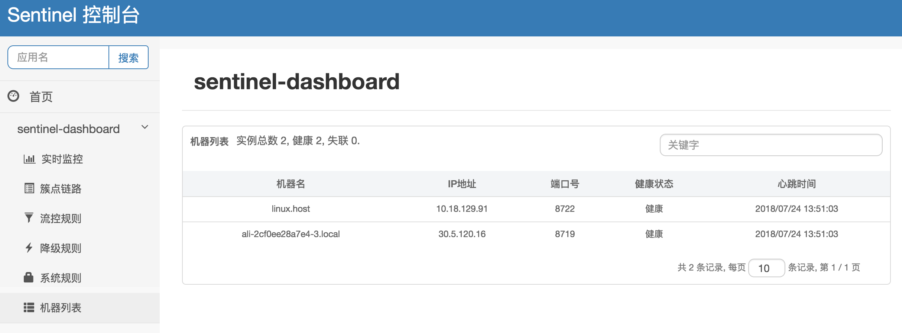
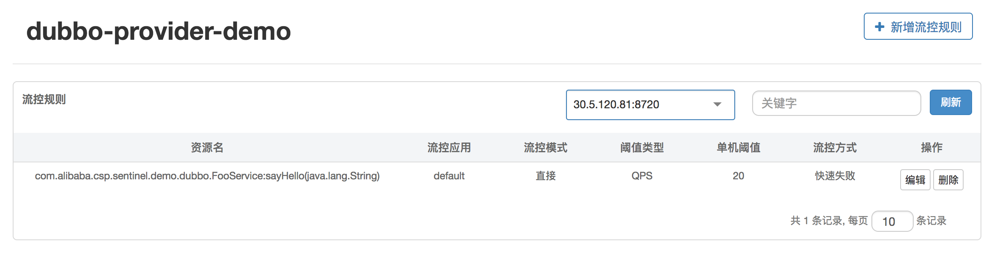
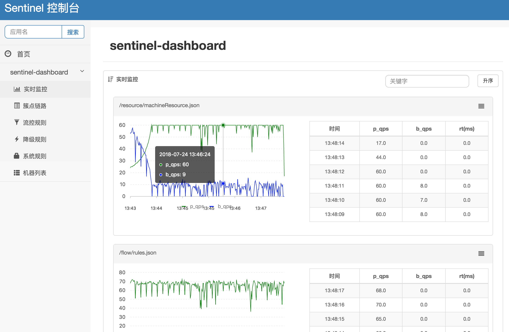
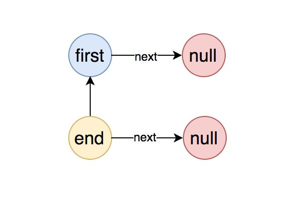
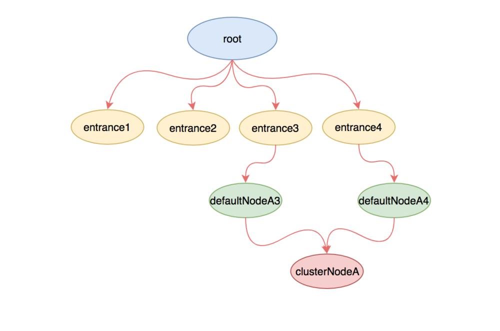
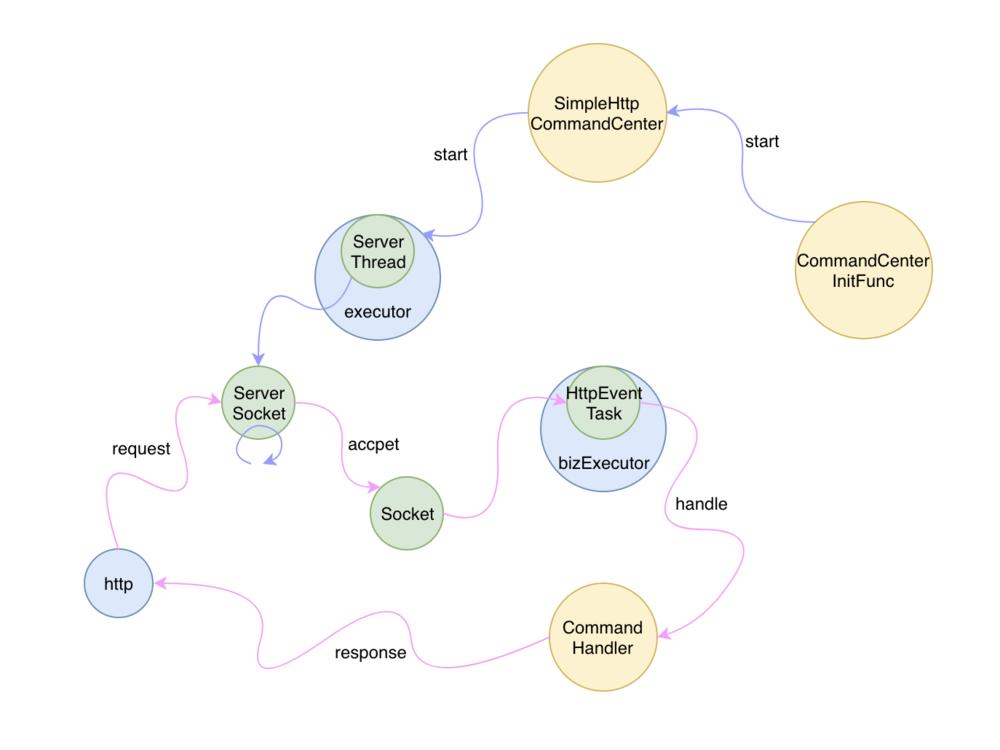

# 阿里巴巴开源限流系统 Sentinel 全解析

 总阅读量:691次

| [《Dubbo 实现原理与源码解析 —— 精品合集》](http://www.iocoder.cn/Dubbo/good-collection/?title) | [《Netty 实现原理与源码解析 —— 精品合集》](http://www.iocoder.cn/Netty/Netty-collection/?title) |
| ------------------------------------------------------------ | ------------------------------------------------------------ |
| [《Spring 实现原理与源码解析 —— 精品合集》](http://www.iocoder.cn/Spring/good-collection/?title) | [《MyBatis 实现原理与源码解析 —— 精品合集》](http://www.iocoder.cn/MyBatis/good-collection/?title) |
| [《Spring MVC 实现原理与源码解析 —— 精品合集》](http://www.iocoder.cn/Spring-MVC/good-collection/?title) | [《数据库实体设计合集》](http://www.iocoder.cn/Entity/good-collection/?title) |
| [《Spring Boot 实现原理与源码解析 —— 精品合集》](http://www.iocoder.cn/Spring-Boot/good-collection/?title) | [《Java 面试题 + Java 学习指南》](http://www.iocoder.cn/Interview/good-collection/?title) |

摘要:原创出处<https://juejin.im/post/5c26023151882545e24f2ed9> 「老钱」欢迎转载，保留摘要，谢谢！

- [Sentinel 入门](http://www.iocoder.cn/Sentinel/laoqian/Sentinel-an-open-source-current-limiting-system-of-alibaba-is-fully-analyzed/)
- [规则控制](http://www.iocoder.cn/Sentinel/laoqian/Sentinel-an-open-source-current-limiting-system-of-alibaba-is-fully-analyzed/)
- [健康状态上报与检查](http://www.iocoder.cn/Sentinel/laoqian/Sentinel-an-open-source-current-limiting-system-of-alibaba-is-fully-analyzed/)
- [分布式限流](http://www.iocoder.cn/Sentinel/laoqian/Sentinel-an-open-source-current-limiting-system-of-alibaba-is-fully-analyzed/)
- [框架适配](http://www.iocoder.cn/Sentinel/laoqian/Sentinel-an-open-source-current-limiting-system-of-alibaba-is-fully-analyzed/)
- [熔断降级](http://www.iocoder.cn/Sentinel/laoqian/Sentinel-an-open-source-current-limiting-system-of-alibaba-is-fully-analyzed/)
- [热点限流](http://www.iocoder.cn/Sentinel/laoqian/Sentinel-an-open-source-current-limiting-system-of-alibaba-is-fully-analyzed/)
- [系统自适应限流 —— 过载保护](http://www.iocoder.cn/Sentinel/laoqian/Sentinel-an-open-source-current-limiting-system-of-alibaba-is-fully-analyzed/)

------

------

今年下半年阿里开源了自研的限流系统 Sentinel，官方对 Sentinel 的介绍中用到了一系列高大山的名词诸如 限流、熔断降级、流量塑形、系统负载保护等，还有漂亮的形容词诸如 轻巧、专业、实时等。作为技术消费者看到这样的广告词之后禁不住要大声感叹 —— NiuB！更要不得的是 Sentinel 的发布会由阿里的高级技术专家 子衿 主讲，她是一位女性开发者，这在男性主导额 IT 产业也算得上难得一见的奇观。


我花了一整天的时间仔细研究了 Sentinel 的功能和代码，大致摸清了整体的架构和局部的一些技术细节，这里给大家做一次全面的分享。

## Sentinel 入门

首先，Sentinel 不算一个特别复杂的系统 ，普通技术开发者也可以轻松理解它的原理和结构。你别看架构图上 Sentinel 的周边是一系列的其它高大山的开源中间件，这不过是一种华丽的包装，其内核 Sentinel Core 确实是非常轻巧的。

首先我们从它的 Hello World 开始，通过深入理解这段入门代码就可以洞悉其架构原理。

```
<dependency>
    <groupId>com.alibaba.csp</groupId>
    <artifactId>sentinel-core</artifactId>
    <version>1.4.0</version>
</dependency>
```

限流分为单机和分布式两种，单机限流是指限定当前进程里面的某个代码片段的 QPS 或者 并发线程数 或者 整个机器负载指数，一旦超出规则配置的数值就会抛出异常或者返回 false。我把这里的被限流的代码片段称为「临界区」。


而分布式则需要另启一个集中的发票服务器，这个服务器针对每个指定的资源每秒只会生成一定量的票数，在执行临界区的代码之前先去集中的发票服务领票，如果领成功了就可以执行，否则就会抛出限流异常。所以分布式限流代价较高，需要多一次网络读写操作。如果读者阅读了我的小册《Redis 深度历险》，里面就提到了 Redis 的限流模块，Sentinel 限流的原理和它是类似的，只不过 Sentinel 的发票服务器是自研的，使用了 Netty 框架。

Sentinel 在使用上提供了两种形式，一种是异常捕获形式，一种是布尔形式。也就是当限流被触发时，是抛出异常来还是返回一个 false。下面我们看看它的异常捕获形式，这是单机版

```
import com.alibaba.csp.sentinel.Entry;
import com.alibaba.csp.sentinel.SphU;
import com.alibaba.csp.sentinel.slots.block.BlockException;

public class SentinelTest {
	public static void main(String[] args) {
		// 配置规则
		List<FlowRule> rules = new ArrayList<>();
		FlowRule rule = new FlowRule();
		rule.setResource("tutorial");
		// QPS 不得超出 1
		rule.setCount(1);
		rule.setGrade(RuleConstant.FLOW_GRADE_QPS);
		rule.setLimitApp("default");
		rules.add(rule);
        // 加载规则
		FlowRuleManager.loadRules(rules);
        // 下面开始运行被限流作用域保护的代码
		while (true) {
			Entry entry = null;
			try {
				entry = SphU.entry("tutorial");
				System.out.println("hello world");
			} catch (BlockException e) {
				System.out.println("blocked");
			} finally {
				if (entry != null) {
					entry.exit();
				}
			}
			try {
				Thread.sleep(500);
			} catch (InterruptedException e) {}
		}
	}
}
```

使用 Sentinel 需要我们提供限流规则，在规则的基础上，将临界区代码使用限流作用域结构包裹起来。在上面的例子中限定了 tutorial 资源的单机 QPS 不得超出 1，但是实际上它的运行 QPS 是 2，这多出来的执行逻辑就会被限制，对应的 Sphu.entry() 方法就会抛出限流异常 BlockException。下面是它的运行结果

```
INFO: log base dir is: /Users/qianwp/logs/csp/
INFO: log name use pid is: false
hello world
blocked
hello world
blocked
hello world
blocked
hello world
blocked
...
```

从输出中可以看出 Sentinel 在本地文件中记录了详细的限流日志，可以将这部分日志收集起来作为报警的数据源。

我们再看看它的 bool 形式，使用也是很简单，大同小异。

```
import java.util.ArrayList;
import java.util.List;
import com.alibaba.csp.sentinel.SphO;
import com.alibaba.csp.sentinel.slots.block.RuleConstant;
import com.alibaba.csp.sentinel.slots.block.flow.FlowRule;
import com.alibaba.csp.sentinel.slots.block.flow.FlowRuleManager;

public class SentinelTest {
	public static void main(String[] args) {
		// 配置规则
		List<FlowRule> rules = new ArrayList<>();
		FlowRule rule = new FlowRule();
		rule.setResource("tutorial");
		// QPS 不得超出 1
		rule.setCount(1);
		rule.setGrade(RuleConstant.FLOW_GRADE_QPS);
		rule.setLimitApp("default");
		rules.add(rule);
		FlowRuleManager.loadRules(rules);
		// 运行被限流作用域保护的代码
		while (true) {
			if (SphO.entry("tutorial")) {
				try {
					System.out.println("hello world");
				} finally {
					SphO.exit();
				}
			} else {
				System.out.println("blocked");
			}
			try {
				Thread.sleep(500);
			} catch (InterruptedException e) {}
		}
	}
}
```

## 规则控制

上面的例子中规则都是通过代码写死的，在实际的项目中，规则应该需要支持动态配置。这就需要有一个规则配置源，它可以是 Redis、Zookeeper 等数据库，还需要有一个规则变更通知机制和规则配置后台，允许管理人员可以在后台动态配置规则并实时下发到业务服务器进行控制。


有一些规则源存储不支持事件通知机制，比如关系数据库，Sentinel 也提供了定时刷新规则，比如每隔几秒来刷新内存里面的限流规则。下面是 redis 规则源定义

```
// redis 地址
RedisConnectionConfig redisConf = new RedisConnectionConfig("localhost", 6379, 1000);
// 反序列化算法
Converter<String, List<FlowRule>> converter = r -> JSON.parseArray(r, FlowRule.class);
// 定义规则源，包含全量和增量部分
// 全量是一个字符串key，增量是 pubsub channel key
ReadableDataSource<String, List<FlowRule>> redisDataSource = new RedisDataSource<List<FlowRule>>(redisConf,"app_key", "app_pubsub_key", converter);
FlowRuleManager.register2Property(redisDataSource.getProperty());
```

健康状态上报与检查

接入 Sentinel 的应用服务器需要将自己的限流状态上报到 Dashboard，这样就可以在后台实时呈现所有服务的限流状态。Sentinel 使用拉模型来上报状态，它在当前进程注册了一个 HTTP 服务，Dashboard 会定时来访问这个 HTTP 服务来获取每个服务进程的健康状况和限流信息。


Sentinel 需要将服务的地址以心跳包的形式上报给 Dashboard，如此 Dashboard 才知道每个服务进程的 HTTP 健康服务的具体地址。如果进程下线了，心跳包就停止了，那么对应的地址信息也会过期，如此Dashboard 就能准实时知道当前的有效进程服务列表。

当前版本开源的 Dashboard 不具备持久化能力，当管理员在后台修改了规则时，它会直接通过 HTTP 健康服务地址来同步服务限流规则直接控制具体服务进程。如果应用重启，规则将自动重置。如果你希望通过 Redis 来持久化规则源，那就需要自己定制 Dashboard。定制不难，实现它内置的持久化接口即可。

## 分布式限流

前面我们说到分布式限流需要另起一个 Ticket Server，由它来分发 Ticket，能够获取到 Ticket 的请求才可以允许执行临界区代码，Ticket 服务器也需要提供规则输入源。


Ticket Server 是单点的，如果 Ticket Server 挂掉了，应用服务器限流将自动退化为本地模式。

## 框架适配

Sentinel 保护的临界区是代码块，通过拓展临界区的边界就可以直接适配各种框架，比如 Dubbo、SpringBoot 、GRPC 和消息队列等。每一种框架的适配器会在请求边界处统一定义临界区作用域，用户就可以完全不必手工添加熔断保护性代码，在毫无感知的情况下就自动植入了限流保护功能。

## 熔断降级

限流在于限制流量，也就是 QPS 或者线程的并发数，还有一种情况是请求处理不稳定或者服务损坏，导致请求处理时间过长或者老是频繁抛出异常，这时就需要对服务进行降级处理。所谓的降级处理和限流处理在形式上没有明显差异，也是以同样的形式定义一个临界区，区别是需要对抛出来的异常需要进行统计，这样才可以知道请求异常的频率，有了这个指标才会触发降级。

```
// 定义降级规则
List<DegradeRule> rules = new ArrayList<>();
DegradeRule rule = new DegradeRule();
rule.setResource("tutorial");
// 5s内异常不得超出10
rule.setCount(10);
rule.setGrade(RuleConstant.DEGRADE_GRADE_EXCEPTION_COUNT);
rule.setLimitApp("default");
rules.add(rule);
DegradeRuleManager.loadRules(rules);

Entry entry = null;
try {
  entry = SphU.entry(key);
  // 业务代码在这里
} catch (Throwable t) {
  // 记录异常
  if (!BlockException.isBlockException(t)) {
    Tracer.trace(t);
  }
} finally {
  if (entry != null) {
    entry.exit();
  }
}
```

触发限流时会抛出 FlowException，触发熔断时会抛出 DegradeException，这两个异常都继承自 BlockException。

## 热点限流

还有一种特殊的动态限流规则，用于限制动态的热点资源。内部采用 LRU 算法计算出 topn 热点资源，然后对 topn 的资源进行限流，同时还提供特殊资源特殊对待的参数设置。 比如在下面的例子中限定了同一个用户的访问频次，同时也限定了同一本书的访问频次，但是对于某个特殊用户和某个特殊的书进行了特殊的频次设置。


```
ParamFlowRule ruleUser = new ParamFlowRule();
// 同样的 userId QPS 不得超过 10
ruleUser.setParamIdx(0).setCount(10);
// qianwp用户特殊对待，QPS 上限是 100
ParamFlowItem uitem = new ParamFlowItem("qianwp", 100, String.class);
ruleUser.setParamFlowItemList(Collections.singletonList(uitem));

ParamFlowRule ruleBook = new ParamFlowRule();
// 同样的 bookId QPS 不得超过 20
ruleBook.setParamIdx(1).setCount(20);
// redis 的书特殊对待，QPS 上限是 100
ParamFlowItem bitem = new ParamFlowItem("redis", 100, String.class);
ruleBook.setParamFlowItemList(Collections.singletonList(item));

// 加载规则
List<ParamFlowRule> rules = new ArrayList<>();
rules.add(ruleUser);
rules.add(ruleBook);
ParamFlowRuleManager.loadRules(rules)；

// userId的用户访问bookId的书
Entry entry = Sphu.entry(key, EntryType.IN, 1, userId, bookId);
```

热点限流的难点在于如何统计定长滑动窗口时间内的热点资源的访问量，Sentinel 设计了一个特别的数据结构叫 LeapArray，内部有较为复杂的算法设计后续需要单独分析。

## 系统自适应限流 —— 过载保护

当系统的负载较高时，为了避免系统被洪水般的请求冲垮，需要对当前的系统进行限流保护。保护的方式是逐步限制 QPS，观察到系统负载恢复后，再逐渐放开 QPS，如果系统的负载又下降了，就再逐步降低 QPS。如此达到一种动态的平衡，这里面涉及到一个特殊的保持平衡的算法。系统的负载指数存在一个问题，它取自操作系统负载的 load1 参数，load1 参数更新的实时性不足，从 load1 超标到恢复的过程存在一个较长的过渡时间，如果使用一刀切方案，在这段恢复时间内阻止任何请求，待 load1 恢复后又立即放开请求，势必会导致负载的大起大落，服务处理的时断时开。为此作者将 TCP 拥塞控制算法的思想移植到这里实现了系统平滑的过载保护功能。这个算法很精巧，代码实现并不复杂，效果却是非常显著。

算法定义了一个稳态公式，稳态一旦打破，系统负载就会出现波动。算法的本质就是当稳态被打破时，通过持续调整相关参数来重新建立稳态。


稳态公式很简单：ThreadNum * (1/ResponseTime) = QPS，这个公式很好理解，就是系统的 QPS 等于线程数乘以单个线程每秒可以执行的请求数量。系统会实时采样统计所有临界区的 QPS 和 ResponseTime，就可以计算出相应的稳态并发线程数。当负载超标时，通过判定当前的线程数是否超出稳态线程数就可以明确是否需要拒绝当前的请求。

定义自适应限流规则需要提供多个参数

1. 系统的负载水平线，超过这个值时触发过载保护功能
2. 当过载保护超标时，允许的最大线程数、最长响应时间和最大 QPS，可以不设置

```
List<SystemRule> rules = new ArrayList<SystemRule>();
SystemRule rule = new SystemRule();
rule.setHighestSystemLoad(3.0);
rule.setAvgRt(10);
rule.setQps(20);
rule.setMaxThread(10);
rules.add(rule);
SystemRuleManager.loadRules(Collections.singletonList(rule));
```

从代码中也可以看出系统自适应限流规则不需要定义资源名称，因为它是全局的规则，会自动应用到所有的临界区。如果当负载超标时，所有临界区资源将一起勒紧裤腰带渡过难关。

# Sentinel 为 Dubbo 服务保驾护航


 总阅读量:861次

| [《Dubbo 实现原理与源码解析 —— 精品合集》](http://www.iocoder.cn/Dubbo/good-collection/?title) | [《Netty 实现原理与源码解析 —— 精品合集》](http://www.iocoder.cn/Netty/Netty-collection/?title) |
| ------------------------------------------------------------ | ------------------------------------------------------------ |
| [《Spring 实现原理与源码解析 —— 精品合集》](http://www.iocoder.cn/Spring/good-collection/?title) | [《MyBatis 实现原理与源码解析 —— 精品合集》](http://www.iocoder.cn/MyBatis/good-collection/?title) |
| [《Spring MVC 实现原理与源码解析 —— 精品合集》](http://www.iocoder.cn/Spring-MVC/good-collection/?title) | [《数据库实体设计合集》](http://www.iocoder.cn/Entity/good-collection/?title) |
| [《Spring Boot 实现原理与源码解析 —— 精品合集》](http://www.iocoder.cn/Spring-Boot/good-collection/?title) | [《Java 面试题 + Java 学习指南》](http://www.iocoder.cn/Interview/good-collection/?title) |

摘要: 原创出处 <http://dubbo.incubator.apache.org/zh-cn/blog/sentinel-introduction-for-dubbo.html> 「未知」欢迎转载，保留摘要，谢谢！

- [快速接入 Sentinel](http://www.iocoder.cn/Sentinel/all/sentinel-introduction-for-dubbo/)
- [限流必备 - 监控管理](http://www.iocoder.cn/Sentinel/all/sentinel-introduction-for-dubbo/)
- Sentinel 基于 Dubbo 的最佳实践
  - [Service Provider](http://www.iocoder.cn/Sentinel/all/sentinel-introduction-for-dubbo/)
  - [Service Consumer](http://www.iocoder.cn/Sentinel/all/sentinel-introduction-for-dubbo/)
  - [Fallback](http://www.iocoder.cn/Sentinel/all/sentinel-introduction-for-dubbo/)
- [Sentinel 与 Hystrix 的比较](http://www.iocoder.cn/Sentinel/all/sentinel-introduction-for-dubbo/)
- [总结](http://www.iocoder.cn/Sentinel/all/sentinel-introduction-for-dubbo/)
- [666. 彩蛋](http://www.iocoder.cn/Sentinel/all/sentinel-introduction-for-dubbo/)

------

------

在复杂的生产环境下可能部署着成千上万的 Dubbo 服务实例，流量持续不断地进入，服务之间进行相互调用。但是分布式系统中可能会因流量激增、系统负载过高、网络延迟等一系列问题，导致某些服务不可用，如果不进行相应的控制可能导致级联故障，影响服务的可用性，因此如何对流量进行合理的控制，成为保障服务稳定性的关键。

[Sentinel](https://github.com/alibaba/Sentinel) 是阿里中间件团队开源的，面向分布式服务架构的轻量级流量控制产品，主要以流量为切入点，从**流量控制**、**熔断降级**、**系统负载保护**等多个维度来帮助用户保护服务的稳定性。本文将基于 Dubbo，看看 Sentinel 是如何进行流量控制的，并且提供 Dubbo 整合 Sentinel 的最佳实践。

## 快速接入 Sentinel

Sentinel 意为**哨兵**，这个命名形象的诠释了 Sentinel 在分布式系统中的工作角色和重要性。以 Sentinel 在 Dubbo 生态系统中的作用为例，Dubbo 的核心模块包括注册中心、服务提供方、服务消费方（服务调用方）和监控四个模块。Sentinel 通过对服务提供方和服务消费方的限流来进一步提升服务的可用性。接下来我们看看 Sentinel 对服务提供方和服务消费方限流的技术实现方式。


Sentinel 提供了与 Dubbo 适配的模块 – [Sentinel Dubbo Adapter](https://github.com/dubbo/dubbo-sentinel-support)，包括针对服务提供方的过滤器和服务消费方的过滤器（Filter）。使用时我们只需引入以下模块（以 Maven 为例）：

```
<dependency>
    <groupId>com.alibaba.csp</groupId>
    <artifactId>sentinel-dubbo-adapter</artifactId>
    <version>x.y.z</version>
</dependency>

```

引入此依赖后，Dubbo 的服务接口和方法（包括调用端和服务端）就会成为 Sentinel 中的资源，在配置了规则后就可以自动享受到 Sentinel 的防护能力。同时提供了灵活的配置选项，例如若不希望开启 Sentinel Dubbo Adapter 中的某个 Filter，可以手动关闭对应的 Filter。

接入 Sentinel Dubbo Adapter 后，即使未配置规则，Sentinel 也会对相应的 Dubbo 服务的调用信息进行统计。那么我们怎么知道 Sentinel 接入成功了呢？这时候就要请出一大利器 —— Sentinel 控制台了。

## 限流必备 - 监控管理

流量具有很强的实时性，之所以需要限流，是因为我们无法对流量的到来作出精确的预判，不然的话我们完全可以通过弹性的计算资源来处理，所以这时候为了保证限流的准确性，限流框架的监控功能就非常重要了。

Sentinel 的控制台（Dashboard）是流量控制、熔断降级规则统一配置和管理的入口，同时它为用户提供了多个维度的监控功能。在 Sentinel 控制台上，我们可以配置规则并实时查看流量控制效果。

接入 Sentinel 控制台的步骤如下（**缺一不可**）：

1. 按照 [Sentinel 控制台文档](https://github.com/alibaba/Sentinel/wiki/控制台) 启动控制台
2. 应用引入 `sentinel-transport-simple-http` 依赖，以便控制台可以拉取对应应用的相关信息
3. 给应用添加相关的启动参数，启动应用。需要配置的参数有：
   - `-Dcsp.sentinel.api.port`：客户端的 port，用于上报相关信息（默认为 8719）
   - `-Dcsp.sentinel.dashboard.server`：控制台的地址
   - `-Dproject.name`：应用名称，会在控制台中显示

注意某些环境下本地运行 Dubbo 服务还需要加上 `-Djava.net.preferIPv4Stack=true` 参数。比如中 Service Provider 的启动参数可以配成：

```
-Djava.net.preferIPv4Stack=true -Dcsp.sentinel.api.port=8720 -Dcsp.sentinel.dashboard.server=localhost:8080 -Dproject.name=dubbo-provider-demo

```

这样在启动应用后就能在控制台找到对应的应用了。以下是常用功能：

- **单台设备监控**：当在机器列表中看到您的机器，就代表着已经成功接入控制台，可以查看单台设备的设备名称、IP地址、端口号、健康状态和心跳时间等信息。



- **链路监控**：簇点链路实时的去拉取指定客户端资源的运行情况，它提供了两种展示模式，一种用书状结构展示资源的调用链路；另外一种则不区分调用链路展示资源的运行情况。通过链路监控，可以查看到每个资源的流控和降级的历史状态。

| 树状链路                          | 平铺链路                          |
| :-------------------------------- | :-------------------------------- |
|  |  |

- **聚合监控**：同一个服务下的所有机器的簇点信息会被汇总，实现实时监控，精确度达秒级。


- **规则配置**：可以查看已有的限流、降级和系统保护规则，并实时地进行配置。



## Sentinel 基于 Dubbo 的最佳实践

> 具体 Demo 代码请见 [sentinel-demo-dubbo](https://github.com/alibaba/Sentinel/tree/master/sentinel-demo/sentinel-demo-dubbo)。

### Service Provider

> 对服务提供方的流量控制可分为**服务提供方的自我保护能力**和**服务提供方对服务消费方的请求分配能力**两个维度。

Service Provider 用于向外界提供服务，处理各个消费者的调用请求。为了保护 Provider 不被激增的流量拖垮影响稳定性，可以给 Provider 配置 **QPS 模式**的限流，这样当每秒的请求量超过设定的阈值时会自动拒绝多的请求。限流粒度可以是 *服务接口* 和 *服务方法* 两种粒度。若希望整个服务接口的 QPS 不超过一定数值，则可以为对应服务接口资源（resourceName 为**接口全限定名**）配置 QPS 阈值；若希望服务的某个方法的 QPS 不超过一定数值，则可以为对应服务方法资源（resourceName 为**接口全限定名:方法签名**）配置 QPS 阈值。有关配置详情请参考 [流量控制 | Sentinel](https://github.com/alibaba/Sentinel/wiki/流量控制)。

我们看一下这种模式的限流产生的效果。假设我们已经定义了某个服务接口 `com.alibaba.csp.sentinel.demo.dubbo.FooService`，其中有一个方法 `sayHello(java.lang.String)`，Provider 端该方法设定 QPS 阈值为 10。在 Consumer 端在 1s 之内连续发起 15 次调用，可以通过日志文件看到 Provider 端被限流。拦截日志统一记录在 `~/logs/csp/sentinel-block.log` 中：

```
2018-07-24 17:13:43|1|com.alibaba.csp.sentinel.demo.dubbo.FooService:sayHello(java.lang.String),FlowException,default,|5,0

```

在 Provider 对应的 metrics 日志中也有记录：

```
1532423623000|2018-07-24 17:13:43|com.alibaba.csp.sentinel.demo.dubbo.FooService|15|0|15|0|3
1532423623000|2018-07-24 17:13:43|com.alibaba.csp.sentinel.demo.dubbo.FooService:sayHello(java.lang.String)|10|5|10|0|0

```

> 注：Dubbo 默认通信不携带对端 application name 信息，因此需要开发者在调用端手动将 application name 置入 attachment 中，provider 端进行相应的解析。Sentinel Dubbo Adapter 实现了一个 Filter 用于自动从 consumer 端向 provider 端透传 application name。若调用端未引入 Sentinel Dubbo Adapter，又希望根据调用端限流，可以在调用端手动将 application name 置入 attachment 中，key 为 `dubboApplication`。

在限流日志中会也会记录调用方的名称，如下面的日志中的 `demo-consumer` 即为调用方名称：

```
2018-07-25 16:26:48|1|com.alibaba.csp.sentinel.demo.dubbo.FooService:sayHello(java.lang.String),FlowException,default,demo-consumer|5,0

```

### Service Consumer

> 对服务提供方的流量控制可分为**控制并发线程数**和**服务降级**两个维度。

#### 并发线程数限流

Service Consumer 作为客户端去调用远程服务。每一个服务都可能会依赖几个下游服务，若某个服务 A 依赖的下游服务 B 出现了不稳定的情况，服务 A 请求 服务 B 的响应时间变长，从而服务 A 调用服务 B 的线程就会产生堆积，最终可能耗尽服务 A 的线程数。我们通过用并发线程数来控制对下游服务 B 的访问，来保证下游服务不可靠的时候，不会拖垮服务自身。基于这种场景，推荐给 Consumer 配置**线程数模式**的限流，来保证自身不被不稳定服务所影响。采用基于线程数的限流模式后，我们不需要再显式地去进行线程池隔离，Sentinel 会控制资源的线程数，超出的请求直接拒绝，直到堆积的线程处理完成，可以达到**信号量隔离**的效果。

我们看一下这种模式的效果。假设当前服务 A 依赖两个远程服务方法 `sayHello(java.lang.String)` 和 `doAnother()`。前者远程调用的响应时间 为 1s-1.5s 之间，后者 RT 非常小（30 ms 左右）。服务 A 端设两个远程方法 thread count 为 5。然后每隔 50 ms 左右向线程池投入两个任务，作为消费者分别远程调用对应方法，持续 10 次。可以看到 `sayHello` 方法被限流 5 次，因为后面调用的时候前面的远程调用还未返回（RT 高）；而 `doAnother()` 调用则不受影响。线程数目超出时快速失败能够有效地防止自己被慢调用所影响。

#### 服务降级

当服务依赖于多个下游服务，而某个下游服务调用非常慢时，会严重影响当前服务的调用。这里我们可以利用 Sentinel 熔断降级的功能，为调用端配置基于平均 RT 的[降级规则](https://github.com/alibaba/Sentinel/wiki/熔断降级)。这样当调用链路中某个服务调用的平均 RT 升高，在一定的次数内超过配置的 RT 阈值，Sentinel 就会对此调用资源进行降级操作，接下来的调用都会立刻拒绝，直到过了一段设定的时间后才恢复，从而保护服务不被调用端短板所影响。同时可以配合 fallback 功能使用，在被降级的时候提供相应的处理逻辑。

### Fallback

从 0.1.1 版本开始，Sentinel Dubbo Adapter 还支持配置全局的 fallback 函数，可以在 Dubbo 服务被限流/降级/负载保护的时候进行相应的 fallback 处理。用户只需要实现自定义的 [`DubboFallback`](https://github.com/alibaba/Sentinel/blob/master/sentinel-adapter/sentinel-dubbo-adapter/src/main/java/com/alibaba/csp/sentinel/adapter/dubbo/fallback/DubboFallback.java) 接口，并通过 `DubboFallbackRegistry` 注册即可。默认情况会直接将 `BlockException` 包装后抛出。同时，我们还可以配合 [Dubbo 的 fallback 机制](http://dubbo.apache.org/#!/docs/user/demos/local-mock.md?lang=zh-cn) 来为降级的服务提供替代的实现。

## Sentinel 与 Hystrix 的比较

目前业界常用的熔断降级/隔离的库是 Netflix 的 [Hystrix](https://github.com/Netflix/Hystrix)，那么 Sentinel 与 Hystrix 有什么异同呢？Hystrix 的关注点在于以 *隔离* 和 *熔断* 为主的容错机制，而 Sentinel 的侧重点在于多样化的流量控制、熔断降级、系统负载保护、实时监控和控制台，可以看到解决的问题还是有比较大的不同的。

Hystrix 采用命令模式封装资源调用逻辑，并且资源的定义与隔离规则是强依赖的，即在创建 HystrixCommand 的时候就要指定隔离规则（因其执行模型依赖于隔离模式）。Sentinel 的设计更为简单，不关注资源是如何执行的，资源的定义与规则的配置相分离。用户可以先定义好资源，然后在需要的时候配置规则即可。Sentinel 的原则非常简单：根据对应资源配置的规则来为资源执行相应的限流/降级/负载保护策略，若规则未配置则仅进行统计。从 0.1.1 版本开始，Sentinel 还引入了[注解支持](https://github.com/alibaba/Sentinel/wiki/注解支持)，可以更方便地定义资源。

隔离是 Hystrix 的核心功能。Hystrix 通过线程池或信号量的方式来对依赖（即 Sentinel 中对应的资源）进行隔离，其中最常用的是资源隔离。Hystrix 线程池隔离的好处是比较彻底，但是不足之处在于要开很多线程池，在应用本身线程数目比较多的时候上下文切换的 overhead 会非常大；Hystrix 的信号量隔离模式可以限制调用的并发数而不显式创建线程，这样的方式比较轻量级，但缺点是无法对慢调用自动进行降级，只能等待客户端自己超时，因此仍然可能会出现级联阻塞的情况。Sentinel 可以通过并发线程数模式的流量控制来提供信号量隔离的功能。并且结合基于响应时间的熔断降级模式，可以在不稳定资源的平均响应时间比较高的时候自动降级，防止过多的慢调用占满并发数，影响整个系统。

Hystrix 熔断降级功能采用熔断器模式，在某个服务失败比率高时自动进行熔断。Sentinel 的熔断降级功能更为通用，支持平均响应时间与失败比率两个指标。Sentinel 还提供各种调用链路关系和流量控制效果支持，同时还可以根据系统负载去实时地调整流量来保护系统，应用场景更为丰富。同时，Sentinel 还提供了实时的监控 API 和控制台，可以方便用户快速了解目前系统的状态，对服务的稳定性了如指掌。

更详细的对比请参见 [Sentinel 与 Hystrix 的对比](https://github.com/alibaba/Sentinel/wiki/Sentinel-与-Hystrix-的对比)。

## 总结

以上介绍的只是 Sentinel 的一个最简单的场景 —— 限流。Sentinel 还可以处理更复杂的各种情况，比如超时熔断、冷启动、请求匀速等。可以参考 [Sentinel 文档](https://github.com/alibaba/Sentinel/wiki/主页)，更多的场景等待你去挖掘！

# Sentinel 为 RocketMQ 服务保驾护航


 总阅读量:314次

| [《Dubbo 实现原理与源码解析 —— 精品合集》](http://www.iocoder.cn/Dubbo/good-collection/?title) | [《Netty 实现原理与源码解析 —— 精品合集》](http://www.iocoder.cn/Netty/Netty-collection/?title) |
| ------------------------------------------------------------ | ------------------------------------------------------------ |
| [《Spring 实现原理与源码解析 —— 精品合集》](http://www.iocoder.cn/Spring/good-collection/?title) | [《MyBatis 实现原理与源码解析 —— 精品合集》](http://www.iocoder.cn/MyBatis/good-collection/?title) |
| [《Spring MVC 实现原理与源码解析 —— 精品合集》](http://www.iocoder.cn/Spring-MVC/good-collection/?title) | [《数据库实体设计合集》](http://www.iocoder.cn/Entity/good-collection/?title) |
| [《Spring Boot 实现原理与源码解析 —— 精品合集》](http://www.iocoder.cn/Spring-Boot/good-collection/?title) | [《Java 面试题 + Java 学习指南》](http://www.iocoder.cn/Interview/good-collection/?title) |

摘要: 原创出处 <https://github.com/alibaba/Sentinel/wiki/Sentinel-为-RocketMQ-保驾护航> 「未知」欢迎转载，保留摘要，谢谢！

- Sentinel 是如何削峰填谷的
  - [Sentinel 介绍](http://www.iocoder.cn/Sentinel/all/sentinel-introduction-for-rocketmq/)
  - [原理](http://www.iocoder.cn/Sentinel/all/sentinel-introduction-for-rocketmq/)
  - [RocketMQ Client 接入 Sentinel 的示例](http://www.iocoder.cn/Sentinel/all/sentinel-introduction-for-rocketmq/)
  - [Sentinel Dashboard](http://www.iocoder.cn/Sentinel/all/sentinel-introduction-for-rocketmq/)
- [其它](http://www.iocoder.cn/Sentinel/all/sentinel-introduction-for-rocketmq/)
- [666. 彩蛋](http://www.iocoder.cn/Sentinel/all/sentinel-introduction-for-rocketmq/)

------

------

在 Apache RocketMQ 中，当消费者去消费消息的时候，无论是通过 pull 的方式还是 push 的方式，都可能会出现大批量的消息突刺。如果此时要处理所有消息，很可能会导致系统负载过高，影响稳定性。但其实可能后面几秒之内都没有消息投递，若直接把多余的消息丢掉则没有充分利用系统处理消息的能力。我们希望可以把消息突刺均摊到一段时间内，让系统负载保持在消息处理水位之下的同时尽可能地处理更多消息，从而起到“削峰填谷”的效果：


上图中红色的部分代表超出消息处理能力的部分。我们可以看到消息突刺往往都是瞬时的、不规律的，其后一段时间系统往往都会有空闲资源。我们希望把红色的那部分消息平摊到后面空闲时去处理，这样既可以保证系统负载处在一个稳定的水位，又可以尽可能地处理更多消息，这时候我们就需要一个能够控制消息匀速处理的利器 —— Sentinel，来为 RocketMQ 削峰填谷，保驾护航。

## Sentinel 是如何削峰填谷的

### Sentinel 介绍

[Sentinel](https://github.com/alibaba/Sentinel) 是阿里中间件团队开源的，面向分布式服务架构的轻量级流量控制产品，主要以流量为切入点，从流量控制、熔断降级、系统负载保护等多个维度来帮助用户保护服务的稳定性。

### 原理

Sentinel 专门为这种场景提供了[匀速器](https://github.com/alibaba/Sentinel/wiki/限流---匀速器)的特性，可以把突然到来的大量请求以匀速的形式均摊，以固定的间隔时间让请求通过，以稳定的速度逐步处理这些请求，起到“削峰填谷”的效果，从而避免流量突刺造成系统负载过高。同时堆积的请求将会排队，逐步进行处理；当请求排队预计超过最大超时时长的时候则直接拒绝，而不是拒绝全部请求。

比如在 RocketMQ 的场景下配置了匀速模式下请求 QPS 为 5，则会每 200 ms 处理一条消息，多余的处理任务将排队；同时设置了超时时间为 5 s，预计排队时长超过 5 s 的处理任务将会直接被拒绝。示意图如下图所示：


### RocketMQ Client 接入 Sentinel 的示例

在结合 RocketMQ Client 使用 Sentinel 时，用户首先需要引入 `sentinel-core` 依赖（以 Maven 为例）：

```
<dependency>
    <groupId>com.alibaba.csp</groupId>
    <artifactId>sentinel-core</artifactId>
    <version>x.y.z</version>
</dependency>

```

由于 RocketMQ Client 未提供相应拦截机制，而且每次收到都可能是批量的消息，因此用户在处理消息时需要手动进行埋点。

在 RocketMQ 的场景中，用户可以根据不同的 group 和不同的 topic 分别设置限流规则，开启匀速器模式（`RuleConstant.CONTROL_BEHAVIOR_RATE_LIMITER`），并在处理消息时埋点，即可以以固定的速率处理消息。以下是一个规则示例：

```
private void initFlowControlRule() {
    FlowRule rule = new FlowRule();
    rule.setResource(KEY); // 对应的 key 为 `groupName:topicName`
    rule.setCount(5);
    rule.setGrade(RuleConstant.FLOW_GRADE_QPS);
    rule.setLimitApp("default");

    // 匀速器模式下，设置了 QPS 为 5，则请求每 200 ms 允许通过 1 个
    rule.setControlBehavior(RuleConstant.CONTROL_BEHAVIOR_RATE_LIMITER);
    // 如果更多的请求到达，这些请求会被置于虚拟的等待队列中。等待队列有一个 max timeout，如果请求预计的等待时间超过这个时间会直接被 block
    // 在这里，timeout 为 5s
    rule.setMaxQueueingTimeMs(5 * 1000);
    FlowRuleManager.loadRules(Collections.singletonList(rule));
}

```

然后在处理消息的时候手动埋点（以 pull consumer 为例）：

```
// pull 消息的代码片段，每次最多 32 条消息
PullResult pullResult = consumer.pullBlockIfNotFound(mq, null, getMessageQueueOffset(mq), 32);
if (pullResult.getMsgFoundList() != null) {
    for (MessageExt msg : pullResult.getMsgFoundList()) {
        // 处理消息
        doSomething(msg);
    }
}

long nextOffset = pullResult.getNextBeginOffset();
putMessageQueueOffset(mq, nextOffset);
consumer.updateConsumeOffset(mq, nextOffset);
private static void doSomething(MessageExt message) {
    pool.submit(() -> {
        Entry entry = null;
        try {
            ContextUtil.enter(KEY);
            entry = SphU.entry(KEY, EntryType.OUT);

            // 在此处理消息.
            System.out.printf("[%d][%s][Success: %d] Receive New Messages: %s %n", System.currentTimeMillis(),
                Thread.currentThread().getName(), successCount.addAndGet(1), , new String(message.getBody()));
        } catch (BlockException ex) {
            // Blocked.
			// NOTE: 在处理请求被拒绝的时候，需要根据需求决定是否需要重新消费消息
            System.out.println("Blocked: " + failCount.addAndGet(1));
        } finally {
            if (entry != null) {
                entry.exit();
            }
            ContextUtil.exit();
        }
    });
}

```

详细代码请见 [PullConsumerDemo](https://github.com/alibaba/Sentinel/blob/master/sentinel-demo/sentinel-demo-rocketmq/src/main/java/com/alibaba/csp/sentinel/demo/rocketmq/PullConsumerDemo.java)。

下面我们来看一下具体的运行效果。首先根据 [RocketMQ 的文档](https://rocketmq.apache.org/docs/quick-start/) 来在本地启动 RocketMQ，然后向对应 group 的对应 topic 发送 1000 条消息，然后按上面的例子配限流规则，启动消费者应用。可以看到消息消费的速率是匀速的，大约每 200 ms 消费一条消息：

```
[1532571650235][pool-1-thread-32][Success: 3] Receive New Messages: Hello RocketMQ From Sentinel 274
[1532571650435][pool-1-thread-22][Success: 4] Receive New Messages: Hello RocketMQ From Sentinel 154
[1532571650634][pool-1-thread-7][Success: 5] Receive New Messages: Hello RocketMQ From Sentinel 72
[1532571650833][pool-1-thread-31][Success: 6] Receive New Messages: Hello RocketMQ From Sentinel 262
[1532571651035][pool-1-thread-30][Success: 7] Receive New Messages: Hello RocketMQ From Sentinel 250
[1532571651235][pool-1-thread-8][Success: 8] Receive New Messages: Hello RocketMQ From Sentinel 84
[1532571651435][pool-1-thread-4][Success: 9] Receive New Messages: Hello RocketMQ From Sentinel 36
[1532571651635][pool-1-thread-5][Success: 10] Receive New Messages: Hello RocketMQ From Sentinel 48
[1532571651835][pool-1-thread-1][Success: 11] Receive New Messages: Hello RocketMQ From Sentinel 0

```

同时不断有排队的处理任务完成，超出等待时长的处理请求直接被拒绝。注意在处理请求被拒绝的时候，需要根据需求决定是否需要重新消费消息。

如果不开启匀速模式，只是普通的限流模式，则只会同时处理 5 条消息，其余的全部被拒绝，即使后面的时间系统资源充足多余的请求也无法被处理，因而浪费了许多空闲资源。

### Sentinel Dashboard

Sentinel 提供 API 用于获取实时的监控信息，对应文档见[此处](https://github.com/alibaba/Sentinel/wiki/实时监控)。使用时可以添加以下依赖：

```
<dependency>
    <groupId>com.alibaba.csp</groupId>
    <artifactId>sentinel-transport-simple-http</artifactId>
    <version>x.y.z</version>
</dependency>

```

为了便于使用，Sentinel 还提供了一个控制台（Dashboard）用于配置规则、查看监控、机器发现等功能。我们只需要按照 [Sentinel 控制台文档](https://github.com/alibaba/Sentinel/wiki/控制台)启动控制台，然后给对应的应用程序添加相应参数并启动即可（注意客户端需要添加上面的 transport 依赖）。比如本文中消息消费者示例的启动参数：

```
-Dcsp.sentinel.api.port=8720 -Dcsp.sentinel.dashboard.server=localhost:8080 -Dproject.name=sentinel-rocketmq-consumer

```

这样在启动 Consumer 示例以后，就可以在 Sentinel 控制台中找到我们的应用了。可以很方便地在控制台中配置限流规则：


或者查看实时监控（这里对应匀速模式，图中标注的 `b_qps` 代表每秒被 block 的数目，下同）：


对比普通限流模式下的监控图线：


可以看到普通限流模式下每次流量突刺都只能在一瞬间处理少量消息，其它请求都会立即被限掉。而匀速模式下可以把突刺的部分平滑到后面的时间中处理，每次消息量激增时都可以处理更多的消息。两种模式对比说明匀速模式下消息处理能力得到了更好的利用。

## 其它

以上介绍的只是 Sentinel 的其中一个场景 —— 请求匀速。Sentinel 还可以处理更复杂的各种情况，比如：

- 流量控制：Sentinel 可以针对不同的调用关系，以不同的运行指标（如 QPS、线程数、系统负载等）为基准，对资源调用进行流量控制，将随机的请求调整成合适的形状（请求匀速、冷启动等）。
- 熔断降级：当调用链路中某个资源出现不稳定的情况，如平均 RT 增高、异常比例升高的时候，Sentinel 会使对此资源的调用请求快速失败，避免影响其它的资源，导致级联失败。
- 系统负载保护：Sentinel 对系统的维度提供保护。当系统负载较高的时候，Sentinel 提供了对应的保护机制，让系统的入口流量和系统的负载达到一个平衡，保证系统在能力范围之内处理最多的请求。

可以参考 [Sentinel 文档](https://github.com/alibaba/Sentinel/wiki/主页) 来挖掘更多的场景。

# Sentinel 与 Hystrix 的对比


 总阅读量:566次

| [《Dubbo 实现原理与源码解析 —— 精品合集》](http://www.iocoder.cn/Dubbo/good-collection/?title) | [《Netty 实现原理与源码解析 —— 精品合集》](http://www.iocoder.cn/Netty/Netty-collection/?title) |
| ------------------------------------------------------------ | ------------------------------------------------------------ |
| [《Spring 实现原理与源码解析 —— 精品合集》](http://www.iocoder.cn/Spring/good-collection/?title) | [《MyBatis 实现原理与源码解析 —— 精品合集》](http://www.iocoder.cn/MyBatis/good-collection/?title) |
| [《Spring MVC 实现原理与源码解析 —— 精品合集》](http://www.iocoder.cn/Spring-MVC/good-collection/?title) | [《数据库实体设计合集》](http://www.iocoder.cn/Entity/good-collection/?title) |
| [《Spring Boot 实现原理与源码解析 —— 精品合集》](http://www.iocoder.cn/Spring-Boot/good-collection/?title) | [《Java 面试题 + Java 学习指南》](http://www.iocoder.cn/Interview/good-collection/?title) |

摘要: 原创出处 <https://github.com/alibaba/Sentinel/wiki/Sentinel-与-Hystrix-的对比> 「未知」欢迎转载，保留摘要，谢谢！

- [Overview](http://www.iocoder.cn/Sentinel/all/Sentinel-and-Hystrix/)
- 共同特性
  - [资源模型和执行模型上的对比](http://www.iocoder.cn/Sentinel/all/Sentinel-and-Hystrix/)
  - [隔离设计上的对比](http://www.iocoder.cn/Sentinel/all/Sentinel-and-Hystrix/)
  - [熔断降级对比](http://www.iocoder.cn/Sentinel/all/Sentinel-and-Hystrix/)
  - [实时指标统计实现对比](http://www.iocoder.cn/Sentinel/all/Sentinel-and-Hystrix/)
- Sentinel 的特色
  - [轻量级、高性能](http://www.iocoder.cn/Sentinel/all/Sentinel-and-Hystrix/)
  - [流量控制](http://www.iocoder.cn/Sentinel/all/Sentinel-and-Hystrix/)
  - [系统负载保护](http://www.iocoder.cn/Sentinel/all/Sentinel-and-Hystrix/)
  - [实时监控与控制面板](http://www.iocoder.cn/Sentinel/all/Sentinel-and-Hystrix/)
  - [生态](http://www.iocoder.cn/Sentinel/all/Sentinel-and-Hystrix/)
- [总结](http://www.iocoder.cn/Sentinel/all/Sentinel-and-Hystrix/)
- [666. 彩蛋](http://www.iocoder.cn/Sentinel/all/Sentinel-and-Hystrix/)

------

------

[Sentinel](https://github.com/alibaba/Sentinel) 是阿里中间件团队开源的，面向分布式服务架构的轻量级高可用流量控制组件，主要以流量为切入点，从流量控制、熔断降级、系统负载保护等多个维度来帮助用户保护服务的稳定性。大家可能会问：Sentinel 和之前常用的熔断降级库 Netflix Hystrix 有什么异同呢？本文将从多个角度对 Sentinel 和 Hystrix 进行对比，帮助大家进行技术选型。

## Overview

> Hystrix is a library that helps you control the interactions between these distributed services by adding latency tolerance and fault tolerance logic. Hystrix does this by isolating points of access between the services, stopping cascading failures across them, and providing fallback options, all of which improve your system’s overall resiliency.

可以看到 Hystrix 的关注点在于以 *隔离* 和 *熔断* 为主的容错机制，超时或被熔断的调用将会快速失败，并可以提供 fallback 机制。

而 Sentinel 的侧重点在于：

- 多样化的流量控制
- 熔断降级
- 系统负载保护
- 实时监控和控制台

可以看到两者解决的问题还是有比较大的不同的，下面我们来分别对比一下。

## 共同特性

### 资源模型和执行模型上的对比

Hystrix 的资源模型设计上采用了命令模式，将对外部资源的调用和 fallback 逻辑封装成一个命令对象（`HystrixCommand` / `HystrixObservableCommand`），其底层的执行是基于 RxJava 实现的。每个 Command 创建时都要指定 commandKey 和 groupKey（用于区分资源）以及对应的隔离策略（线程池隔离 or 信号量隔离）。线程池隔离模式下需要配置线程池对应的参数（线程池名称、容量、排队超时等），然后 Command 就会在指定的线程池按照指定的容错策略执行；信号量隔离模式下需要配置最大并发数，执行 Command 时 Hystrix 就会限制其并发调用。

Sentinel 的设计则更为简单。相比 Hystrix Command 强依赖隔离规则，Sentinel 的资源定义与规则配置的耦合度更低。Hystrix 的 Command 强依赖于隔离规则配置的原因是隔离规则会直接影响 Command 的执行。在执行的时候 Hystrix 会解析 Command 的隔离规则来创建 RxJava Scheduler 并在其上调度执行，若是线程池模式则 Scheduler 底层的线程池为配置的线程池，若是信号量模式则简单包装成当前线程执行的 Scheduler。而 Sentinel 并不指定执行模型，也不关注应用是如何执行的。Sentinel 的原则非常简单：根据对应资源配置的规则来为资源执行相应的限流/降级/负载保护策略。在 Sentinel 中资源定义和规则配置是分离的。用户先通过 Sentinel API 给对应的业务逻辑定义资源（埋点），然后可以在需要的时候配置规则。埋点方式有两种：

- try-catch 方式（通过 `SphU.entry(...)`），用户在 catch 块中执行异常处理 / fallback
- if-else 方式（通过 `SphO.entry(...)`），当返回 false 时执行异常处理 / fallback

从 0.1.1 版本开始，Sentinel 还支持基于注解的资源定义方式，可以通过注解参数指定异常处理函数和 fallback 函数。

从 0.2.0 版本开始，Sentinel 引入异步调用链路支持，可以方便地统计异步调用资源的数据，维护异步调用链路，同时具备了适配异步框架/库的能力。可以参考 [相关文档](https://github.com/alibaba/Sentinel/wiki/如何使用#异步调用支持)。

Sentinel 提供[多样化的规则配置方式](https://github.com/alibaba/Sentinel/wiki/动态规则扩展)。除了直接通过 `loadRules` API 将规则注册到内存态之外，用户还可以注册各种外部数据源来提供动态的规则。用户可以根据系统当前的实时情况去动态地变更规则配置，数据源会将变更推送至 Sentinel 并即时生效。

### 隔离设计上的对比

隔离是 Hystrix 的核心功能之一。Hystrix 提供两种隔离策略：线程池隔离（Bulkhead Pattern）和信号量隔离，其中最推荐也是最常用的是线程池隔离。Hystrix 的线程池隔离针对不同的资源分别创建不同的线程池，不同服务调用都发生在不同的线程池中，在线程池排队、超时等阻塞情况时可以快速失败，并可以提供 fallback 机制。线程池隔离的好处是隔离度比较高，可以针对某个资源的线程池去进行处理而不影响其它资源，但是代价就是线程上下文切换的 overhead 比较大，特别是对低延时的调用有比较大的影响。

但是，实际情况下，线程池隔离并没有带来非常多的好处。首先就是过多的线程池会非常影响性能。考虑这样一个场景，在 Tomcat 之类的 Servlet 容器使用 Hystrix，本身 Tomcat 自身的线程数目就非常多了（可能到几十或一百多），如果加上 Hystrix 为各个资源创建的线程池，总共线程数目会非常多（几百个线程），这样上下文切换会有非常大的损耗。另外，线程池模式比较彻底的隔离性使得 Hystrix 可以针对不同资源线程池的排队、超时情况分别进行处理，但这其实是超时熔断和流量控制要解决的问题，如果组件具备了超时熔断和流量控制的能力，线程池隔离就显得没有那么必要了。

Hystrix 的信号量隔离限制对某个资源调用的并发数。这样的隔离非常轻量级，仅限制对某个资源调用的并发数，而不是显式地去创建线程池，所以 overhead 比较小，但是效果不错。但缺点是无法对慢调用自动进行降级，只能等待客户端自己超时，因此仍然可能会出现级联阻塞的情况。Sentinel 可以通过并发线程数模式的流量控制来提供信号量隔离的功能。并且结合基于响应时间的熔断降级模式，可以在不稳定资源的平均响应时间比较高的时候自动降级，防止过多的慢调用占满并发数，影响整个系统。

### 熔断降级对比

Sentinel 和 Hystrix 的熔断降级功能本质上都是基于熔断器模式（Circuit Breaker Pattern）。Sentinel 与 Hystrix 都支持基于失败比率（异常比率）的熔断降级，在调用达到一定量级并且失败比率达到设定的阈值时自动进行熔断，此时所有对该资源的调用都会被 block，直到过了指定的时间窗口后才启发性地恢复。上面提到过，Sentinel 还支持基于平均响应时间的熔断降级，可以在服务响应时间持续飙高的时候自动熔断，拒绝掉更多的请求，直到一段时间后才恢复。这样可以防止调用非常慢造成级联阻塞的情况。

### 实时指标统计实现对比

Hystrix 和 Sentinel 的实时指标数据统计实现都是基于滑动窗口的。Hystrix 1.5 之前的版本是通过环形数组实现的滑动窗口，通过锁配合 CAS 的操作对每个桶的统计信息进行更新。Hystrix 1.5 开始对实时指标统计的实现进行了重构，将指标统计数据结构抽象成了响应式流（reactive stream）的形式，方便消费者去利用指标信息。同时底层改造成了基于 RxJava 的事件驱动模式，在服务调用成功/失败/超时的时候发布相应的事件，通过一系列的变换和聚合最终得到实时的指标统计数据流，可以被熔断器或 Dashboard 消费。

Sentinel 目前抽象出了 Metric 指标统计接口，底层可以有不同的实现，目前默认的实现是基于 `LeapArray` 的滑动窗口，后续根据需要可能会引入 reactive stream 等实现。

## Sentinel 的特色

除了之前提到的两者的共同特性之外，Sentinel 还提供以下的特色功能：

### 轻量级、高性能

Sentinel 作为一个功能完备的高可用流量管控组件，其核心 `sentinel-core` 没有任何多余依赖，打包后只有不到 200 KB，非常轻量级。开发者可以放心地引入 `sentinel-core` 而不需担心依赖问题。同时，Sentinel 提供了多种扩展点，用户可以很方便地根据需求去进行扩展，并且无缝地切合到 Sentinel 中。

引入 Sentinel 带来的性能损耗非常小。只有在业务单机量级超过 25W QPS 的时候才会有一些显著的影响（5% - 10% 左右），单机 QPS 不太大的时候损耗几乎可以忽略不计。

### 流量控制

Sentinel 可以针对不同的调用关系，以不同的运行指标（如 QPS、并发调用数、系统负载等）为基准，对资源调用进行流量控制，将随机的请求调整成合适的形状。

Sentinel 支持多样化的流量整形策略，在 QPS 过高的时候可以自动将流量调整成合适的形状。常用的有：

- 直接拒绝模式：即超出的请求直接拒绝。
- 慢启动预热模式：当流量激增的时候，控制流量通过的速率，让通过的流量缓慢增加，在一定时间内逐渐增加到阈值上限，给冷系统一个预热的时间，避免冷系统被压垮。


- 匀速器模式：利用 Leaky Bucket 算法实现的匀速模式，严格控制了请求通过的时间间隔，同时堆积的请求将会排队，超过超时时长的请求直接被拒绝。


Sentinel 还支持 [基于调用关系的限流](https://github.com/alibaba/Sentinel/wiki/流量控制#基于调用关系的流量控制)，包括基于调用方限流、基于调用链入口限流、关联流量限流等，依托于 Sentinel 强大的调用链路统计信息，可以提供精准的不同维度的限流。

Sentinel 0.2.0 开始支持 [热点参数限流](https://github.com/alibaba/Sentinel/wiki/热点参数限流)，能够实时的统计热点参数并针对热点参数的资源调用进行流量控制。

### 系统负载保护

Sentinel 对系统的维度提供保护，负载保护算法借鉴了 TCP BBR 的思想。当系统负载较高的时候，如果仍持续让请求进入，可能会导致系统崩溃，无法响应。在集群环境下，网络负载均衡会把本应这台机器承载的流量转发到其它的机器上去。如果这个时候其它的机器也处在一个边缘状态的时候，这个增加的流量就会导致这台机器也崩溃，最后导致整个集群不可用。针对这个情况，Sentinel 提供了对应的保护机制，让系统的入口流量和系统的负载达到一个平衡，保证系统在能力范围之内处理最多的请求。


### 实时监控与控制面板

Sentinel 提供 HTTP API 用于获取[实时的监控信息](https://github.com/alibaba/Sentinel/wiki/实时监控)，如调用链路统计信息、簇点信息、规则信息等。如果用户正在使用 Spring Boot/Spring Cloud 并使用了 [Sentinel Spring Cloud Starter](https://github.com/spring-cloud-incubator/spring-cloud-alibaba)，还可以方便地通过其暴露的 Actuator Endpoint 来获取运行时的一些信息，如动态规则等。未来 Sentinel 还会支持标准化的指标监控 API，可以方便地整合各种监控系统和可视化系统，如 Prometheus、Grafana 等。

[Sentinel 控制台](https://github.com/alibaba/Sentinel/wiki/控制台)（Dashboard）提供了机器发现、配置规则、查看实时监控、查看调用链路信息等功能，使得用户可以非常方便地去查看监控和进行配置。



### 生态

Sentinel 目前已经针对 Servlet、Dubbo、Spring Boot/Spring Cloud、gRPC 等进行了适配，用户只需引入相应依赖并进行简单配置即可非常方便地享受 Sentinel 的高可用流量防护能力。未来 Sentinel 还会对更多常用框架进行适配，并且会为 Service Mesh 提供集群流量防护的能力。

## 总结

最后用表格来进行对比总结：

|                | Sentinel                                       | Hystrix                       |
| :------------- | :--------------------------------------------- | :---------------------------- |
| 隔离策略       | 信号量隔离                                     | 线程池隔离/信号量隔离         |
| 熔断降级策略   | 基于响应时间或失败比率                         | 基于失败比率                  |
| 实时指标实现   | 滑动窗口                                       | 滑动窗口（基于 RxJava）       |
| 规则配置       | 支持多种数据源                                 | 支持多种数据源                |
| 扩展性         | 多个扩展点                                     | 插件的形式                    |
| 基于注解的支持 | 支持                                           | 支持                          |
| 限流           | 基于 QPS，支持基于调用关系的限流               | 不支持                        |
| 流量整形       | 支持慢启动、匀速器模式                         | 不支持                        |
| 系统负载保护   | 支持                                           | 不支持                        |
| 控制台         | 开箱即用，可配置规则、查看秒级监控、机器发现等 | 不完善                        |
| 常见框架的适配 | Servlet、Spring Cloud、Dubbo、gRPC 等          | Servlet、Spring Cloud Netflix |

若有 Sentinel 设计上的疑问或讨论，欢迎来提 [issue](https://github.com/alibaba/Sentinel/issues)。若对 Sentinel 的开发感兴趣，不要犹豫，欢迎加入我们，我们随时欢迎贡献！

# 在生产环境中使用 Sentinel 控制台


 总阅读量:243次

| [《Dubbo 实现原理与源码解析 —— 精品合集》](http://www.iocoder.cn/Dubbo/good-collection/?title) | [《Netty 实现原理与源码解析 —— 精品合集》](http://www.iocoder.cn/Netty/Netty-collection/?title) |
| ------------------------------------------------------------ | ------------------------------------------------------------ |
| [《Spring 实现原理与源码解析 —— 精品合集》](http://www.iocoder.cn/Spring/good-collection/?title) | [《MyBatis 实现原理与源码解析 —— 精品合集》](http://www.iocoder.cn/MyBatis/good-collection/?title) |
| [《Spring MVC 实现原理与源码解析 —— 精品合集》](http://www.iocoder.cn/Spring-MVC/good-collection/?title) | [《数据库实体设计合集》](http://www.iocoder.cn/Entity/good-collection/?title) |
| [《Spring Boot 实现原理与源码解析 —— 精品合集》](http://www.iocoder.cn/Spring-Boot/good-collection/?title) | [《Java 面试题 + Java 学习指南》](http://www.iocoder.cn/Interview/good-collection/?title) |

摘要: 原创出处 <https://github.com/alibaba/Sentinel/wiki/在生产环境中使用-Sentinel-控制台> 「未知」欢迎转载，保留摘要，谢谢！

- 动态规则数据源
  - [原始情况](http://www.iocoder.cn/Sentinel/all/sentinel-introduction-for-dubbo/)
  - [pull 模式的数据源](http://www.iocoder.cn/Sentinel/all/sentinel-introduction-for-dubbo/)
  - [push 模式的数据源](http://www.iocoder.cn/Sentinel/all/sentinel-introduction-for-dubbo/)
- [监控数据持久化](http://www.iocoder.cn/Sentinel/all/sentinel-introduction-for-dubbo/)
- [其它](http://www.iocoder.cn/Sentinel/all/sentinel-introduction-for-dubbo/)
- [666. 彩蛋](http://www.iocoder.cn/Sentinel/all/sentinel-introduction-for-dubbo/)

------

------

Sentinel 控制台作为 Sentinel 的一大利器，提供了多个维度的监控和规则配置功能。Sentinel 客户端目前已可用于生产环境，但若希望在生产环境中使用 Sentinel 控制台还需要进行一些改造。本文将介绍如何对 Sentinel 控制台进行改造以便在生产环境中使用。

在生产环境中使用 Sentinel 控制台只需要两步改造：

1. 改造推送逻辑，支持向规则数据源进行推送
2. 改造监控逻辑，支持监控数据持久化

## 动态规则数据源

Sentinel 的 [动态规则数据源](https://github.com/alibaba/Sentinel/wiki/动态规则扩展) 用于从中读取及写入规则。从 0.2.0 版本开始，Sentinel 将动态规则数据源分为两种类型：读数据源（`ReadableDataSource`）和写数据源（`WritableDataSource`）：

- 读数据源仅负责监听或轮询读取远程存储的变更。
- 写数据源仅负责将规则变更写入到规则源中。

其中读数据源常见的实现方式有:

- pull 模式：客户端主动向某个规则管理中心定期轮询拉取规则，这个规则中心可以是 RDBMS、文件 等。这样做的方式是简单，缺点是可能无法及时获取变更，拉取过于频繁也可能会有性能问题。
- push 模式：规则中心统一推送，客户端通过注册监听器的方式时刻监听变化，比如使用 Nacos、Zookeeper 等配置中心。这种方式有更好的实时性和一致性保证。

在实际的场景中，不同的存储类型对应的数据源类型也不同。对于 push 模式的数据源，一般不支持写入；而 pull 模式的数据源则是可写的。

下面我们分别来分析一下它们结合 Sentinel 控制台的使用场景，以及相应的需要改造的点。

### 原始情况

若应用未注册任何数据源，直接从 Sentinel 控制台推送规则的过程非常简单：


Sentinel 控制台通过 API 将规则推送至客户端并直接更新到内存中。这种情况下应用重启规则就会消失，仅用于简单测试，不能用于生产环境。一般在生产环境中，我们需要在应用端配置规则数据源。

### pull 模式的数据源

pull 模式的数据源（如本地文件、RDBMS 等）一般是可写入的。使用时需要在客户端注册数据源：将对应的读数据源注册至对应的 RuleManager，将写数据源注册至 transport 的 `WritableDataSourceRegistry` 中。以本地文件数据源为例：

```
public class FileDataSourceInit implements InitFunc {

    @Override
    public void init() throws Exception {
        String flowRulePath = "xxx";

        ReadableDataSource<String, List<FlowRule>> ds = new FileRefreshableDataSource<>(
            flowRulePath, source -> JSON.parseObject(source, new TypeReference<List<FlowRule>>() {})
        );
        // 将可读数据源注册至 FlowRuleManager.
        FlowRuleManager.register2Property(ds.getProperty());

        WritableDataSource<List<FlowRule>> wds = new FileWritableDataSource<>(flowRulePath, this::encodeJson);
        // 将可写数据源注册至 transport 模块的 WritableDataSourceRegistry 中.
        // 这样收到控制台推送的规则时，Sentinel 会先更新到内存，然后将规则写入到文件中.
        WritableDataSourceRegistry.registerFlowDataSource(wds);
    }

    private <T> String encodeJson(T t) {
        return JSON.toJSONString(t);
    }
}


```

本地文件数据源会定时轮询文件的变更，读取规则。这样我们既可以在应用本地直接修改文件来更新规则，也可以通过 Sentinel 控制台推送规则。以本地文件数据源为例，推送过程如下图所示：


首先 Sentinel 控制台通过 API 将规则推送至客户端并更新到内存中，接着注册的写数据源会将新的规则保存到本地的文件中。使用 pull 模式的数据源时一般不需要对 Sentinel 控制台进行改造。

### push 模式的数据源

对于 push 模式的数据源（如远程配置中心），推送的操作不应由 Sentinel 数据源进行，而应该经控制台进行推送，数据源仅负责获取配置中心推送的配置并更新到本地。

假设写入的操作也由数据源进行，那么 Sentinel 客户端收到控制台推送的规则后，将新的规则更新到内存中，同时将规则推送至远程的配置中心。此时，数据源监听到配置中心推送过来的新规则，又一次更新到内存中。也就是说应用在本地更新完规则并推送到远程后，又要接收变更并更新一次，这样显然是不合理的。因此推送规则正确做法应该是 **配置中心控制台/Sentinel 控制台 → 配置中心 → Sentinel 数据源 → Sentinel**，而不是经 Sentinel 数据源推送至配置中心。这样的流程就非常清晰了：


注意由于不同的生产环境可能使用不同的数据源，从 Sentinel 控制台推送至配置中心的实现需要用户自行改造。以 ZooKeeper 为例，我们可以按照如下步骤进行改造（假设推送维度为应用维度）：

1. 实现一个公共的 ZooKeeper 客户端用于推送规则，在 Sentinel 控制台配置项中需要指定 ZooKeeper 的地址，启动时即创建 ZooKeeper Client。
2. 我们需要针对每个应用（appName），每种规则设置不同的 path（可随时修改）；或者约定大于配置（如 path 的模式统一为 `/sentinel_rules/{appName}/{ruleType}`，e.g. `sentinel_rules/appA/flowRule`）。
3. 规则配置页需要进行相应的改造，直接针对**应用维度**进行规则配置；修改同个应用多个资源的规则时可以批量进行推送，也可以分别推送。Sentinel 控制台将规则缓存在内存中（如 `InMemFlowRuleStore`），可以对其进行改造使其支持应用维度的规则缓存（key 为 appName），每次添加/修改/删除规则都先更新内存中的规则缓存，然后需要推送的时候从规则缓存中获取全量规则，然后通过上面实现的 Client 将规则推送到 ZooKeeper 即可。
4. 应用客户端需要注册对应的读数据源以监听变更，可以参考 [相关文档](https://github.com/alibaba/Sentinel/wiki/动态规则扩展)。

## 监控数据持久化

Sentinel 会记录资源访问的秒级数据（若没有访问则不进行记录）并保存在本地日志中，具体格式请见 [秒级监控日志文档](https://github.com/alibaba/Sentinel/wiki/日志#秒级监控日志)。Sentinel 控制台通过 [Sentinel 客户端预留的 API](https://github.com/alibaba/Sentinel/wiki/实时监控#实时查询) 从秒级监控日志中拉取监控数据，并进行聚合。目前 Sentinel 控制台中监控数据聚合后直接存在内存中，未进行持久化，且仅保留最近 5 分钟的监控数据。若需要监控数据持久化的功能，可以自行扩展实现 `MetricsRepository` 接口（0.2.0 版本），然后注册成 Spring Bean 并在相应位置通过 `@Qualifier` 注解指定对应的 bean name 即可。`MetricsRepository` 接口定义了以下功能：

- `save` 与 `saveAll`：存储对应的监控数据
- `queryByAppAndResourceBetween`：查询某段时间内的某个应用的某个资源的监控数据
- `listResourcesOfApp`：查询某个应用下的所有资源

其中默认的监控数据类型为 `MetricEntity`，包含应用名称、时间戳、资源名称、异常数、请求通过数、请求 block 数、平均响应时间等信息。

同时用户可以自行进行扩展，适配 Grafana 等可视化平台，以便将监控数据更好地进行可视化。

## 其它

在生产环境中使用 Sentinel 控制台还需要考虑以下问题：

- 权限控制：生产环境下的权限控制是非常重要的，理论上只有 AppOps 或管理员才有权限去修改对应应用的规则。Sentinel 控制台不提供权限控制功能，需要开发者自行进行改造。

同时也可以到 [Awesome Sentinel](https://github.com/alibaba/sentinel-awesome) 去参考社区用户的一些扩展和解决方案，也欢迎大家将一些比较好的扩展实现添加进来。

# 限流降级神器-哨兵(sentinel)原理分析


 总阅读量:420次

| [《Dubbo 实现原理与源码解析 —— 精品合集》](http://www.iocoder.cn/Dubbo/good-collection/?title) | [《Netty 实现原理与源码解析 —— 精品合集》](http://www.iocoder.cn/Netty/Netty-collection/?title) |
| ------------------------------------------------------------ | ------------------------------------------------------------ |
| [《Spring 实现原理与源码解析 —— 精品合集》](http://www.iocoder.cn/Spring/good-collection/?title) | [《MyBatis 实现原理与源码解析 —— 精品合集》](http://www.iocoder.cn/MyBatis/good-collection/?title) |
| [《Spring MVC 实现原理与源码解析 —— 精品合集》](http://www.iocoder.cn/Spring-MVC/good-collection/?title) | [《数据库实体设计合集》](http://www.iocoder.cn/Entity/good-collection/?title) |
| [《Spring Boot 实现原理与源码解析 —— 精品合集》](http://www.iocoder.cn/Spring-Boot/good-collection/?title) | [《Java 面试题 + Java 学习指南》](http://www.iocoder.cn/Interview/good-collection/?title) |

摘要: 原创出处 <https://www.jianshu.com/p/0e218ef7f505> 「逅弈」欢迎转载，保留摘要，谢谢！

- [项目结构](http://www.iocoder.cn/Sentinel//)
- [运行样例](http://www.iocoder.cn/Sentinel//)
- 深入原理
  - [创建SlotChain](http://www.iocoder.cn/Sentinel//)
  - [执行SlotChain的entry方法](http://www.iocoder.cn/Sentinel//)
  - [执行Slot的entry方法](http://www.iocoder.cn/Sentinel//)
- Dashboard控制台
  - [1 启动控制台](http://www.iocoder.cn/Sentinel//)
  - [2 客户端接入控制台](http://www.iocoder.cn/Sentinel//)
  - [dashboard](http://www.iocoder.cn/Sentinel//)
  - [client](http://www.iocoder.cn/Sentinel//)
- [主流框架的适配](http://www.iocoder.cn/Sentinel//)
- 规则持久化，动态化
  - [DataSource 扩展](http://www.iocoder.cn/Sentinel//)

------

------

[Sentinel](https://github.com/alibaba/Sentinel) 是阿里中间件团队开源的，面向分布式服务架构的轻量级高可用流量控制组件，主要以流量为切入点，从流量控制、熔断降级、系统负载保护等多个维度来帮助用户保护服务的稳定性。

大家可能会问：Sentinel 和之前常用的熔断降级库 [Netflix Hystrix](https://github.com/netflix/hystrix) 有什么异同呢？Sentinel官网有一个对比的文章，这里摘抄一个总结的表格，具体的对比可以点此 [链接](https://github.com/alibaba/Sentinel/wiki/Sentinel-与-Hystrix-的对比) 查看。

| 对比内容       | Sentinel                                       | Hystrix                       |
| :------------- | :--------------------------------------------- | :---------------------------- |
| 隔离策略       | 信号量隔离                                     | 线程池隔离/信号量隔离         |
| 熔断降级策略   | 基于响应时间或失败比率                         | 基于失败比率                  |
| 实时指标实现   | 滑动窗口                                       | 滑动窗口（基于 RxJava）       |
| 规则配置       | 支持多种数据源                                 | 支持多种数据源                |
| 扩展性         | 多个扩展点                                     | 插件的形式                    |
| 基于注解的支持 | 支持                                           | 支持                          |
| 限流           | 基于 QPS，支持基于调用关系的限流               | 不支持                        |
| 流量整形       | 支持慢启动、匀速器模式                         | 不支持                        |
| 系统负载保护   | 支持                                           | 不支持                        |
| 控制台         | 开箱即用，可配置规则、查看秒级监控、机器发现等 | 不完善                        |
| 常见框架的适配 | Servlet、Spring Cloud、Dubbo、gRPC 等          | Servlet、Spring Cloud Netflix |

从对比的表格可以看到，Sentinel比Hystrix在功能性上还要强大一些，本文让我们一起来了解下Sentinel的源码，揭开Sentinel的神秘面纱。

## 项目结构

将Sentinel的源码fork到自己的github库中，接着把源码clone到本地，然后开始源码阅读之旅吧。

首先我们看一下Sentinel项目的整个结构：


sentinel-project-structure.png

- sentinel-core 核心模块，限流、降级、系统保护等都在这里实现
- sentinel-dashboard 控制台模块，可以对连接上的sentinel客户端实现可视化的管理
- sentinel-transport 传输模块，提供了基本的监控服务端和客户端的API接口，以及一些基于不同库的实现
- sentinel-extension 扩展模块，主要对DataSource进行了部分扩展实现
- sentinel-adapter 适配器模块，主要实现了对一些常见框架的适配
- sentinel-demo 样例模块，可参考怎么使用sentinel进行限流、降级等
- sentinel-benchmark 基准测试模块，对核心代码的精确性提供基准测试

## 运行样例

基本上每个框架都会带有样例模块，有的叫example，有的叫demo，sentinel也不例外。

那我们从sentinel的demo中找一个例子运行下看看大致的情况吧，上面说过了sentinel主要的核心功能是做限流、降级和系统保护，那我们就从“限流”开始看sentinel的实现原理吧。


sentinel-basic-demo-flow-qps.png

可以看到sentinel-demo模块中有很多不同的样例，我们找到basic模块下的flow包，这个包下面就是对应的限流的样例，但是限流也有很多种类型的限流，我们就找根据qps限流的类看吧，其他的限流方式原理上都大差不差。

```
public class FlowQpsDemo {

    private static final String KEY = "abc";

    private static AtomicInteger pass = new AtomicInteger();
    private static AtomicInteger block = new AtomicInteger();
    private static AtomicInteger total = new AtomicInteger();

    private static volatile boolean stop = false;

    private static final int threadCount = 32;

    private static int seconds = 30;

    public static void main(String[] args) throws Exception {
        initFlowQpsRule();

        tick();
        // first make the system run on a very low condition
        simulateTraffic();

        System.out.println("===== begin to do flow control");
        System.out.println("only 20 requests per second can pass");

    }

    private static void initFlowQpsRule() {
        List<FlowRule> rules = new ArrayList<FlowRule>();
        FlowRule rule1 = new FlowRule();
        rule1.setResource(KEY);
        // set limit qps to 20
        rule1.setCount(20);
        // 设置限流类型：根据qps
        rule1.setGrade(RuleConstant.FLOW_GRADE_QPS);
        rule1.setLimitApp("default");
        rules.add(rule1);
        // 加载限流的规则
        FlowRuleManager.loadRules(rules);
    }

    private static void simulateTraffic() {
        for (int i = 0; i < threadCount; i++) {
            Thread t = new Thread(new RunTask());
            t.setName("simulate-traffic-Task");
            t.start();
        }
    }

    private static void tick() {
        Thread timer = new Thread(new TimerTask());
        timer.setName("sentinel-timer-task");
        timer.start();
    }

    static class TimerTask implements Runnable {

        @Override
        public void run() {
            long start = System.currentTimeMillis();
            System.out.println("begin to statistic!!!");

            long oldTotal = 0;
            long oldPass = 0;
            long oldBlock = 0;
            while (!stop) {
                try {
                    TimeUnit.SECONDS.sleep(1);
                } catch (InterruptedException e) {
                }
                long globalTotal = total.get();
                long oneSecondTotal = globalTotal - oldTotal;
                oldTotal = globalTotal;

                long globalPass = pass.get();
                long oneSecondPass = globalPass - oldPass;
                oldPass = globalPass;

                long globalBlock = block.get();
                long oneSecondBlock = globalBlock - oldBlock;
                oldBlock = globalBlock;

                System.out.println(seconds + " send qps is: " + oneSecondTotal);
                System.out.println(TimeUtil.currentTimeMillis() + ", total:" + oneSecondTotal
                    + ", pass:" + oneSecondPass
                    + ", block:" + oneSecondBlock);

                if (seconds-- <= 0) {
                    stop = true;
                }
            }

            long cost = System.currentTimeMillis() - start;
            System.out.println("time cost: " + cost + " ms");
            System.out.println("total:" + total.get() + ", pass:" + pass.get()
                + ", block:" + block.get());
            System.exit(0);
        }
    }

    static class RunTask implements Runnable {
        @Override
        public void run() {
            while (!stop) {
                Entry entry = null;

                try {
                    entry = SphU.entry(KEY);
                    // token acquired, means pass
                    pass.addAndGet(1);
                } catch (BlockException e1) {
                    block.incrementAndGet();
                } catch (Exception e2) {
                    // biz exception
                } finally {
                    total.incrementAndGet();
                    if (entry != null) {
                        entry.exit();
                    }
                }

                Random random2 = new Random();
                try {
                    TimeUnit.MILLISECONDS.sleep(random2.nextInt(50));
                } catch (InterruptedException e) {
                    // ignore
                }
            }
        }
    }
}


```

执行上面的代码后，打印出如下的结果：


sentinel-basic-demo-flow-qps-result.png

可以看到，上面的结果中，pass的数量和我们的预期并不相同，我们预期的是每秒允许pass的请求数是20个，但是目前有很多pass的请求数是超过20个的。

原因是，我们这里测试的代码使用了多线程，注意看 `threadCount` 的值，一共有32个线程来模拟，**而在RunTask的run方法中执行资源保护时，即在 SphU.entry 的内部是没有加锁的，所以就会导致在高并发下，pass的数量会高于20。**

可以用下面这个模型来描述下，有一个TimeTicker线程在做统计，每1秒钟做一次。有N个RunTask线程在模拟请求，被访问的business code被资源key保护着，根据规则，每秒只允许20个请求通过。

由于pass、block、total等计数器是全局共享的，而多个RunTask线程在执行SphU.entry申请获取entry时，内部没有锁保护，所以会存在pass的个数超过设定的阈值。


sentinel-basic-demo-flow-qps-module.png

那为了证明在单线程下限流的正确性与可靠性，那我们的模型就应该变成了这样：


sentinel-basic-demo-flow-qps-single-thread-module.png

那接下来我把 `threadCount` 的值改为1，只有一个线程来执行这个方法，看下具体的限流结果，执行上面的代码后打印的结果如下：


sentinel-basic-demo-single-thread-flow-qps-result.png

可以看到pass数基本上维持在20，但是第一次统计的pass值还是超过了20。这又是什么原因导致的呢？

其实仔细看下Demo中的代码可以发现，模拟请求是用的一个线程，统计结果是用的另外一个线程，统计线程每1秒钟统计一次结果，这两个线程之间是有时间上的误差的。从TimeTicker线程打印出来的时间戳可以看出来，虽然每隔一秒进行统计，但是当前打印时的时间和上一次的时间还是有误差的，不完全是1000ms的间隔。

要真正验证每秒限制20个请求，保证数据的精准性，需要做基准测试，这个不是本篇文章的重点，有兴趣的同学可以去了解下jmh，sentinel中的基准测试也是通过jmh做的。

## 深入原理

通过一个简单的示例程序，我们了解了sentinel可以对请求进行限流，除了限流外，还有降级和系统保护等功能。那现在我们就拨开云雾，深入源码内部去一窥sentinel的实现原理吧。

首先从入口开始：`SphU.entry()` 。这个方法会去申请一个entry，如果能够申请成功，则说明没有被限流，否则会抛出BlockException，表面已经被限流了。

从 `SphU.entry()` 方法往下执行会进入到 `Sph.entry()` ，Sph的默认实现类是 `CtSph` ，在CtSph中最终会执行到 `entry(ResourceWrapper resourceWrapper, int count, Object... args) throws BlockException` 这个方法。

我们来看一下这个方法的具体实现：

```
public Entry entry(ResourceWrapper resourceWrapper, int count, Object... args) throws BlockException {
    Context context = ContextUtil.getContext();
    if (context instanceof NullContext) {
        // Init the entry only. No rule checking will occur.
        return new CtEntry(resourceWrapper, null, context);
    }

    if (context == null) {
        context = MyContextUtil.myEnter(Constants.CONTEXT_DEFAULT_NAME, "", resourceWrapper.getType());
    }

    // Global switch is close, no rule checking will do.
    if (!Constants.ON) {
        return new CtEntry(resourceWrapper, null, context);
    }

    // 获取该资源对应的SlotChain
    ProcessorSlot<Object> chain = lookProcessChain(resourceWrapper);

    /*
     * Means processor cache size exceeds {@link Constants.MAX_SLOT_CHAIN_SIZE}, so no
     * rule checking will be done.
     */
    if (chain == null) {
        return new CtEntry(resourceWrapper, null, context);
    }

    Entry e = new CtEntry(resourceWrapper, chain, context);
    try {
        // 执行Slot的entry方法
        chain.entry(context, resourceWrapper, null, count, args);
    } catch (BlockException e1) {
        e.exit(count, args);
        // 抛出BlockExecption
        throw e1;
    } catch (Throwable e1) {
        RecordLog.info("Sentinel unexpected exception", e1);
    }
    return e;
}


```

这个方法可以分为以下几个部分：

- 1.对参数和全局配置项做检测，如果不符合要求就直接返回了一个CtEntry对象，不会再进行后面的限流检测，否则进入下面的检测流程。
- 2.根据包装过的资源对象获取对应的SlotChain
- 3.执行SlotChain的entry方法
  - 3.1.如果SlotChain的entry方法抛出了BlockException，则将该异常继续向上抛出
  - 3.2.如果SlotChain的entry方法正常执行了，则最后会将该entry对象返回
- 4.如果上层方法捕获了BlockException，则说明请求被限流了，否则请求能正常执行

其中比较重要的是第2、3两个步骤，我们来分解一下这两个步骤。

### 创建SlotChain

首先看一下lookProcessChain的方法实现：

```
private ProcessorSlot<Object> lookProcessChain(ResourceWrapper resourceWrapper) {
    ProcessorSlotChain chain = chainMap.get(resourceWrapper);
    if (chain == null) {
        synchronized (LOCK) {
            chain = chainMap.get(resourceWrapper);
            if (chain == null) {
                // Entry size limit.
                if (chainMap.size() >= Constants.MAX_SLOT_CHAIN_SIZE) {
                    return null;
                }

                // 具体构造chain的方法
                chain = Env.slotsChainbuilder.build();
                Map<ResourceWrapper, ProcessorSlotChain> newMap = new HashMap<ResourceWrapper, ProcessorSlotChain>(chainMap.size() + 1);
                newMap.putAll(chainMap);
                newMap.put(resourceWrapper, chain);
                chainMap = newMap;
            }
        }
    }
    return chain;
}


```

该方法使用了一个HashMap做了缓存，key是资源对象。这里加了锁，并且做了 `double check` 。具体构造chain的方法是通过： `Env.slotsChainbuilder.build()` 这句代码创建的。那就进入这个方法看看吧。

```
public ProcessorSlotChain build() {
    ProcessorSlotChain chain = new DefaultProcessorSlotChain();
    chain.addLast(new NodeSelectorSlot());
    chain.addLast(new ClusterBuilderSlot());
    chain.addLast(new LogSlot());
    chain.addLast(new StatisticSlot());
    chain.addLast(new SystemSlot());
    chain.addLast(new AuthoritySlot());
    chain.addLast(new FlowSlot());
    chain.addLast(new DegradeSlot());

    return chain;
}


```

Chain是链条的意思，从build的方法可看出，ProcessorSlotChain是一个链表，里面添加了很多个Slot。具体的实现需要到DefaultProcessorSlotChain中去看。

```
public class DefaultProcessorSlotChain extends ProcessorSlotChain {

    AbstractLinkedProcessorSlot<?> first = new AbstractLinkedProcessorSlot<Object>() {
        @Override
        public void entry(Context context, ResourceWrapper resourceWrapper, Object t, int count, Object... args)
            throws Throwable {
            super.fireEntry(context, resourceWrapper, t, count, args);
        }
        @Override
        public void exit(Context context, ResourceWrapper resourceWrapper, int count, Object... args) {
            super.fireExit(context, resourceWrapper, count, args);
        }
    };

    AbstractLinkedProcessorSlot<?> end = first;

    @Override
    public void addFirst(AbstractLinkedProcessorSlot<?> protocolProcessor) {
        protocolProcessor.setNext(first.getNext());
        first.setNext(protocolProcessor);
        if (end == first) {
            end = protocolProcessor;
        }
    }

    @Override
    public void addLast(AbstractLinkedProcessorSlot<?> protocolProcessor) {
        end.setNext(protocolProcessor);
        end = protocolProcessor;
    }
}


```

DefaultProcessorSlotChain中有两个AbstractLinkedProcessorSlot类型的变量：first和end，这就是链表的头结点和尾节点。

创建DefaultProcessorSlotChain对象时，首先创建了首节点，然后把首节点赋值给了尾节点，可以用下图表示：



slot-chain-1.png

将第一个节点添加到链表中后，整个链表的结构变成了如下图这样：


slot-chain-2.png

将所有的节点都加入到链表中后，整个链表的结构变成了如下图所示：


slot-chain-3.png

这样就将所有的Slot对象添加到了链表中去了，每一个Slot都是继承自AbstractLinkedProcessorSlot。而AbstractLinkedProcessorSlot是一种责任链的设计，每个对象中都有一个next属性，指向的是另一个AbstractLinkedProcessorSlot对象。其实责任链模式在很多框架中都有，比如Netty中是通过pipeline来实现的。

知道了SlotChain是如何创建的了，那接下来就要看下是如何执行Slot的entry方法的了。

### 执行SlotChain的entry方法

lookProcessChain方法获得的ProcessorSlotChain的实例是DefaultProcessorSlotChain，那么执行chain.entry方法，就会执行DefaultProcessorSlotChain的entry方法，而DefaultProcessorSlotChain的entry方法是这样的：

```
@Override
public void entry(Context context, ResourceWrapper resourceWrapper, Object t, int count, Object... args)
    throws Throwable {
    first.transformEntry(context, resourceWrapper, t, count, args);
}


```

也就是说，DefaultProcessorSlotChain的entry实际是执行的first属性的transformEntry方法。

而transformEntry方法会执行当前节点的entry方法，在DefaultProcessorSlotChain中first节点重写了entry方法，具体如下：

```
@Override
public void entry(Context context, ResourceWrapper resourceWrapper, Object t, int count, Object... args)
    throws Throwable {
    super.fireEntry(context, resourceWrapper, t, count, args);
}


```

first节点的entry方法，实际又是执行的super的fireEntry方法，那继续把目光转移到fireEntry方法，具体如下：

```
@Override
public void fireEntry(Context context, ResourceWrapper resourceWrapper, Object obj, int count, Object... args)
    throws Throwable {
    if (next != null) {
        next.transformEntry(context, resourceWrapper, obj, count, args);
    }
}


```

从这里可以看到，从fireEntry方法中就开始传递执行entry了，这里会执行当前节点的下一个节点transformEntry方法，上面已经分析过了，transformEntry方法会触发当前节点的entry，也就是说fireEntry方法实际是触发了下一个节点的entry方法。具体的流程如下图所示：


slot-chain-entry-process.png

从图中可以看出，从最初的调用Chain的entry()方法，转变成了调用SlotChain中Slot的entry()方法。从上面的分析可以知道，SlotChain中的第一个Slot节点是NodeSelectorSlot。

### 执行Slot的entry方法

现在可以把目光转移到SlotChain中的第一个节点NodeSelectorSlot的entry方法中去了，具体的代码如下：

```
@Override
public void entry(Context context, ResourceWrapper resourceWrapper, Object obj, int count, Object... args)
    throws Throwable {

    DefaultNode node = map.get(context.getName());
    if (node == null) {
        synchronized (this) {
            node = map.get(context.getName());
            if (node == null) {
                node = Env.nodeBuilder.buildTreeNode(resourceWrapper, null);
                HashMap<String, DefaultNode> cacheMap = new HashMap<String, DefaultNode>(map.size());
                cacheMap.putAll(map);
                cacheMap.put(context.getName(), node);
                map = cacheMap;
            }
            // Build invocation tree
            ((DefaultNode)context.getLastNode()).addChild(node);
        }
    }

    context.setCurNode(node);
    // 由此触发下一个节点的entry方法
    fireEntry(context, resourceWrapper, node, count, args);
}


```

从代码中可以看到，NodeSelectorSlot节点做了一些自己的业务逻辑处理，具体的大家可以深入源码继续追踪，这里大概的介绍下每种Slot的功能职责：

- `NodeSelectorSlot` 负责收集资源的路径，并将这些资源的调用路径，以树状结构存储起来，用于根据调用路径来限流降级；
- `ClusterBuilderSlot` 则用于存储资源的统计信息以及调用者信息，例如该资源的 RT, QPS, thread count 等等，这些信息将用作为多维度限流，降级的依据；
- `StatistcSlot` 则用于记录，统计不同纬度的 runtime 信息；
- `FlowSlot` 则用于根据预设的限流规则，以及前面 slot 统计的状态，来进行限流；
- `AuthorizationSlot` 则根据黑白名单，来做黑白名单控制；
- `DegradeSlot` 则通过统计信息，以及预设的规则，来做熔断降级；
- `SystemSlot` 则通过系统的状态，例如 load1 等，来控制总的入口流量；

执行完业务逻辑处理后，调用了fireEntry()方法，由此触发了下一个节点的entry方法。此时我们就知道了sentinel的责任链就是这样传递的：每个Slot节点执行完自己的业务后，会调用fireEntry来触发下一个节点的entry方法。

所以可以将上面的图完整了，具体如下：


slot-chain-entry-whole-process.png

至此就通过SlotChain完成了对每个节点的entry()方法的调用，每个节点会根据创建的规则，进行自己的逻辑处理，当统计的结果达到设置的阈值时，就会触发限流、降级等事件，具体是抛出BlockException异常。

## 总结

sentinel主要是基于7种不同的Slot形成了一个链表，每个Slot都各司其职，自己做完分内的事之后，会把请求传递给下一个Slot，直到在某一个Slot中命中规则后抛出BlockException而终止。

前三个Slot负责做统计，后面的Slot负责根据统计的结果结合配置的规则进行具体的控制，是Block该请求还是放行。

控制的类型也有很多可选项：根据qps、线程数、冷启动等等。

然后基于这个核心的方法，衍生出了很多其他的功能：

- 1、dashboard控制台，可以可视化的对每个连接过来的sentinel客户端 (通过发送heartbeat消息)进行控制，dashboard和客户端之间通过http协议进行通讯。
- 2、规则的持久化，通过实现DataSource接口，可以通过不同的方式对配置的规则进行持久化，默认规则是在内存中的
- 3、对主流的框架进行适配，包括servlet，dubbo，rRpc等

## Dashboard控制台

sentinel-dashboard是一个单独的应用，通过spring-boot进行启动，主要提供一个轻量级的控制台，它提供机器发现、单机资源实时监控、集群资源汇总，以及规则管理的功能。

我们只需要对应用进行简单的配置，就可以使用这些功能。

### 1 启动控制台

#### 1.1 下载代码并编译控制台

- 下载 [控制台](https://github.com/alibaba/Sentinel/tree/master/sentinel-dashboard) 工程
- 使用以下命令将代码打包成一个 fat jar: `mvn clean package`

#### 1.2 启动

使用如下命令启动编译后的控制台：

```
$ java -Dserver.port=8080 -Dcsp.sentinel.dashboard.server=localhost:8080 -jar target/sentinel-dashboard.jar


```

上述命令中我们指定了一个JVM参数，`-Dserver.port=8080` 用于指定 Spring Boot 启动端口为 `8080`。

### 2 客户端接入控制台

控制台启动后，客户端需要按照以下步骤接入到控制台。

#### 2.1 引入客户端jar包

通过 `pom.xml` 引入 jar 包:

```
<dependency>
    <groupId>com.alibaba.csp</groupId>
    <artifactId>sentinel-transport-simple-http</artifactId>
    <version>x.y.z</version>
</dependency>


```

#### 2.2 配置启动参数

启动时加入 JVM 参数 `-Dcsp.sentinel.dashboard.server=consoleIp:port` 指定控制台地址和端口。若启动多个应用，则需要通过 `-Dcsp.sentinel.api.port=xxxx` 指定客户端监控 API 的端口（默认是 8719）。

除了修改 JVM 参数，也可以通过配置文件取得同样的效果。更详细的信息可以参考 [启动配置项](https://github.com/alibaba/Sentinel/wiki/启动配置项)。

#### 2.3 触发客户端初始化

**确保客户端有访问量**，Sentinel 会在**客户端首次调用的时候**进行初始化，开始向控制台发送心跳包。

sentinel-dashboard是一个独立的web应用，可以接受客户端的连接，然后与客户端之间进行通讯，他们之间使用http协议进行通讯。他们之间的关系如下图所示：


dashboard-client-transport.png

### dashboard

dashboard启动后会等待客户端的连接，具体的做法是在 `MachineRegistryController` 中有一个 `receiveHeartBeat` 的方法，客户端发送心跳消息，就是通过http请求这个方法。

dashboard接收到客户端的心跳消息后，会把客户端的传递过来的ip、port等信息封装成一个 `MachineInfo` 对象，然后将该对象通过 `MachineDiscovery` 接口的 `addMachine` 方法添加到一个ConcurrentHashMap中保存起来。

这里会有问题，因为客户端的信息是保存在dashboard的内存中的，所以当dashboard应用重启后，之前已经发送过来的客户端信息都会丢失掉。

### client

client在启动时，会通过CommandCenterInitFunc选择一个，并且只选择一个CommandCenter进行启动。

启动之前会通过spi的方式扫描获取到所有的CommandHandler的实现类，然后将所有的CommandHandler注册到一个HashMap中去，待后期使用。

**PS：考虑一下，为什么CommandHandler不需要做持久化，而是直接保存在内存中。**

注册完CommandHandler之后，紧接着就启动CommandCenter了，目前CommandCenter有两个实现类：

- SimpleHttpCommandCenter 通过ServerSocket启动一个服务端，接受socket连接
- NettyHttpCommandCenter 通过Netty启动一个服务端，接受channel连接

CommandCenter启动后，就等待dashboard发送消息过来了，当接收到消息后，会把消息通过具体的CommandHandler进行处理，然后将处理的结果返回给dashboard。

这里需要注意的是，dashboard给client发送消息是通过异步的httpClient进行发送的，在HttpHelper类中。

但是诡异的是，既然通过异步发送了，又通过一个CountDownLatch来等待消息的返回，然后获取结果，那这样不就失去了异步的意义的吗？具体的代码如下：

```
private String httpGetContent(String url) {
    final HttpGet httpGet = new HttpGet(url);
    final CountDownLatch latch = new CountDownLatch(1);
    final AtomicReference<String> reference = new AtomicReference<>();
    httpclient.execute(httpGet, new FutureCallback<HttpResponse>() {
        @Override
        public void completed(final HttpResponse response) {
            try {
                reference.set(getBody(response));
            } catch (Exception e) {
                logger.info("httpGetContent " + url + " error:", e);
            } finally {
                latch.countDown();
            }
        }

        @Override
        public void failed(final Exception ex) {
            latch.countDown();
            logger.info("httpGetContent " + url + " failed:", ex);
        }

        @Override
        public void cancelled() {
            latch.countDown();
        }
    });
    try {
        latch.await(5, TimeUnit.SECONDS);
    } catch (Exception e) {
        logger.info("wait http client error:", e);
    }
    return reference.get();
}


```

## 主流框架的适配

sentinel也对一些主流的框架进行了适配，使得在使用主流框架时，也可以享受到sentinel的保护。目前已经支持的适配器包括以下这些：

- Web Servlet
- Dubbo
- Spring Boot / Spring Cloud
- gRPC
- Apache RocketMQ

其实做适配就是通过那些主流框架的扩展点，然后在扩展点上加入sentinel限流降级的代码即可。拿Servlet的适配代码看一下，具体的代码是：

```
public class CommonFilter implements Filter {

    @Override
    public void init(FilterConfig filterConfig) {

    }

    @Override
    public void doFilter(ServletRequest request, ServletResponse response, FilterChain chain)
        throws IOException, ServletException {
        HttpServletRequest sRequest = (HttpServletRequest)request;
        Entry entry = null;

        try {
            // 根据请求生成的资源
            String target = FilterUtil.filterTarget(sRequest);
            target = WebCallbackManager.getUrlCleaner().clean(target);

            // “申请”该资源
            ContextUtil.enter(target);
            entry = SphU.entry(target, EntryType.IN);

            // 如果能成功“申请”到资源，则说明未被限流
            // 则将请求放行
            chain.doFilter(request, response);
        } catch (BlockException e) {
            // 否则如果捕获了BlockException异常，说明请求被限流了
            // 则将请求重定向到一个默认的页面
            HttpServletResponse sResponse = (HttpServletResponse)response;
            WebCallbackManager.getUrlBlockHandler().blocked(sRequest, sResponse);
        } catch (IOException e2) {
            // 省略部分代码
        } finally {
            if (entry != null) {
                entry.exit();
            }
            ContextUtil.exit();
        }
    }

    @Override
    public void destroy() {

    }
}


```

通过Servlet的Filter进行扩展，实现一个Filter，然后在doFilter方法中对请求进行限流控制，如果请求被限流则将请求重定向到一个默认页面，否则将请求放行给下一个Filter。

## 规则持久化，动态化

Sentinel 的理念是开发者只需要关注资源的定义，当资源定义成功，可以动态增加各种流控降级规则。

Sentinel 提供两种方式修改规则：

- 通过 API 直接修改 (`loadRules`)
- 通过`DataSource`适配不同数据源修改

通过 API 修改比较直观，可以通过以下三个 API 修改不同的规则：

```
FlowRuleManager.loadRules(List<FlowRule> rules); // 修改流控规则
DegradeRuleManager.loadRules(List<DegradeRule> rules); // 修改降级规则
SystemRuleManager.loadRules(List<SystemRule> rules); // 修改系统规则


```

### DataSource 扩展

上述 `loadRules()` 方法只接受内存态的规则对象，但应用重启后内存中的规则就会丢失，更多的时候规则最好能够存储在文件、数据库或者配置中心中。

`DataSource` 接口给我们提供了对接任意配置源的能力。相比直接通过 API 修改规则，实现 `DataSource` 接口是更加可靠的做法。

官方**推荐通过控制台设置规则后将规则推送到统一的规则中心，用户只需要实现 DataSource 接口，来监听规则中心的规则变化，以实时获取变更的规则**。

`DataSource` 拓展常见的实现方式有：

- **拉模式**：客户端主动向某个规则管理中心定期轮询拉取规则，这个规则中心可以是 SQL、文件，甚至是 VCS 等。这样做的方式是简单，缺点是无法及时获取变更；
- **推模式**：规则中心统一推送，客户端通过注册监听器的方式时刻监听变化，比如使用 [Nacos](https://github.com/alibaba/nacos)、Zookeeper 等配置中心。这种方式有更好的实时性和一致性保证。

至此，sentinel的基本情况都已经分析了，更加详细的内容，可以继续阅读源码来研究。

# 限流降级神器-哨兵(sentinel)的资源调用链原理分析


 总阅读量:517次

| [《Dubbo 实现原理与源码解析 —— 精品合集》](http://www.iocoder.cn/Dubbo/good-collection/?title) | [《Netty 实现原理与源码解析 —— 精品合集》](http://www.iocoder.cn/Netty/Netty-collection/?title) |
| ------------------------------------------------------------ | ------------------------------------------------------------ |
| [《Spring 实现原理与源码解析 —— 精品合集》](http://www.iocoder.cn/Spring/good-collection/?title) | [《MyBatis 实现原理与源码解析 —— 精品合集》](http://www.iocoder.cn/MyBatis/good-collection/?title) |
| [《Spring MVC 实现原理与源码解析 —— 精品合集》](http://www.iocoder.cn/Spring-MVC/good-collection/?title) | [《数据库实体设计合集》](http://www.iocoder.cn/Entity/good-collection/?title) |
| [《Spring Boot 实现原理与源码解析 —— 精品合集》](http://www.iocoder.cn/Spring-Boot/good-collection/?title) | [《Java 面试题 + Java 学习指南》](http://www.iocoder.cn/Interview/good-collection/?title) |

摘要: 原创出处 <https://www.jianshu.com/p/5a468b6a07fe> 「逅弈」欢迎转载，保留摘要，谢谢！

- NodeSelectorSlot
  - [Context的创建与销毁](http://www.iocoder.cn/Sentinel/houyi/Analysis-of-resource-call-chain-for-the-sentinel/)
  - [调用链树](http://www.iocoder.cn/Sentinel/houyi/Analysis-of-resource-call-chain-for-the-sentinel/)
- [ClusterBuilderSlot](http://www.iocoder.cn/Sentinel/houyi/Analysis-of-resource-call-chain-for-the-sentinel/)
- [StatistcSlot](http://www.iocoder.cn/Sentinel/houyi/Analysis-of-resource-call-chain-for-the-sentinel/)
- [SystemSlot](http://www.iocoder.cn/Sentinel/houyi/Analysis-of-resource-call-chain-for-the-sentinel/)
- [AuthoritySlot](http://www.iocoder.cn/Sentinel/houyi/Analysis-of-resource-call-chain-for-the-sentinel/)
- [FlowSlot](http://www.iocoder.cn/Sentinel/houyi/Analysis-of-resource-call-chain-for-the-sentinel/)
- [DegradeSlot](http://www.iocoder.cn/Sentinel/houyi/Analysis-of-resource-call-chain-for-the-sentinel/)
- [总结](http://www.iocoder.cn/Sentinel/houyi/Analysis-of-resource-call-chain-for-the-sentinel/)

------

------

我们已经知道了sentinel实现限流降级的原理，其核心就是一堆Slot组成的调用链。

这里大概的介绍下每种Slot的功能职责：

- `NodeSelectorSlot` 负责收集资源的路径，并将这些资源的调用路径，以树状结构存储起来，用于根据调用路径来限流降级；
- `ClusterBuilderSlot` 则用于存储资源的统计信息以及调用者信息，例如该资源的 RT, QPS, thread count 等等，这些信息将用作为多维度限流，降级的依据；
- `StatisticsSlot` 则用于记录，统计不同维度的 runtime 信息；
- `SystemSlot` 则通过系统的状态，例如 load1 等，来控制总的入口流量；
- `AuthoritySlot` 则根据黑白名单，来做黑白名单控制；
- `FlowSlot` 则用于根据预设的限流规则，以及前面 slot 统计的状态，来进行限流；
- `DegradeSlot` 则通过统计信息，以及预设的规则，来做熔断降级；

每个Slot执行完业务逻辑处理后，会调用fireEntry()方法，该方法将会触发下一个节点的entry方法，下一个节点又会调用他的fireEntry，以此类推直到最后一个Slot，由此就形成了sentinel的责任链。

下面我们就来详细研究下这些Slot的原理。

## NodeSelectorSlot

`NodeSelectorSlot` 是用来构造调用链的，具体的是将资源的调用路径，封装成一个一个的节点，再组成一个树状的结构来形成一个完整的调用链，`NodeSelectorSlot`是所有Slot中最关键也是最复杂的一个Slot，这里涉及到以下几个核心的概念：

- Resource

资源是 Sentinel 的关键概念。它可以是 Java 应用程序中的任何内容，例如，由应用程序提供的服务，或由应用程序调用的其它服务，甚至可以是一段代码。

只要通过 Sentinel API 定义的代码，就是资源，能够被 Sentinel 保护起来。大部分情况下，可以使用方法签名，URL，甚至服务名称作为资源名来标示资源。

简单来说，资源就是 Sentinel 用来保护系统的一个媒介。源码中用来包装资源的类是：`com.alibaba.csp.sentinel.slotchain.ResourceWrapper`，他有两个子类：`StringResourceWrapper` 和 `MethodResourceWrapper`，通过名字就知道可以将一段字符串或一个方法包装为一个资源。

打个比方，我有一个服务A，请求非常多，经常会被陡增的流量冲垮，为了防止这种情况，简单的做法，我们可以定义一个 Sentinel 的资源，通过该资源来对请求进行调整，使得允许通过的请求不会把服务A搞崩溃。


resource.png

每个资源的状态也是不同的，这取决于资源后端的服务，有的资源可能比较稳定，有的资源可能不太稳定。那么在整个调用链中，Sentinel 需要对不稳定资源进行控制。当调用链路中某个资源出现不稳定，例如，表现为 timeout，或者异常比例升高的时候，则对这个资源的调用进行限制，并让请求快速失败，避免影响到其它的资源，最终导致雪崩的后果。

- Context

上下文是一个用来保存调用链当前状态的元数据的类，每次进入一个资源时，就会创建一个上下文。**相同的资源名可能会创建多个上下文。**一个Context中包含了三个核心的对象：

1）当前调用链的根节点：EntranceNode

2）当前的入口：Entry

3）当前入口所关联的节点：Node

上下文中只会保存一个当前正在处理的入口Entry，另外还会保存调用链的根节点。**需要注意的是，每次进入一个新的资源时，都会创建一个新的上下文。**

- Entry

每次调用 `SphU#entry()` 都会生成一个Entry入口，该入口中会保存了以下数据：入口的创建时间，当前入口所关联的节点，当前入口所关联的调用源对应的节点。Entry是一个抽象类，他只有一个实现类，在CtSph中的一个静态类：CtEntry

- Node

节点是用来保存某个资源的各种实时统计信息的，他是一个接口，通过访问节点，就可以获取到对应资源的实时状态，以此为依据进行限流和降级操作。

可能看到这里，大家还是比较懵，这么多类到底有什么用，接下来就让我们更进一步，挖掘一下这些类的作用，在这之前，我先给大家展示一下他们之间的关系，如下图所示：


relations.png

这里把几种Node的作用先大概介绍下：

| 节点          | 作用                                                         |
| :------------ | :----------------------------------------------------------- |
| StatisticNode | 执行具体的资源统计操作                                       |
| DefaultNode   | 该节点持有指定上下文中指定资源的统计信息，当在同一个上下文中多次调用entry方法时，该节点可能下会创建有一系列的子节点。 另外每个DefaultNode中会关联一个ClusterNode |
| ClusterNode   | 该节点中保存了资源的总体的运行时统计信息，包括rt，线程数，qps等等，相同的资源会全局共享同一个ClusterNode，不管他属于哪个上下文 |
| EntranceNode  | 该节点表示一棵调用链树的入口节点，通过他可以获取调用链树中所有的子节点 |

### Context的创建与销毁

首先我们要清楚的一点就是，每次执行entry()方法，试图冲破一个资源时，都会生成一个上下文。这个上下文中会保存着调用链的根节点和当前的入口。

Context是通过ContextUtil创建的，具体的方法是trueEntry，代码如下：

```
protected static Context trueEnter(String name, String origin) {
    // 先从ThreadLocal中获取
    Context context = contextHolder.get();
    if (context == null) {
        // 如果ThreadLocal中获取不到Context
        // 则根据name从map中获取根节点，只要是相同的资源名，就能直接从map中获取到node
        Map<String, DefaultNode> localCacheNameMap = contextNameNodeMap;
        DefaultNode node = localCacheNameMap.get(name);
        if (node == null) {
            // 省略部分代码
            try {
                LOCK.lock();
                node = contextNameNodeMap.get(name);
                if (node == null) {
                    // 省略部分代码
                    // 创建一个新的入口节点
                    node = new EntranceNode(new StringResourceWrapper(name, EntryType.IN), null);
                    Constants.ROOT.addChild(node);
                    // 省略部分代码
                }
            } finally {
                LOCK.unlock();
            }
        }
        // 创建一个新的Context，并设置Context的根节点，即设置EntranceNode
        context = new Context(node, name);
        context.setOrigin(origin);
        // 将该Context保存到ThreadLocal中去
        contextHolder.set(context);
    }
    return context;
}


```

上面的代码中我省略了部分代码，只保留了核心的部分。从源码中还是可以比较清晰的看出生成Context的过程：

- 1.先从ThreadLocal中获取，如果能获取到直接返回，如果获取不到则继续第2步
- 2.从一个static的map中根据上下文的名称获取，如果能获取到则直接返回，否则继续第3步
- 3.加锁后进行一次double check，如果还是没能从map中获取到，则创建一个EntranceNode，并把该EntranceNode添加到一个全局的ROOT节点中去，然后将该节点添加到map中去(这部分代码在上述代码中省略了)
- 4.根据EntranceNode创建一个上下文，并将该上下文保存到ThreadLocal中去，下一个请求可以直接获取

那保存在ThreadLocal中的上下文什么时候会清除呢？从代码中可以看到具体的清除工作在ContextUtil的exit方法中，当执行该方法时，会将保存在ThreadLocal中的context对象清除，具体的代码非常简单，这里就不贴代码了。

那ContextUtil.exit方法什么时候会被调用呢？有两种情况：一是主动调用ContextUtil.exit的时候，二是当一个入口Entry要退出，执行该Entry的trueExit方法的时候，此时会触发ContextUtil.exit的方法。但是有一个前提，就是当前Entry的父Entry为null时，此时说明该Entry已经是最顶层的根节点了，可以清除context。

### 调用链树

当在一个上下文中多次调用了 SphU#entry() 方法时，就会创建一棵调用链树。具体的代码在entry方法中创建CtEntry对象时：

```
CtEntry(ResourceWrapper resourceWrapper, ProcessorSlot<Object> chain, Context context) {
    super(resourceWrapper);
    this.chain = chain;
    this.context = context;
    // 获取「上下文」中上一次的入口
    parent = context.getCurEntry();
    if (parent != null) {
        // 然后将当前入口设置为上一次入口的子节点
        ((CtEntry)parent).child = this;
    }
    // 设置「上下文」的当前入口为该类本身
    context.setCurEntry(this);
}


```

这里可能看代码没有那么直观，可以用一些图形来描述一下这个过程。

#### 构造树干

##### 创建context

context的创建在上面已经分析过了，初始化的时候，context中的curEntry属性是没有值的，如下图所示：


create-context.png

##### 创建Entry

每创建一个新的Entry对象时，都会重新设置context的curEntry，并将context原来的curEntry设置为该新Entry对象的父节点，如下图所示：


new-entry.png

##### 退出Entry

某个Entry退出时，将会重新设置context的curEntry，当该Entry是最顶层的一个入口时，将会把ThreadLocal中保存的context也清除掉，如下图所示：


entry-exit.png

#### 构造叶子节点

上面的过程是构造了一棵调用链的树，但是这棵树只有树干，没有叶子，那叶子节点是在什么时候创建的呢？DefaultNode就是叶子节点，在叶子节点中保存着目标资源在当前状态下的统计信息。通过分析，我们知道了叶子节点是在NodeSelectorSlot的entry方法中创建的。具体的代码如下：

```
@Override
public void entry(Context context, ResourceWrapper resourceWrapper, Object obj, int count, Object... args) throws Throwable {
    // 根据「上下文」的名称获取DefaultNode
    // 多线程环境下，每个线程都会创建一个context，
    // 只要资源名相同，则context的名称也相同，那么获取到的节点就相同
    DefaultNode node = map.get(context.getName());
    if (node == null) {
        synchronized (this) {
            node = map.get(context.getName());
            if (node == null) {
                // 如果当前「上下文」中没有该节点，则创建一个DefaultNode节点
                node = Env.nodeBuilder.buildTreeNode(resourceWrapper, null);
                // 省略部分代码
            }
            // 将当前node作为「上下文」的最后一个节点的子节点添加进去
            // 如果context的curEntry.parent.curNode为null，则添加到entranceNode中去
            // 否则添加到context的curEntry.parent.curNode中去
            ((DefaultNode)context.getLastNode()).addChild(node);
        }
    }
    // 将该节点设置为「上下文」中的当前节点
    // 实际是将当前节点赋值给context中curEntry的curNode
    // 在Context的getLastNode中会用到在此处设置的curNode
    context.setCurNode(node);
    fireEntry(context, resourceWrapper, node, count, args);
}


```

上面的代码可以分解成下面这些步骤：
1）获取当前上下文对应的DefaultNode，如果没有的话会为当前的调用新生成一个DefaultNode节点，它的作用是对资源进行各种统计度量以便进行流控；
2）将新创建的DefaultNode节点，添加到context中，作为「entranceNode」或者「curEntry.parent.curNode」的子节点；
3）将DefaultNode节点，添加到context中，作为「curEntry」的curNode。

上面的第2步，不是每次都会执行。我们先看第3步，把当前DefaultNode设置为context的curNode，实际上是把当前节点赋值给context中curEntry的curNode，用图形表示就是这样：


create-default-node.png

多次创建不同的Entry，并且执行NodeSelectorSlot的entry方法后，就会变成这样一棵调用链树：


create-multi-default-node.png

**PS：这里图中的node0，node1，node2可能是相同的node，因为在同一个context中从map中获取的node是同一个，这里只是为了表述的更清楚所以用了不同的节点名。**

##### 保存子节点

上面已经分析了叶子节点的构造过程，叶子节点是保存在各个Entry的curNode属性中的。

我们知道context中只保存了入口节点和当前Entry，那子节点是什么时候保存的呢，其实子节点就是上面代码中的第2步中保存的。

下面我们来分析上面的第2步的情况：

第一次调用NodeSelectorSlot的entry方法时，map中肯定是没有DefaultNode的，那就会进入第2步中，创建一个node，创建完成后会把该节点加入到context的lastNode的子节点中去。我们先看一下context的getLastNode方法：

```
public Node getLastNode() {
    // 如果curEntry不存在时，返回entranceNode
    // 否则返回curEntry的lastNode，
    // 需要注意的是curEntry的lastNode是获取的parent的curNode，
    // 如果每次进入的资源不同，就会每次都创建一个CtEntry，则parent为null，
    // 所以curEntry.getLastNode()也为null
    if (curEntry != null && curEntry.getLastNode() != null) {
        return curEntry.getLastNode();
    } else {
        return entranceNode;
    }
}


```

代码中我们可以知道，lastNode的值可能是context中的entranceNode也可能是curEntry.parent.curNode，但是他们都是「DefaultNode」类型的节点，DefaultNode的所有子节点是保存在一个HashSet中的。

第一次调用getLastNode方法时，context中curEntry是null，因为curEntry是在第3步中才赋值的。所以，lastNode最初的值就是context的entranceNode。那么将node添加到entranceNode的子节点中去之后就变成了下面这样：


add-child-1.png

紧接着再进入一次，资源名不同，会再次生成一个新的Entry，上面的图形就变成下图这样：


add-child-2.png

此时再次调用context的getLastNode方法，因为此时curEntry的parent不再是null了，所以获取到的lastNode是curEntry.parent.curNode，在上图中可以很方便的看出，这个节点就是**node0**。那么把当前节点node1添加到lastNode的子节点中去，上面的图形就变成下图这样：


add-child-3.png

然后将当前node设置给context的curNode，上面的图形就变成下图这样：


add-child-4.png

假如再创建一个Entry，然后再进入一次不同的资源名，上面的图就变成下面这样：


add-child-5.png

至此NodeSelectorSlot的基本功能已经大致分析清楚了。

**PS：以上的分析是基于每次执行SphU.entry(name)时，资源名都是不一样的前提下。如果资源名都一样的话，那么生成的node都相同，则只会再第一次把node加入到entranceNode的子节点中去，其他的时候，只会创建一个新的Entry，然后替换context中的curEntry的值。**

## ClusterBuilderSlot

NodeSelectorSlot的entry方法执行完之后，会调用fireEntry方法，此时会触发ClusterBuilderSlot的entry方法。

ClusterBuilderSlot的entry方法比较简单，具体代码如下：

```
@Override
public void entry(Context context, ResourceWrapper resourceWrapper, DefaultNode node, int count, Object... args) throws Throwable {
    if (clusterNode == null) {
        synchronized (lock) {
            if (clusterNode == null) {
                // Create the cluster node.
                clusterNode = Env.nodeBuilder.buildClusterNode();
                // 将clusterNode保存到全局的map中去
                HashMap<ResourceWrapper, ClusterNode> newMap = new HashMap<ResourceWrapper, ClusterNode>(16);
                newMap.putAll(clusterNodeMap);
                newMap.put(node.getId(), clusterNode);

                clusterNodeMap = newMap;
            }
        }
    }
    // 将clusterNode塞到DefaultNode中去
    node.setClusterNode(clusterNode);

    // 省略部分代码

    fireEntry(context, resourceWrapper, node, count, args);
}


```

NodeSelectorSlot的职责比较简单，主要做了两件事：

一、为每个资源创建一个clusterNode，然后把clusterNode塞到DefaultNode中去

二、将clusterNode保持到全局的map中去，用资源作为map的key

**PS：一个资源只有一个ClusterNode，但是可以有多个DefaultNode**

## StatistcSlot

StatisticSlot负责来统计资源的实时状态，具体的代码如下：

```
@Override
public void entry(Context context, ResourceWrapper resourceWrapper, DefaultNode node, int count, Object... args) throws Throwable {
    try {
        // 触发下一个Slot的entry方法
        fireEntry(context, resourceWrapper, node, count, args);
        // 如果能通过SlotChain中后面的Slot的entry方法，说明没有被限流或降级
        // 统计信息
        node.increaseThreadNum();
        node.addPassRequest();
        // 省略部分代码
    } catch (BlockException e) {
        context.getCurEntry().setError(e);
        // Add block count.
        node.increaseBlockedQps();
        // 省略部分代码
        throw e;
    } catch (Throwable e) {
        context.getCurEntry().setError(e);
        // Should not happen
        node.increaseExceptionQps();
        // 省略部分代码
        throw e;
    }
}

@Override
public void exit(Context context, ResourceWrapper resourceWrapper, int count, Object... args) {
    DefaultNode node = (DefaultNode)context.getCurNode();
    if (context.getCurEntry().getError() == null) {
        long rt = TimeUtil.currentTimeMillis() - context.getCurEntry().getCreateTime();
        if (rt > Constants.TIME_DROP_VALVE) {
            rt = Constants.TIME_DROP_VALVE;
        }
        node.rt(rt);
        // 省略部分代码
        node.decreaseThreadNum();
        // 省略部分代码
    }
    fireExit(context, resourceWrapper, count);
}


```

代码分成了两部分，第一部分是entry方法，该方法首先会触发后续slot的entry方法，即SystemSlot、FlowSlot、DegradeSlot等的规则，如果规则不通过，就会抛出BlockException，则会在node中统计被block的数量。反之会在node中统计通过的请求数和线程数等信息。第二部分是在exit方法中，当退出该Entry入口时，会统计rt的时间，并减少线程数。

这些统计的实时数据会被后续的校验规则所使用，具体的统计方式是通过 `滑动窗口` 来实现的。后面我会详细分析滑动窗口的原理。

## SystemSlot

SystemSlot就是根据总的请求统计信息，来做流控，主要是防止系统被搞垮，具体的代码如下：

```
@Override
public void entry(Context context, ResourceWrapper resourceWrapper, DefaultNode node, int count, Object... args)
    throws Throwable {
    SystemRuleManager.checkSystem(resourceWrapper);
    fireEntry(context, resourceWrapper, node, count, args);
}

public static void checkSystem(ResourceWrapper resourceWrapper) throws BlockException {
    // 省略部分代码
    // total qps
    double currentQps = Constants.ENTRY_NODE.successQps();
    if (currentQps > qps) {
        throw new SystemBlockException(resourceWrapper.getName(), "qps");
    }
    // total thread
    int currentThread = Constants.ENTRY_NODE.curThreadNum();
    if (currentThread > maxThread) {
        throw new SystemBlockException(resourceWrapper.getName(), "thread");
    }
    double rt = Constants.ENTRY_NODE.avgRt();
    if (rt > maxRt) {
        throw new SystemBlockException(resourceWrapper.getName(), "rt");
    }
    // 完全按照RT,BBR算法来
    if (highestSystemLoadIsSet && getCurrentSystemAvgLoad() > highestSystemLoad) {
        if (currentThread > 1 &&
            currentThread > Constants.ENTRY_NODE.maxSuccessQps() * Constants.ENTRY_NODE.minRt() / 1000) {
            throw new SystemBlockException(resourceWrapper.getName(), "load");
        }
    }
}


```

其中的Constants.ENTRY_NODE是一个全局的ClusterNode，该节点的值是在StatisticsSlot中进行统计的。

## AuthoritySlot

AuthoritySlot做的事也比较简单，主要是根据黑白名单进行过滤，只要有一条规则校验不通过，就抛出异常。

```
@Override
public void entry(Context context, ResourceWrapper resourceWrapper, DefaultNode node, int count, Object... args) throws Throwable {
    AuthorityRuleManager.checkAuthority(resourceWrapper, context, node, count);
    fireEntry(context, resourceWrapper, node, count, args);
}

public static void checkAuthority(ResourceWrapper resource, Context context, DefaultNode node, int count) throws BlockException {
    if (authorityRules == null) {
        return;
    }
    // 根据资源名称获取相应的规则
    List<AuthorityRule> rules = authorityRules.get(resource.getName());
    if (rules == null) {
        return;
    }
    for (AuthorityRule rule : rules) {
        // 只要有一条规则校验不通过，就抛出AuthorityException
        if (!rule.passCheck(context, node, count)) {
            throw new AuthorityException(context.getOrigin());
        }
    }
}


```

## FlowSlot

FlowSlot主要是根据前面统计好的信息，与设置的限流规则进行匹配校验，如果规则校验不通过则进行限流，具体的代码如下：

```
@Override
public void entry(Context context, ResourceWrapper resourceWrapper, DefaultNode node, int count, Object... args) throws Throwable {
    FlowRuleManager.checkFlow(resourceWrapper, context, node, count);
    fireEntry(context, resourceWrapper, node, count, args);
}

public static void checkFlow(ResourceWrapper resource, Context context, DefaultNode node, int count) throws BlockException {
    List<FlowRule> rules = flowRules.get(resource.getName());
    if (rules != null) {
        for (FlowRule rule : rules) {
            if (!rule.passCheck(context, node, count)) {
                throw new FlowException(rule.getLimitApp());
            }
        }
    }
}


```

## DegradeSlot

DegradeSlot主要是根据前面统计好的信息，与设置的降级规则进行匹配校验，如果规则校验不通过则进行降级，具体的代码如下：

```
@Override
public void entry(Context context, ResourceWrapper resourceWrapper, DefaultNode node, int count, Object... args) throws Throwable {
    DegradeRuleManager.checkDegrade(resourceWrapper, context, node, count);
    fireEntry(context, resourceWrapper, node, count, args);
}

public static void checkDegrade(ResourceWrapper resource, Context context, DefaultNode node, int count) throws BlockException {
    List<DegradeRule> rules = degradeRules.get(resource.getName());
    if (rules != null) {
        for (DegradeRule rule : rules) {
            if (!rule.passCheck(context, node, count)) {
                throw new DegradeException(rule.getLimitApp());
            }
        }
    }
}


```

## 总结

sentinel的限流降级等功能，主要是通过一个SlotChain实现的。在链式插槽中，有7个核心的Slot，这些Slot各司其职，可以分为以下几种类型：

一、进行资源调用路径构造的NodeSelectorSlot和ClusterBuilderSlot

二、进行资源的实时状态统计的StatisticsSlot

三、进行系统保护，限流，降级等规则校验的SystemSlot、AuthoritySlot、FlowSlot、DegradeSlot

后面几个Slot依赖于前面几个Slot统计的结果。至此，每种Slot的功能已经基本分析清楚了。

# 限流降级神器「sentinel」基于滑动时间窗口的实时指标统计分析


 总阅读量:348次

| [《Dubbo 实现原理与源码解析 —— 精品合集》](http://www.iocoder.cn/Dubbo/good-collection/?title) | [《Netty 实现原理与源码解析 —— 精品合集》](http://www.iocoder.cn/Netty/Netty-collection/?title) |
| ------------------------------------------------------------ | ------------------------------------------------------------ |
| [《Spring 实现原理与源码解析 —— 精品合集》](http://www.iocoder.cn/Spring/good-collection/?title) | [《MyBatis 实现原理与源码解析 —— 精品合集》](http://www.iocoder.cn/MyBatis/good-collection/?title) |
| [《Spring MVC 实现原理与源码解析 —— 精品合集》](http://www.iocoder.cn/Spring-MVC/good-collection/?title) | [《数据库实体设计合集》](http://www.iocoder.cn/Entity/good-collection/?title) |
| [《Spring Boot 实现原理与源码解析 —— 精品合集》](http://www.iocoder.cn/Spring-Boot/good-collection/?title) | [《Java 面试题 + Java 学习指南》](http://www.iocoder.cn/Interview/good-collection/?title) |

摘要: 原创出处 <https://www.jianshu.com/p/6ee4b7bdb844> 「逅弈」欢迎转载，保留摘要，谢谢！

- 化整为零
  - [DefaultNode和ClusterNode](http://www.iocoder.cn/Sentinel/houyi/The-sentinel-is-based-on-the-statistics-analysis-of-the-real-time-index-of-the-sliding-time-window/)
  - [StatisticNode](http://www.iocoder.cn/Sentinel/houyi/The-sentinel-is-based-on-the-statistics-analysis-of-the-real-time-index-of-the-sliding-time-window/)
  - [Metric](http://www.iocoder.cn/Sentinel/houyi/The-sentinel-is-based-on-the-statistics-analysis-of-the-real-time-index-of-the-sliding-time-window/)
  - [LeapArray和Window](http://www.iocoder.cn/Sentinel/houyi/The-sentinel-is-based-on-the-statistics-analysis-of-the-real-time-index-of-the-sliding-time-window/)
- [完整的流程](http://www.iocoder.cn/Sentinel/houyi/The-sentinel-is-based-on-the-statistics-analysis-of-the-real-time-index-of-the-sliding-time-window/)
- 继续深入
  - [获取当前Window](http://www.iocoder.cn/Sentinel/houyi/The-sentinel-is-based-on-the-statistics-analysis-of-the-real-time-index-of-the-sliding-time-window/)
  - [看图理解](http://www.iocoder.cn/Sentinel/houyi/The-sentinel-is-based-on-the-statistics-analysis-of-the-real-time-index-of-the-sliding-time-window/)

------

------

上篇文章中，我们了解了sentinel是如何构造资源调用链的，以及每种Slot的具体作用，其中最重要的一个Slot非StatisticSlot莫属，因为他做的事是其他所有的Slot的基础。包括各种限流，熔断的规则，都是基于StatisticSlot统计出来的结果进行规则校验的。本篇文章我将深入研究下sentinel是如何进行qps等指标的统计的，首先要确定的一点是，sentinel是基于滑动时间窗口来实现的。

## 化整为零

我们已经知道了Slot是从第一个往后一直传递到最后一个的，且当信息传递到StatisticSlot时，这里就开始进行统计了，统计的结果又会被后续的Slot所采用，作为规则校验的依据。我们先来看一段非常熟悉的代码，就是StatisticSlot中的entry方法：

```
@Override
public void entry(Context context, ResourceWrapper resourceWrapper, DefaultNode node, int count, Object... args) throws Throwable {
    try {
        // 触发下一个Slot的entry方法
        fireEntry(context, resourceWrapper, node, count, args);
        // 如果能通过SlotChain中后面的Slot的entry方法，说明没有被限流或降级
        // 统计信息
        node.increaseThreadNum();
        node.addPassRequest();
        // 省略部分代码
    } catch (BlockException e) {
        context.getCurEntry().setError(e);
        // Add block count.
        node.increaseBlockedQps();
        // 省略部分代码
        throw e;
    } catch (Throwable e) {
        context.getCurEntry().setError(e);
        // Should not happen
        node.increaseExceptionQps();
        // 省略部分代码
        throw e;
    }
}


```

上面的代码注释写的已经很清晰了，简单的来说，StatisticSlot中就是做了三件事：

- 1.通过node中的当前的实时统计指标信息进行规则校验
- 2.如果通过了校验，则重新更新node中的实时指标数据
- 3.如果被block或出现了异常了，则重新更新node中block的指标或异常指标

从上面的代码中可以很清晰的看到，所有的实时指标的统计都是在node中进行的。这里我们拿qps的指标进行分析，看sentinel是怎么统计出qps的，这里可以事先透露下他是通过滑动时间窗口来统计的，而滑动窗口就是本篇文章的重点。

### DefaultNode和ClusterNode

我们可以看到 `node.addPassRequest()` 这段代码是在fireEntry执行之后执行的，这意味着，当前请求通过了sentinel的流控等规则，此时需要将当次请求记录下来，也就是执行 `node.addPassRequest()` 这行代码，现在我们进入这个代码看看。具体的代码如下所示：

```
@Override
public void addPassRequest() {
    super.addPassRequest();
    this.clusterNode.addPassRequest();
}


```

首先我们知道这里的node是一个 `DefaultNode` 实例，这里特别补充一个 `DefaultNode` 和 `ClusterNode` 的区别：

DefaultNode：保存着某个resource在某个context中的实时指标，每个DefaultNode都指向一个ClusterNode

ClusterNode：保存着某个resource在所有的context中实时指标的总和，同样的resource会共享同一个ClusterNode，不管他在哪个context中

### StatisticNode

好了，知道了他们的区别后，我们再来看上面的代码，其实都是执行的 `StatisticNode` 对象的 `addPassRequest` 方法。进入这个方法中看下具体的代码：

```
private transient Metric rollingCounterInSecond = new ArrayMetric(1000 / SampleCountProperty.sampleCount, IntervalProperty.INTERVAL);

private transient Metric rollingCounterInMinute = new ArrayMetric(1000, 2 * 60);

@Override
public void addPassRequest() {
    rollingCounterInSecond.addPass();
    rollingCounterInMinute.addPass();
}


```

### Metric

从代码中我们可以看到，具体的增加pass指标是通过一个叫 `Metric` 的接口进行操作的，并且是通过 `ArrayMetric` 这种实现类，现在我们在进入 `ArrayMetric` 中看一下。具体的代码如下所示：

```
private final WindowLeapArray data;

public ArrayMetric(int windowLength, int interval) {
    this.data = new WindowLeapArray(windowLength, interval);
}

@Override
public void addPass() {
    WindowWrap<Window> wrap = data.currentWindow();
    wrap.value().addPass();
}


```

### LeapArray和Window

本以为在ArrayMetric中应该可以看到具体的统计操作了，谁知道又出现了一个叫 `WindowLeapArray` 的类，不过从名字上看有点 **「窗口」** 的意思了。继续跟代码，发现 `wrap.value().addPass()` 是执行的 `wrap` 对象所包装的 `Window` 对象的 `addPass` 方法，这里就是最终的增加qps中q的值的地方了。进入 `Window` 类中看一下，具体的代码如下：

```
private final LongAdder pass = new LongAdder();
private final LongAdder block = new LongAdder();
private final LongAdder exception = new LongAdder();
private final LongAdder rt = new LongAdder();
private final LongAdder success = new LongAdder();

public void addPass() {
    pass.add(1L);
}
public void addException() {
    exception.add(1L);
}
public void addBlock() {
    block.add(1L);
}
public void addSuccess() {
    success.add(1L);
}
public void addRT(long rt) {
    this.rt.add(rt);

    // Not thread-safe, but it's okay.
    if (rt < minRt) {
        minRt = rt;
    }
}


```

看到这里是不是就放心了，原来 `Window` 是通过 `LongAdder` 来保存各种指标的值的，看到 `LongAdder` 是不是立刻就想到 `AtomicLong` 了？但是这里为什么不用 `AtomicLong` ，而是用 `LongAdder` 呢？主要是 `LongAdder` 在高并发下有更好的吞吐量，代价是花费了更多的空间，典型的以空间换时间。

## 完整的流程

分析到这里我们已经把指标统计的完整链路理清楚了，可以用下面这张图来表示整个过程：


add-pass-request.png

有人可能会问了，你不是要分析滑动窗口的吗？搞了半天只画了一张图，而且图上还多了一个 `timeId` 之类的东西，这个根本没在上面出现过。

好了，现在我们就可以来分析具体的滑动窗口了，这里的 `timeId` 是用来表示一个 `WindowWrap` 对象的时间id。为什么要用 `timeId` 来表示呢？我们可以看到每一个 `WindowWrap` 对象由三个部分组成：

- **windowStart:** 时间窗口的开始时间，单位是毫秒
- **windowLength:** 时间窗口的长度，单位是毫秒
- **value:** 时间窗口的内容，在 `WindowWrap` 中是用泛型表示这个值的，但实际上就是 `Window` 类

我们先大致的了解下时间窗口的构成，后面会再来分析 **timeId** 的作用。首先一个时间窗口是用来在某个固定时间长度内保存一些统计值的虚拟概念。有了这个概念后，我们就可以通过时间窗口来计算统计一段时间内的诸如：qps，rt，threadNum等指标了。

## 继续深入

我们再回到 `ArrayMetric` 中看一下：

```
private final WindowLeapArray data;

public ArrayMetric(int windowLength, int interval) {
    this.data = new WindowLeapArray(windowLength, interval);
}


```

首先创建了一个 `WindowLeapArray` 对象，看一下 `WindowLeapArray` 类的代码：

```
public class WindowLeapArray extends LeapArray<Window> {
    public WindowLeapArray(int windowLengthInMs, int intervalInSec) {
        super(windowLengthInMs, intervalInSec);
    }
}


```

该对象的构造方法有两个参数：

- `windowLengthInMs` ：一个用毫秒做单位的时间窗口的长度
- `intervalInSec` ，一个用秒做单位的时间间隔，这个时间间隔具体是做什么的，下面会分析。

然后 `WindowLeapArray` 继承自 `LeapArray` ，在初始化 `WindowLeapArray` 的时候，直接调用了父类的构造方法，再来看一下父类 `LeapArray`的代码：

```
public abstract class LeapArray<T> {

    // 时间窗口的长度
    protected int windowLength;
    // 采样窗口的个数
    protected int sampleCount;
    // 以毫秒为单位的时间间隔
    protected int intervalInMs;

    // 采样的时间窗口数组
    protected AtomicReferenceArray<WindowWrap<T>> array;

    /**
     * LeapArray对象
     * @param windowLength 时间窗口的长度，单位：毫秒
     * @param intervalInSec 统计的间隔，单位：秒
     */
    public LeapArray(int windowLength, int intervalInSec) {
        this.windowLength = windowLength;
        // 时间窗口的采样个数，默认为2个采样窗口
        this.sampleCount = intervalInSec * 1000 / windowLength;
        this.intervalInMs = intervalInSec * 1000;

        this.array = new AtomicReferenceArray<WindowWrap<T>>(sampleCount);
    }
}


```

可以很清晰的看出来在 `LeapArray` 中创建了一个 `AtomicReferenceArray` 数组，用来对时间窗口中的统计值进行采样。通过采样的统计值再计算出平均值，就是我们需要的最终的实时指标的值了。

可以看到我在上面的代码中通过注释，标明了默认采样的时间窗口的个数是2个，这个值是怎么得到的呢？我们回忆一下 `LeapArray` 对象创建，是通过在 `StatisticNode` 中，new了一个 `ArrayMetric` ，然后将参数一路往上传递后创建的：

```
private transient Metric rollingCounterInSecond = new ArrayMetric(1000 / SampleCountProperty.sampleCount,IntervalProperty.INTERVAL);


```

`SampleCountProperty.sampleCount` 的默认值是2，所以第一个参数 `windowLengthInMs` 的值是 500ms，那么1秒钟是1000ms，每个时间窗口的长度是500ms，也就是说总共分了两个采样的时间窗口。

现在继续回到 `ArrayMetric.addPass()` 方法：

```
@Override
public void addPass() {
    WindowWrap<Window> wrap = data.currentWindow();
    wrap.value().addPass();
}


```

### 获取当前Window

我们已经分析了 `wrap.value().addPass()` ，现在只需要分析清楚 `data.currentWindow()` 具体做了什么，拿到了当前时间窗口就可以 了。继续深入代码，最终定位到下面的代码：

```
@Override
public WindowWrap<Window> currentWindow(long time) {
    long timeId = time / windowLength;
    // Calculate current index.
    int idx = (int)(timeId % array.length());

    // Cut the time to current window start.
    long time = time - time % windowLength;

    while (true) {
        WindowWrap<Window> old = array.get(idx);
        if (old == null) {
            WindowWrap<Window> window = new WindowWrap<Window>(windowLength, time, new Window());
            if (array.compareAndSet(idx, null, window)) {
                return window;
            } else {
                Thread.yield();
            }
        } else if (time == old.windowStart()) {
            return old;
        } else if (time > old.windowStart()) {
            if (addLock.tryLock()) {
                try {
                    // if (old is deprecated) then [LOCK] resetTo currentTime.
                    return resetWindowTo(old, time);
                } finally {
                    addLock.unlock();
                }
            } else {
                Thread.yield();
            }
        } else if (time < old.windowStart()) {
            // Cannot go through here.
            return new WindowWrap<Window>(windowLength, time, new Window());
        }
    }
}


```

初次看到这段代码时，可能会觉得有点懵，但是细细的分析一下，实际可以把他分成以下几步：

- 1.根据当前时间，算出该时间的timeId，并根据timeId算出当前窗口在采样窗口数组中的索引idx
- 2.根据当前时间算出当前窗口的应该对应的开始时间time，以毫秒为单位
- 3.根据索引idx，在采样窗口数组中取得一个时间窗口old
- 4.循环判断知道获取到一个当前时间窗口
  - 4.1.如果old为空，则创建一个时间窗口，并将它插入到array的第idx个位置，array上面已经分析过了，是一个 `AtomicReferenceArray`
  - 4.2.如果当前窗口的开始时间time与old的开始时间相等，那么说明old就是当前时间窗口，直接返回old
  - 4.3.如果当前窗口的开始时间time大于old的开始时间，则说明old窗口已经过时了，将old的开始时间更新为最新值：time，下个循环中会在步骤4.2中返回
  - 4.4.如果当前窗口的开始时间time小于old的开始时间，实际上这种情况是不可能存在的，因为time是当前时间，old是过去的一个时间

上面的代码有个比较容易混淆的地方，就是计算出来的当前时间窗口的开始时间，没有使用一个新的变量来表示，而是直接用time来表示。

另外timeId是会随着时间的增长而增加，当前时间每增长一个windowLength的长度，timeId就加1。但是idx不会增长，只会在0和1之间变换，因为array数组的长度是2，只有两个采样时间窗口。至于为什么默认只有两个采样窗口，个人觉得因为sentinel是比较轻量的框架。时间窗口中保存着很多统计数据，如果时间窗口过多的话，一方面会占用过多内存，另一方面时间窗口过多就意味着时间窗口的长度会变小，如果时间窗口长度变小，就会导致时间窗口过于频繁的滑动。

经过分析，加上注释，并将表示当前窗口开始时间的time变量，重命名成其他变量，使得代码更具可读性，调整后的代码如下：

```
@Override
public WindowWrap<Window> currentWindow(long time) {
    // time每增加一个windowLength的长度，timeId就会增加1，时间窗口就会往前滑动一个
    long timeId = time / windowLength;
    // Calculate current index.
    // idx被分成[0,arrayLength-1]中的某一个数，作为array数组中的索引
    int idx = (int)(timeId % array.length());

    // Cut the time to current window start.
    long currentWindowStart = time - time % windowLength;

    while (true) {
        // 从采样数组中根据索引获取缓存的时间窗口
        WindowWrap<Window> old = array.get(idx);
        // array数组长度不宜过大，否则old很多情况下都命中不了，就会创建很多个WindowWrap对象
        if (old == null) {
            // 如果没有获取到，则创建一个新的
            WindowWrap<Window> window = new WindowWrap<Window>(windowLength, currentWindowStart, new Window());
            // 通过CAS将新窗口设置到数组中去
            if (array.compareAndSet(idx, null, window)) {
                // 如果能设置成功，则将该窗口返回
                return window;
            } else {
                // 否则当前线程让出时间片，等待
                Thread.yield();
            }
        // 如果当前窗口的开始时间与old的开始时间相等，则直接返回old窗口
        } else if (currentWindowStart == old.windowStart()) {
            return old;
        // 如果当前时间窗口的开始时间已经超过了old窗口的开始时间，则放弃old窗口
        // 并将time设置为新的时间窗口的开始时间，此时窗口向前滑动
        } else if (currentWindowStart > old.windowStart()) {
            if (addLock.tryLock()) {
                try {
                    // if (old is deprecated) then [LOCK] resetTo currentTime.
                    return resetWindowTo(old, currentWindowStart);
                } finally {
                    addLock.unlock();
                }
            } else {
                Thread.yield();
            }
        // 这个条件不可能存在
        } else if (currentWindowStart < old.windowStart()) {
            // Cannot go through here.
            return new WindowWrap<Window>(windowLength, currentWindowStart, new Window());
        }
    }
}


```

### 看图理解

为了更好的理解，下面我用几幅图来描述下这个过程。


slide-window-1.png

初始的时候arrays数组中只有一个窗口(可能是第一个，也可能是第二个)，每个时间窗口的长度是500ms，这就意味着只要当前时间与时间窗口的差值在500ms之内，时间窗口就不会向前滑动。例如，假如当前时间走到300或者500时，当前时间窗口仍然是相同的那个：


slide-window-2.png

时间继续往前走，当超过500ms时，时间窗口就会向前滑动到下一个，这时就会更新当前窗口的开始时间：


slide-window-3.png

时间继续往前走，只要不超过1000ms，则当前窗口不会发生变化：


slide-window-4.png

当时间继续往前走，当前时间超过1000ms时，就会再次进入下一个时间窗口，此时arrays数组中的窗口将会有一个失效，会有另一个新的窗口进行替换：


slide-window-5.png

以此类推随着时间的流逝，时间窗口也在发生变化，在当前时间点中进入的请求，会被统计到当前时间对应的时间窗口中。计算qps时，会用当前采样的时间窗口中对应的指标统计值除以时间间隔，就是具体的qps。具体的代码在StatisticNode中：

```
@Override
public long totalQps() {
    return passQps() + blockedQps();
}

@Override
public long blockedQps() {
    return rollingCounterInSecond.block() / IntervalProperty.INTERVAL;
}

@Override
public long passQps() {
    return rollingCounterInSecond.pass() / IntervalProperty.INTERVAL;
}


```

到这里就基本上把滑动窗口的原理分析清楚了，还有不清楚的地方，最好能够借助代码继续分析下，最好的做法就是debug，这里贴一下笔者在分析 `currentWindow` 方法时采取的测试代码：

```
public static void main(String[] args) throws InterruptedException {
    int windowLength = 500;
    int arrayLength = 2;
    calculate(windowLength,arrayLength);

    Thread.sleep(100);
    calculate(windowLength,arrayLength);

    Thread.sleep(200);
    calculate(windowLength,arrayLength);

    Thread.sleep(200);
    calculate(windowLength,arrayLength);

    Thread.sleep(500);
    calculate(windowLength,arrayLength);

    Thread.sleep(500);
    calculate(windowLength,arrayLength);

    Thread.sleep(500);
    calculate(windowLength,arrayLength);

    Thread.sleep(500);
    calculate(windowLength,arrayLength);

    Thread.sleep(500);
    calculate(windowLength,arrayLength);
}

private static void calculate(int windowLength,int arrayLength){
    long time = System.currentTimeMillis();
    long timeId = time/windowLength;
    long currentWindowStart = time - time % windowLength;
    int idx = (int)(timeId % arrayLength);
    System.out.println("time="+time+",currentWindowStart="+currentWindowStart+",timeId="+timeId+",idx="+idx);
}


```

这里假设时间窗口的长度为500ms，数组的大小为2，当前时间作为输入参数，计算出当前时间窗口的timeId、windowStart、idx等值。执行上面的代码后，将打印出如下的结果：

```
time=1540629334619,currentWindowStart=1540629334500,timeId=3081258669,idx=1
time=1540629334721,currentWindowStart=1540629334500,timeId=3081258669,idx=1
time=1540629334924,currentWindowStart=1540629334500,timeId=3081258669,idx=1
time=1540629335129,currentWindowStart=1540629335000,timeId=3081258670,idx=0
time=1540629335633,currentWindowStart=1540629335500,timeId=3081258671,idx=1
time=1540629336137,currentWindowStart=1540629336000,timeId=3081258672,idx=0
time=1540629336641,currentWindowStart=1540629336500,timeId=3081258673,idx=1
time=1540629337145,currentWindowStart=1540629337000,timeId=3081258674,idx=0
time=1540629337649,currentWindowStart=1540629337500,timeId=3081258675,idx=1


```

可以看出来，windowStart每增加500ms，timeId就加1，这时就是时间窗口发生滑动的时候。

# 带你了解「sentinel」中的概念实体


 总阅读量:209次

| [《Dubbo 实现原理与源码解析 —— 精品合集》](http://www.iocoder.cn/Dubbo/good-collection/?title) | [《Netty 实现原理与源码解析 —— 精品合集》](http://www.iocoder.cn/Netty/Netty-collection/?title) |
| ------------------------------------------------------------ | ------------------------------------------------------------ |
| [《Spring 实现原理与源码解析 —— 精品合集》](http://www.iocoder.cn/Spring/good-collection/?title) | [《MyBatis 实现原理与源码解析 —— 精品合集》](http://www.iocoder.cn/MyBatis/good-collection/?title) |
| [《Spring MVC 实现原理与源码解析 —— 精品合集》](http://www.iocoder.cn/Spring-MVC/good-collection/?title) | [《数据库实体设计合集》](http://www.iocoder.cn/Entity/good-collection/?title) |
| [《Spring Boot 实现原理与源码解析 —— 精品合集》](http://www.iocoder.cn/Spring-Boot/good-collection/?title) | [《Java 面试题 + Java 学习指南》](http://www.iocoder.cn/Interview/good-collection/?title) |

摘要: 原创出处 <https://www.jianshu.com/p/4a19f675ef5f> 「逅弈」欢迎转载，保留摘要，谢谢！

- [Resource](http://www.iocoder.cn/Sentinel/houyi/Learn-about-the-concept-entities-in-the-sentinel/)
- [Slot](http://www.iocoder.cn/Sentinel/houyi/Learn-about-the-concept-entities-in-the-sentinel/)
- [Context](http://www.iocoder.cn/Sentinel/houyi/Learn-about-the-concept-entities-in-the-sentinel/)
- [Entry](http://www.iocoder.cn/Sentinel/houyi/Learn-about-the-concept-entities-in-the-sentinel/)
- [Node](http://www.iocoder.cn/Sentinel/houyi/Learn-about-the-concept-entities-in-the-sentinel/)
- [Metric](http://www.iocoder.cn/Sentinel/houyi/Learn-about-the-concept-entities-in-the-sentinel/)

------

------

sentinel中有很多比较重要的概念，我们要了解一个框架，首先要对框架中重要的概念实体进行分析，本文我将跟大家一起来分析一下sentinel中非常重要的几个概念。

## Resource

resource是sentinel中最重要的一个概念，sentinel通过资源来保护具体的业务代码或其他后方服务。sentinel把复杂的逻辑给屏蔽掉了，用户只需要为受保护的代码或服务定义一个资源，然后定义规则就可以了，剩下的通通交给sentinel来处理了。并且资源和规则是解耦的，规则甚至可以在运行时动态修改。定义完资源后，就可以通过在程序中埋点来保护你自己的服务了，埋点的方式有两种：

- try-catch 方式（通过 `SphU.entry(...)`），当 catch 到BlockException时执行异常处理(或fallback)
- if-else 方式（通过 `SphO.entry(...)`），当返回 false 时执行异常处理(或fallback)

以上这两种方式都是通过硬编码的形式定义资源然后进行资源埋点的，对业务代码的侵入太大，从0.1.1版本开始，sentinel加入了注解的支持，可以通过注解来定义资源，具体的注解为：`SentinelResource` 。通过注解除了可以定义资源外，还可以指定 `blockHandler` 和 `fallback` 方法。

在sentinel中具体表示资源的类是：`ResourceWrapper` ，他是一个抽象的包装类，包装了资源的 **Name** 和**EntryType**。他有两个实现类，分别是：`StringResourceWrapper` 和 `MethodResourceWrapper`

顾名思义，`StringResourceWrapper` 是通过对一串字符串进行包装，是一个通用的资源包装类，`MethodResourceWrapper` 是对方法调用的包装。


resource.png

## Slot

slot是另一个sentinel中非常重要的概念，sentinel的工作流程就是围绕着一个个插槽所组成的插槽链来展开的。需要注意的是每个插槽都有自己的职责，他们各司其职完好的配合，通过一定的编排顺序，来达到最终的限流降级的目的。默认的各个插槽之间的顺序是固定的，因为有的插槽需要依赖其他的插槽计算出来的结果才能进行工作。

但是这并不意味着我们只能按照框架的定义来，sentinel 通过 `SlotChainBuilder` 作为 SPI 接口，使得 Slot Chain 具备了扩展的能力。我们可以通过实现 `SlotsChainBuilder` 接口加入自定义的 slot 并自定义编排各个 slot 之间的顺序，从而可以给 sentinel 添加自定义的功能。

那SlotChain是在哪创建的呢？是在 `CtSph.lookProcessChain()` 方法中创建的，并且该方法会根据当前请求的资源先去一个静态的HashMap中获取，如果获取不到才会创建，创建后会保存到HashMap中。这就意味着，同一个资源会全局共享一个SlotChain


slot-chain.png

## Context

> This class holds metadata of current invocation

就是说在context中维护着当前调用链的元数据，那元数据有哪些呢，从context类的源码中可以看到有：

- entranceNode：当前调用链的入口节点
- curEntry：当前调用链的当前entry
- node：与当前entry所对应的curNode
- origin：当前调用链的调用源


context.png

每次调用 `SphU.entry()` 或 `SphO.entry()` 都需要在一个 context 中执行，如果没有当前执行时还没有 context，那么框架会使用默认的 context，默认的 context 是通过 `MyContextUtil.myEnter()` 创建的。

那如果我想自己在调用 `SphU.entry()` 或 `SphO.entry()` 前，自己创建一个context该怎么操作呢？那可以通过调用 `ContextUtil.enter()` 方法来创建。

另外context是保存在ThreadLocal中的，每次执行的时候会优先到ThreadLocal中获取。如果context为null时才会再次去创建一个context。

那什么时候context会被置为null并从ThreadLocal中清空呢？当Entry执行exit方法时，当当前entry的parent为null时，也就说明当前entry是最上层的节点了，此时要把保存在ThreadLocal中的context也清空掉。

**在NodeSelectorSlot类中有一个Map保存了DefaultNode，但是key是用的contextName，而不是resourceName，这是为什么呢？**

试想一下，如果用resourceName来做map的key，那对于同一个资源resourceA来说，在context1中获取到的defaultNodeA和在context2中获取到的defaultNodeA是同一个，那么怎么在这两个context中对defaultNodeA进行更改呢，修改了一个必定会对另一个产生影响。


resource-node.png

而如果用contextName来作为key，那对于同一个资源resourceA来说，在context1中获取到的是defaultNodeA1，在context2中获取到是defaultNodeA2，那在不同的context中对同一个资源可以使用不同的DefaultNode进行分别统计和计算，最后再通过ClusterNode进行合并就可以了。


content-node.png

所以在NodeSelectorSlot这个类里面，map里面保存的是contextName和DefaultNode的映射关系，目的是为了可以在不同的context对相同的资源进行分开统计。

> 具体的调用链的原理分析可以参考笔者的另一篇文章：[限流降级神器-哨兵(sentinel)的资源调用链原理分析](https://mp.weixin.qq.com/s/UEzwD22YC6jpp02foNSXnw)

## Entry

entry是sentinel中用来表示是否通过限流的一个凭证，就像一个token一样。每次执行 `SphU.entry()` 或 `SphO.entry()` 都会返回一个 `Entry`给调用者，意思就是告诉调用者，如果正确返回了 `Entry` 给你，那表示你可以正常访问被sentinel保护的后方服务了，否则sentinel会抛出一个BlockException(如果是 `SphO.entry()` 会返回false)，这就表示调用者想要访问的服务被保护了，也就是说调用者本身被限流了。

entry中保存了本次执行 entry() 方法的一些基本信息，包括：

- createTime：当前Entry的创建时间，主要用来后期计算rt
- node：当前Entry所关联的node，该node主要是记录了当前context下该资源的统计信息
- origin：当前Entry的调用来源，通常是调用方的应用名称，在 `ClusterBuilderSlot.entry()` 方法中设置的
- resourceWrapper：当前Entry所关联的资源

当在一个上下文中多次调用了 `SphU.entry()` 方法时，就会创建一个调用树，这个树的节点之间是通过parent和child关系维持的。

**需要注意的是：parent和child是在 CtSph 类的一个私有内部类 CtEntry 中定义的，CtEntry 是 Entry 的一个子类。**
由于context中总是保存着调用链树中的当前入口，所以当当前entry执行exit退出时，需要将parent设置为当前入口。


entry.png

## Node

node中保存了资源的实时统计数据，例如：passQps，blockQps，rt等实时数据。正是有了这些统计数据后，sentinel才能进行限流、降级等一系列的操作。

node是一个接口，他有一个实现类：StatisticNode，但是StatisticNode本身也有两个子类，一个是DefaultNode，另一个是ClusterNode，DefaultNode又有一个子类叫EntranceNode。

其中entranceNode是每个上下文的入口，该节点是直接挂在root下的，是全局唯一的，每一个context都会对应一个entranceNode。另外defaultNode是记录当前调用的实时数据的，每个defaultNode都关联着一个资源和clusterNode，有着相同资源的defaultNode，他们关联着同一个clusterNode。



node.png

## Metric

> 具体的统计原理，可以参考笔者另一篇文章：[sentinel基于滑动时间窗口的实时指标统计原理分析](https://mp.weixin.qq.com/s/B1_7Kb_CxeKEAv43kdCWOA)

Metric有一个实现类：ArrayMetric，在ArrayMetric中主要是通过一个叫WindowLeapArray的对象进行窗口统计的。


metric.png

# Sentinel 实战-限流篇


 总阅读量:244次

| [《Dubbo 实现原理与源码解析 —— 精品合集》](http://www.iocoder.cn/Dubbo/good-collection/?title) | [《Netty 实现原理与源码解析 —— 精品合集》](http://www.iocoder.cn/Netty/Netty-collection/?title) |
| ------------------------------------------------------------ | ------------------------------------------------------------ |
| [《Spring 实现原理与源码解析 —— 精品合集》](http://www.iocoder.cn/Spring/good-collection/?title) | [《MyBatis 实现原理与源码解析 —— 精品合集》](http://www.iocoder.cn/MyBatis/good-collection/?title) |
| [《Spring MVC 实现原理与源码解析 —— 精品合集》](http://www.iocoder.cn/Spring-MVC/good-collection/?title) | [《数据库实体设计合集》](http://www.iocoder.cn/Entity/good-collection/?title) |
| [《Spring Boot 实现原理与源码解析 —— 精品合集》](http://www.iocoder.cn/Spring-Boot/good-collection/?title) | [《Java 面试题 + Java 学习指南》](http://www.iocoder.cn/Interview/good-collection/?title) |

摘要: 原创出处 <https://www.jianshu.com/p/3b8d259666d9> 「逅弈」欢迎转载，保留摘要，谢谢！

- [引入依赖](http://www.iocoder.cn/Sentinel/houyi/Sentinel-practical-current-limiting-journal/)
- [定义资源](http://www.iocoder.cn/Sentinel/houyi/Sentinel-practical-current-limiting-journal/)
- 定义规则
  - [limitApp](http://www.iocoder.cn/Sentinel/houyi/Sentinel-practical-current-limiting-journal/)
  - [strategy](http://www.iocoder.cn/Sentinel/houyi/Sentinel-practical-current-limiting-journal/)
  - [controlBehavior](http://www.iocoder.cn/Sentinel/houyi/Sentinel-practical-current-limiting-journal/)
  - [查看日志](http://www.iocoder.cn/Sentinel/houyi/Sentinel-practical-current-limiting-journal/)
  - [查看统计效果](http://www.iocoder.cn/Sentinel/houyi/Sentinel-practical-current-limiting-journal/)

------

------

我们已经知道了 Sentinel 的三大功能：`限流` `降级` `系统保护`。现在让我们来了解下具体的使用方法，以限流来演示具体的步骤。

## 引入依赖

首先肯定是要先引入需要的依赖，如下所示：

```
<dependency>
    <groupId>com.alibaba.csp</groupId>
    <artifactId>sentinel-core</artifactId>
    <version>x.y.z</version>
</dependency>


```

这里的版本号 x.y.z 可以根据需要自行选择，我选择的是截至目前为止的最新版：1.4.0。

## 定义资源

假设我们有一个 UserService ：

```
public class UserService {
    /**
     * 根据uid获取用户信息
     * @param uid uid
     * @return 用户信息
     */
    public User getUser(Long uid){
        // 业务代码
        User user = new User();
        user.setUid(uid);
        user.setName("user-" + uid);
        return user;
    }

    public static class User {
        private Long uid;
        private String name;
        // 省略getter、setter
    }
}


```

现在我们要对 getUser 方法进行限流，那首先我们要定义一个资源，在 sentinel 中资源是抽象出来做具体的操作的，用资源来保护我们的代码和服务。

用户只需要为受保护的代码或服务定义一个资源，然后定义规则就可以了，剩下的都交给sentinel来处理了。定义完资源后，就可以通过在程序中埋点来保护你自己的服务了，埋点的方式有两种：抛出异常和返回布尔值。

下面我用抛出异常的方式进行埋点：

```
// 定义的资源
public static final String USER_RES = "userResource";

public User getUser(Long uid){
    Entry entry = null;
    try {
        // 流控代码
        entry = SphU.entry(USER_RES);
        // 业务代码
        User user = new User();
        user.setUid(uid);
        user.setName("user-" + uid);
        return user;
    }catch(BlockException e){
        // 被限流了
        System.out.println("[getUser] has been protected! Time="+System.currentTimeMillis());
    }finally {
        if(entry!=null){
            entry.exit();
        }
    }
    return null;
}


```

除了通过跑出异常的方式定义资源外，返回布尔值的方式也是一样的，这里不具体展开了。

PS：如果你不想对原有的业务代码进行侵入，也可以通过注解 SentinelResource 来进行资源埋点。

## 定义规则

定义完资源后，就可以来定义限流的规则了，但是我们需要对流控规则做个详细的了解，以便更好的进行限流的操作，流控的规则对应的是 FlowRule。

一条FlowRule有以下几个重要的属性组成：

- resource: 规则的资源名
- grade: 限流阈值类型，qps 或线程数
- count: 限流的阈值
- limitApp: 被限制的应用，授权时候为逗号分隔的应用集合，限流时为单个应用
- strategy: 基于调用关系的流量控制
- controlBehavior：流控策略

前三个属性比较好理解，最后三个比较难理解，让我们来详细看下最后三个属性：

### limitApp

首先让我们来看下limitApp，从字面上看是指要限制哪个应用的意思，主要是用于根据调用方进行流量控制。

他有三种情况可以选择：

- default

表示不区分调用者，来自任何调用者的请求都将进行限流统计。

- {some_origin_name}

表示针对特定的调用者，只有来自这个调用者的请求才会进行流量控制。

例如：资源 `NodeA` 配置了一条针对调用者 **caller1** 的规则，那么当且仅当来自 **caller1** 对 `NodeA` 的请求才会触发流量控制。

- other

表示除 {some_origin_name} 以外的其余调用方的流量进行流量控制。

例如：资源 `NodeA` 配置了一条针对调用者 **caller1** 的限流规则，同时又配置了一条调用者为 **other** 的规则，那么任意来自非 **caller1** 对 `NodeA`的调用，都不能超过 **other** 这条规则定义的阈值。

### strategy

基于调用关系的流量控制，也有三种情况可以选择：

- STRATEGY_DIRECT

根据调用方进行限流。ContextUtil.enter(resourceName, origin) 方法中的 origin 参数标明了调用方的身份。

如果 strategy 选择了DIRECT ，则还需要根据限流规则中的 limitApp 字段根据调用方在不同的场景中进行流量控制，包括有：”所有调用方“、”特定调用方origin“、”除特定调用方origin之外的调用方“。

- STRATEGY_RELATE

根据关联流量限流。当两个资源之间具有资源争抢或者依赖关系的时候，这两个资源便具有了关联，可使用关联限流来避免具有关联关系的资源之间过度的争抢。

比如对数据库同一个字段的读操作和写操作存在争抢，读的速度过高会影响写得速度，写的速度过高会影响读的速度。

举例来说：read_db 和 write_db 这两个资源分别代表数据库读写，我们可以给 read_db 设置限流规则来达到写优先的目的：设置 FlowRule.strategy 为 RuleConstant.STRATEGY_RELATE，同时设置 FlowRule.refResource 为 write_db。这样当写库操作过于频繁时，读数据的请求会被限流。

- STRATEGY_CHAIN

根据调用链路入口限流。假设来自入口 Entrance1 和 Entrance2 的请求都调用到了资源 NodeA，Sentinel 允许根据某个入口的统计信息对资源进行限流。

举例来说：我们可以设置 FlowRule.strategy 为 RuleConstant.CHAIN，同时设置 FlowRule.refResource 为 Entrance1 来表示只有从入口 Entrance1 的调用才会记录到 NodeA 的限流统计当中，而对来自 Entrance2 的调用可以放行。

### controlBehavior

流控策略，主要是发生拦截后具体的流量整形和控制策略，目前有三种策略，分别是：

- CONTROL_BEHAVIOR_DEFAULT

这种方式是：**直接拒绝**，该方式是默认的流量控制方式，当 qps 超过任意规则的阈值后，新的请求就会被立即拒绝，拒绝方式为抛出FlowException。

这种方式适用于对系统处理能力确切已知的情况下，比如通过压测确定了系统的准确水位。

- CONTROL_BEHAVIOR_WARM_UP

这种方式是：**排队等待** ，又称为 **冷启动**。该方式主要用于当系统长期处于低水位的情况下，流量突然增加时，直接把系统拉升到高水位可能瞬间把系统压垮。

通过”冷启动”，让通过的流量缓慢增加，在一定时间内逐渐增加到阈值上限，给冷系统一个预热的时间，避免冷系统被压垮的情况。

- CONTROL_BEHAVIOR_RATE_LIMITER

这种方式是：**慢启动**，又称为 **匀速器模式**。这种方式严格控制了请求通过的间隔时间，也即是让请求以均匀的速度通过，对应的是漏桶算法。

这种方式主要用于处理间隔性突发的流量，例如消息队列。想象一下这样的场景，在某一秒有大量的请求到来，而接下来的几秒则处于空闲状态，我们希望系统能够在接下来的空闲期间逐渐处理这些请求，而不是在第一秒直接拒绝多余的请求。

具体的 FlowRule 可以用下面这张图表示：


规则定义好了之后，启动应用后，就会自动对我们的业务代码进行保护了，当然实际生产环境中不可能通过硬编码的方式来定义规则的，sentinel 为我们提供了 DataSource 接口，通过实现该接口可以自定义规则的存储数据源。

通过 DataSource 接口可以有很多种方式对规则进行持久化，例如：

- 整合动态配置系统，如 ZooKeeper、[Nacos](https://github.com/alibaba/Nacos) 等，动态地实时刷新配置规则
- 结合 RDBMS、NoSQL、VCS 等来实现该规则
- 配合 Sentinel Dashboard 使用

本篇文章不对规则的持久化做具体的介绍，本篇文章主要是实现一个简单的限流的例子的接入。

**PS：DateSource 接口在后期已经被拆成 ReadableDataSource 和 WritableDataSource 接口了。**

### 查看日志

我们通过一个Spring Boot项目来启动，其中 UserService 作为一个项目中一个具体的服务，项目启动好之后，会在 $目录下创建一个{userhome}/logs/csp/ 目录下创建一个 sentinel-record.log.${date} 的日志文件，该文件会记录 sentinel 的重要的行为，我本地的日志文件如下所示：


从上图中可以看到，除了 sentinel-record 之外，还有 sentinel-exception 文件，从命名上就可以知道这个文件是记录 sentinel 运行过程中出现的异常的。

让我们打开 sentinel-record.log.2019-01-02.0 的文件看下具体的内容：


sentinel-record 日志中会记录加载好的规则等信息，具体的实时统计日志会在另一个 叫 xx-metrics.log.${date} 的文件中。

### 查看统计效果

首先我们要访问一下我们的服务，触发了 sentinel 的限流规则后，才会生成具体的统计文件。


可以发现该方法成功返回了，现在让我们来看看 ~/logs/csp/ 目录下生成的统计文件，如下图所示：


该统计文件的命名方式是 ${appName}-metrics.log.${date} ，其中 ${appName} 会优先获取的系统参数 project.name 的值，如果获取不到会从启动参数中获取，具体的获取方式在 AppNameUtil 类中。

我们打开 lememo-retircs 文件，看到如下的信息：


可以看到我们请求了很多次该资源后，sentinel 把每秒的统计信息都打印出来了，用 | 来分隔不同的参数，一共有8个参数，从左至右分别是：


可以看到我们的请求都已经成功通过了，现在我们把规则中设置的 count 阈值改为1，然后重启服务后，再次请求该服务，然后再次打开 lememo-metrics 文件，如下图所示：


可以看到每秒中只有1个请求通过了，其他的都被 block 了，再看我们在代码中打印的日志：


本篇文章通过一个例子对 sentinel 的限流进行了实战，了解了规则的详细作用，也知道通过 sentinel 打印的日志来查看运行过程中状态。

但是这种方式比较原始，不管是创建规则，还是查看日志，下篇文章我将通过 sentinel 自带的控制台带大家了解具体的作用。

# Sentinel 实战-控制台篇


 总阅读量:185次

| [《Dubbo 实现原理与源码解析 —— 精品合集》](http://www.iocoder.cn/Dubbo/good-collection/?title) | [《Netty 实现原理与源码解析 —— 精品合集》](http://www.iocoder.cn/Netty/Netty-collection/?title) |
| ------------------------------------------------------------ | ------------------------------------------------------------ |
| [《Spring 实现原理与源码解析 —— 精品合集》](http://www.iocoder.cn/Spring/good-collection/?title) | [《MyBatis 实现原理与源码解析 —— 精品合集》](http://www.iocoder.cn/MyBatis/good-collection/?title) |
| [《Spring MVC 实现原理与源码解析 —— 精品合集》](http://www.iocoder.cn/Spring-MVC/good-collection/?title) | [《数据库实体设计合集》](http://www.iocoder.cn/Entity/good-collection/?title) |
| [《Spring Boot 实现原理与源码解析 —— 精品合集》](http://www.iocoder.cn/Spring-Boot/good-collection/?title) | [《Java 面试题 + Java 学习指南》](http://www.iocoder.cn/Interview/good-collection/?title) |

摘要: 原创出处 <https://www.jianshu.com/p/c47dfd25eeee> 「逅弈」欢迎转载，保留摘要，谢谢！

- 部署控制台
  - [下载可执行 jar 包](http://www.iocoder.cn/Sentinel/houyi/The-console/)
  - [下载源码构建](http://www.iocoder.cn/Sentinel/houyi/The-console/)
  - [启动控制台](http://www.iocoder.cn/Sentinel/houyi/The-console/)
- 接入控制台
  - [引入 transport 依赖](http://www.iocoder.cn/Sentinel/houyi/The-console/)
  - [配置应用启动参数](http://www.iocoder.cn/Sentinel/houyi/The-console/)
  - [触发客户端连接控制台](http://www.iocoder.cn/Sentinel/houyi/The-console/)
  - [埋点](http://www.iocoder.cn/Sentinel/houyi/The-console/)
  - [连接控制台](http://www.iocoder.cn/Sentinel/houyi/The-console/)
  - [验证效果](http://www.iocoder.cn/Sentinel/houyi/The-console/)
- 原理
  - [CommandCenter](http://www.iocoder.cn/Sentinel/houyi/The-console/)
  - [HTTP接口](http://www.iocoder.cn/Sentinel/houyi/The-console/)
- [查询规则](http://www.iocoder.cn/Sentinel/houyi/The-console/)
- [更改规则](http://www.iocoder.cn/Sentinel/houyi/The-console/)

------

------

通过 sentinel 的控制台，我们可以对规则进行查询和修改，也可以查看到实时监控，机器列表等信息，所以我们需要对 sentinel 的控制台做个完整的了解。

## 部署控制台

首先需要启动控制台， sentinel 的控制台是用 spring boot 写的一个web 应用，我们有几种方式来获取控制台：

### 下载可执行 jar 包

从 [release 页面](https://github.com/alibaba/Sentinel/releases) 下载截止目前为止最新版本的控制台 jar 包，如下图所示：


### 下载源码构建

除了可以下载预先构建好的可执行 jar 包之外，我们还可以把控制台的工程下载下来自行用源码构建，sentinel 是一个多 maven 模块的项目，控制台是其中的一个项目，如下图所示：


如上图所示，我们可以下载完整的 sentinel 的项目，然后构建其中的 sentinel-dashboard 模块，也可以只下载 sentinel-dashboard 模块然后构建。

这里我选择将完整的 sentinel 工程下载下来，然后构建 sentinel-dashboard 模块，首先在项目根目录下执行：

```
cd sentinel-dashboard


```

将会进入 dashboard 模块，然后在 dashboard 目录下执行：

```
mvn clean package


```

maven将会把 sentinel-dashboard 模块打包成一个可执行的 fat jar包，如下图所示：


### 启动控制台

构建成功后，就可以启动控制台了，执行以下命令：

```
java -Dserver.port=8080 \
-Dcsp.sentinel.dashboard.server=localhost:8080 \
-jar target/sentinel-dashboard.jar


```

其中 `-Dserver.port=8080` 用于指定 Sentinel 控制台端口为 `8080`。

执行完之后，你将看到如下信息：


当看到 `Started DashboardApplication in xx seconds` 时，说明你的控制台已经启动成功了，访问 <http://localhost:8080/> 就可以看到控制台的样子了，如下图所示：


可以看到当前控制台中没有任何的应用，因为还没有应用接入。

## 接入控制台

要想在控制台中操作我们的应用，除了需要部署一个控制台的服务外，还需要将我们的应用接入到控制台中去。

### 引入 transport 依赖

首先需要在我们使用 sentinel 的服务中引入 sentinel-transport 的依赖，因为我们的应用是作为客户端，通过transport模块与控制台进行通讯的，依赖如下所示：

```
<dependency>
    <groupId>com.alibaba.csp</groupId>
    <artifactId>sentinel-transport-simple-http</artifactId>
    <version>x.y.z</version>
</dependency>


```

版本依然选择最新的 1.4.0

### 配置应用启动参数

引入了依赖之后，接着就是在我们的应用中配置 JVM 启动参数，如下所示：

```
-Dproject.name=xxx -Dcsp.sentinel.dashboard.server=consoleIp:port


```

其中的consoleIp和port对应的就是我们部署的 sentinel dashboard 的ip和port，我这里对应的是 127.0.0.1 和 8080，按照实际情况来配置 dashboard 的ip和port就好了，如下图所示：


从图中可以看到我设置的客户端的应用名为：lememo，当客户端连接上控制台后，会显示该应用名。

PS：需要注意的是，除了可通过 JVM -D 参数指定之外，也可通过 properties 文件指定，配置文件的路径为 `${user_home}/logs/csp/${project.name}.properties`。

配置文件中参数的key和类型如下所示：


优先级顺序：JVM -D 参数的优先级最高，若 properties 文件和 JVM 参数中有相同项的配置，以 JVM -D 参数配置的为准。

### 触发客户端连接控制台

客户端配置好了与控制台的连接参数之后，并不会主动连接上控制台，需要触发一次客户端的规则才会开始进行初始化，并向控制台发送心跳和客户端规则等信息。

客户端与控制台的连接初始化是在 Env 的类中触发的，即下面代码中的 `InitExecutor.doInit();`：

```
public class Env {
    public static final NodeBuilder nodeBuilder = new DefaultNodeBuilder();
    public static final Sph sph = new CtSph();

    static {
        // If init fails, the process will exit.
        InitExecutor.doInit();
    }
}


```

### 埋点

上篇文章中我们创建了一个 UserService 来做验证，正常时会返回一个用户对象，被限流时返回一个null，但是这样不太直观，本篇文章我换一个更简单和直观的验证方式，代码如下所示：

```
@GetMapping("/testSentinel")
public @ResponseBody
String testSentinel() {
    String resourceName = "testSentinel";
    Entry entry = null;
    String retVal;
    try{
        entry = SphU.entry(resourceName,EntryType.IN);
        retVal = "passed";
    }catch(BlockException e){
        retVal = "blocked";
    }finally {
        if(entry!=null){
            entry.exit();
        }
    }
    return retVal;
}


```

**PS：这里有个需要注意的知识点，就是 SphU.entry 方法的第二个参数 EntryType 说的是这次请求的流量类型，共有两种类型：IN 和 OUT 。**

**IN**：是指进入我们系统的入口流量，比如 http 请求或者是其他的 rpc 之类的请求。

**OUT**：是指我们系统调用其他第三方服务的出口流量。

入口、出口流量只有在配置了系统规则时才有效。

设置 Type 为 IN 是为了统计整个系统的流量水平，防止系统被打垮，用以自我保护的一种方式。

设置 Type 为 OUT 一方面是为了保护第三方系统，比如我们系统依赖了一个生成订单号的接口，而这个接口是核心服务，如果我们的服务是非核心应用的话需要对他进行限流保护；另一方面也可以保护自己的系统，假设我们的服务是核心应用，而依赖的第三方应用老是超时，那这时可以通过设置依赖的服务的 rt 来进行降级，这样就不至于让第三方服务把我们的系统拖垮。

下图描述了流量的类型和系统之间的关系：


### 连接控制台

应用接入 transport 模块之后，我们主动来访问一次 `/testSentinel` 接口，顺利的话，客户端会主动连接上控制台，并将自己的ip等信息发送给控制台，并且会与控制台维持一个心跳。

现在我们在来访问下控制台，看到客户端已经连接上来了，如下图所示：


客户端连接上dashboard之后，我们就可以为我们定义的资源配置规则了，有两种方式可以配置规则：

- 在【**流控规则**】页面中新增
- 在【**簇点链路**】中添加

我们可以在【流控规则】页面中新增，点击【流控规则】进入页面，如下图所示：


在弹出框中，填写资源名和单机阈值，其他的属性保持默认设置即可，如下图所示：


点击【新增】后，规则即生效了。

第二种方式就是在【簇点链路】的页面中找到我们埋点的资源名，然后直接对该资源进行增加流控规则的操作，如下图所示：


上图中右侧的【+流控】的按钮点击后，弹出框与直接新增规则是一样的，只是会自动将资源名填充进去，省去了我们设置的这一步。

### 验证效果

规则创建完成之后，我们就可以在【流控规则】页面查询到了，如下图所示：


接着我们就可以来验证效果了，让我们在浏览器中快速的刷新来请求 `/testSentinel` 这个接口，不出意外，应该会看到如下图所示的情况：


说明我们设置的流控规则生效了，请求被 block 了。

现在我们再到控制台的【实时监控】页面查询下，刚刚我们的一顿疯狂请求应该有很多都被 block 了，通过的 qps 应该维持在2以下，如下图所示：


## 原理

我们知道 sentinel 的核心就是围绕着几件事：资源的定义，规则的配置，代码中埋点。

而且这些事在 sentinel-core 中都有能力实现，也对外暴露了相应的 http 接口方便我们查看 sentinel 中的相关数据。

### CommandCenter

sentinel-core 在第一次规则被触发的时候，启动了一个 CommandCenter，也就是我们引入的 sentinel-transport-simple-http 依赖中被引入的实现类：SimpleHttpCommandCenter。

这个 SimpleHttpCommandCenter 类中启动了两个线程池：主线程池和业务线程池。

主线程池启动了一个 ServerSocket 来监听默认的 8719 端口，如果端口被占用，会自动尝试获取下一个端口，尝试3次。

业务线程池主要是用来处理 ServerSocket 接收到的数据。

将不重要的代码省略掉之后，具体的代码如下所示：

```
public class SimpleHttpCommandCenter implements CommandCenter {
    // 省略初始化
    private ExecutorService executor;
    private ExecutorService bizExecutor;

    @Override
    public void start() throws Exception {

        Runnable serverInitTask = new Runnable() {
            int port;
            {
                try {
                    port = Integer.parseInt(TransportConfig.getPort());
                } catch (Exception e) {
                    port = DEFAULT_PORT;
                }
            }

            @Override
            public void run() {
                // 获取可用的端口用以创建一个ServerSocket
                ServerSocket serverSocket = getServerSocketFromBasePort(port);
                if (serverSocket != null) {
                    // 在主线程中启动ServerThread用以接收socket请求
                    executor.submit(new ServerThread(serverSocket));
                    // 省略部分代码
                } else {
                    CommandCenterLog.info("[CommandCenter] chooses port fail, http command center will not work");
                }
                executor.shutdown();
            }
        };
        new Thread(serverInitTask).start();
    }

    class ServerThread extends Thread {
        private ServerSocket serverSocket;

        ServerThread(ServerSocket s) {
            this.serverSocket = s;
        }

        @Override
        public void run() {
            while (true) {
                Socket socket = null;
                try {
                    socket = this.serverSocket.accept();
                    setSocketSoTimeout(socket);
                    // 将接收到的socket封装到HttpEventTask中由业务线程去处理
                    HttpEventTask eventTask = new HttpEventTask(socket);
                    bizExecutor.submit(eventTask);
                } catch (Exception e) {
                    // 省略部分代码
                }
            }
        }
    }
}


```

具体的情况如下图所示：



### HTTP接口

SimpleHttpCommandCenter 启动了一个 ServerSocket 来监听8719端口，也对外提供了一些 http 接口用以操作 sentinel-core 中的数据，包括查询|更改规则，查询节点状态等。

**PS：控制台也是通过这些接口与 sentinel-core 进行数据交互的！**

提供这些服务的是一些 CommandHandler 的实现类，每个类提供了一种能力，这些类是在 sentinel-transport-common 依赖中提供的，如下图所示：


## 查询规则

运行下面命令，则会返回现有生效的规则：

```
curl http://localhost:8719/getRules?type=<XXXX>


```

其中，type有以下取值：

- `flow` 以 JSON 格式返回现有的限流规则；
- `degrade` 则返回现有生效的降级规则列表；
- `system` 则返回系统保护规则。

## 更改规则

同时也可以通过下面命令来修改已有规则：

```
curl http://localhost:8719/setRules?type=<XXXX>&data=<DATA>


```

其中，type 可以输入 `flow`、`degrade` 等方式来制定更改的规则种类，`data` 则是对应的 JSON 格式的规则。

其他的接口不再一一详细举例了，有需要的大家可以自行查看源码了解。

