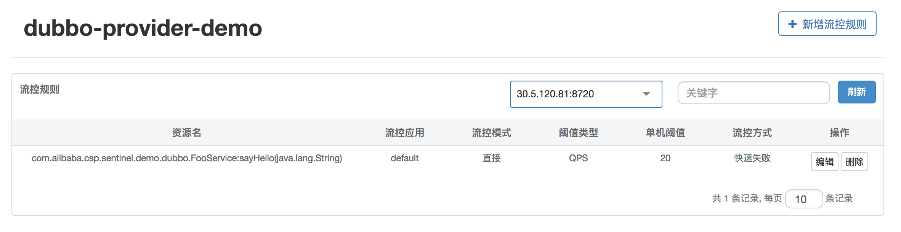

# Sentinel为Dubbo保驾护航

Sentinel是阿里中间件团队开源的，面向分布式服务架构的轻量级流量控制产品，主要以流量为切入点，从流量控制、熔断降级、系统负载保护等多个维度来帮助用户保护服务的稳定性。

## 快速接入Sentinel

Dubbo的核心模块包括注册中心、服务提供方、服务消费方（服务调用方）和监控四个模块。Sentinel通过对服务提供方和服务消费方的限流揽进一步提升服务的可用性。

sentinel提供了与Dubbo适配的模块——Sentinel Dubbo Adapter，包括针对服务提供方的过滤器和服务消费方的过滤器（Filter）

常用功能

* 单台设备监控：可以查看单台设备的设备名称、IP地址、端口号、健康状态和心跳时间等信息
* 链路监控：簇点链路实时的去拉取指定客户端资源的运行情况，它提供了两种展示模式，一种用熟装结构展示资源的调用链路，另外一种则不区分调用链路展示资源的运行情况。通过链路监控，可以看到每个资源的流控和降级的历史状态

## 限流必备—监控管理

**树状链路**

**平铺链路**

* 聚合监控：同一个服务下的所有机器的簇点信息会被汇总，实现实时监控，精度达秒级

* 规则配置：可以查看已有的限流、降级和系统保护规则，并实时地进行配置

