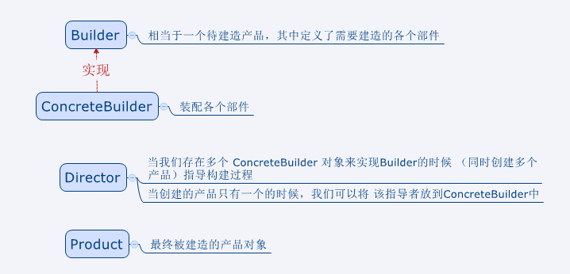
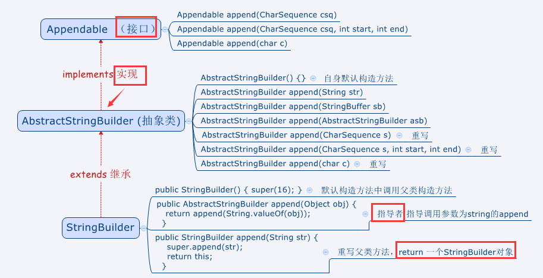

# 设计模式的类型

Design Pattern-Elements of Reusable Object-Oriented Software（设计模式-可复用的面向对象软件元素）中提到的，总共有23种设计模式。这些模式可以分为三大类：创建型模式（Creational Patterns）、结构型模式（Structural Patterns）、行为型模式（Behavioral Patterns）。

| 序号 | 模式&描述                                                    | 包括                                                         |
| ---- | ------------------------------------------------------------ | ------------------------------------------------------------ |
| 1    | **创建型模式**<br/>这些设计模式提供了一种在创建对象的同时隐藏创建逻辑的方式，而不是使用new运算符直接实例化对象。这使得程序在判断针对某个给定实例需要创建哪些对象时更加灵活 | 1.工厂模式（Factory Pattern）<br/>2.抽象工厂模式（Abstract Factory Pattern）<br/>3.单例模式（Singleton Pattern）<br/>4.建造者模式（Builder Pattern）<br/>5.原型模式（Prototype Pattern） |
| 2    | **结构型模式**<br>这些设计模式关注类和对象的组合。继承的概念被用来组合接口和定义组合对象获得新功能的方式 | 1.适配器模式(Adapter Pattern)<br/>2.桥接模式(Bridge Pattern)<br/>3.过滤器模式(Filter、Criteria Pattern)<br/>4.组合模式(Composite Pattern)<br/>5.装饰器模式（Decorator Pattern）<br/>6.外观模式(Facade Pattern)<br/>7.享元模式(Flyweight Pattern)<br/>8.代理模式(Proxy Pattern) |
| 3    | **行为型模式**<br/>这些设计模式特别关注对象之间的通信        | 1.责任链模式(Chain of Responsibility Pattern)<br/>2.命令模式（Command Pattern）<br/>3.解释器模式（Interpreter Pattern）<br/>4.迭代器模式（Iterator Pattern）<br/>5.中介者模式（Mediator Pattern）<br/>6.备忘录模式(Memento Pattern)<br/>7.观察者模式（Observer Pattern）<br/>8.状态模式（State Pattern）<br/>9.空对象模式(Null Object Pattern)<br/>10.策略模式（Strategy Pattern）<br/>11.模板模式（Strategy Pattern）<br/>12.访问者模式(Visitor Pattern) |
| 4    | **J2EE模式**<br/>这些设计模式特别关注表示层。这些模式是由Sun Java Center坚定的 | 1.MVC模式（MVC Pattern）<br/>2.业务代表模式（Business Delegate Pattern）<br/>3.组合实体模式（Composite Entity Pattern）<br/>4.数据访问对象模式(Data Access Object Pattern)<br/>5.前端控制器模式(Front Controller Pattern)<br/>6.拦截过滤器模式（Intercepting Filter Pattern）<br/>7.服务定位器模式（Service Locator Pattern）<br/>8.传输对象模式（Transfer Object Pattern） |

<font color="orange">5个创建型、8个结构型、12个行为型、8个J2EE模式</font>


# 设计模式六大原则（凯利一姐地和）

## 1.开闭原则（Open Close Principle）

开闭原则的意思是：对扩展开放，对修改关闭。在程序需要进行扩展的时候，不能去修改原有的代码，实现一个热插拔的效果。简言之，为了使程序的扩展性好，易于维护和升级。想要达到这样的想过，我们需要使用接口和抽象类，后面具体设计中我们会提到这点

## 2.里氏代换原则（Liskov Subsitution Principle）

里氏代还原则是面向对象设计的基本原则之一。里氏代还原则中说，任何基类可以出现的地方，子类一定可以出现。LSP是继承复用的基石，只有当派生类可以替换掉基类，且软件单位的功能不收影响时，基类才能真正被复用，而派生类也能够在基类的基础上增加新的行为。里氏代还原则是对开闭原则的补充，实现开闭原则的关键步骤就是抽象化，而基类域子类的继承关系就是抽象化的具体实现，所以里氏代还原则是对实现抽象化的具体步骤的规范

## 3.依赖倒转原则（Dependence Inversion Principle）

这个原则是开闭原则的基础，具体内容：针对接口编程，依赖于抽象而不依赖于具体

## 4.接口隔离原则（Interface Segregation Principle）

这个原则的意思是：使用多个隔离的接口，比使用单个接口要好。它还有另外一个意思是：降低类之间的耦合度。由此可见，其实设计模式就是从大型软件架构出发、便于升级和维护的软件思想，它强调降低以来，降低耦合

## 5.迪米特法则，又称最少知道原则（Demeter Principle）

最少知道原则是指：一个实体应当尽量少地域其他实体之间发生相互作用，使得系统功能模块相对独立

## 6.合成复用原则（Composite Reuse Principle）

合成复用原则是指：尽量使用合成/聚合的方式，而不是使用继承

# 创建型模式

## 1.工厂模式

工厂模式是Java中最常用的设计模式之一。这种类型的设计模式属于创建型模式，它提供了一种创建对象的最佳方式。在工厂模式中，我们在创建对象时不会对客户端暴露创建逻辑，并且是通过使用一个共同接口来指向新创建的对象

### 介绍

**意图**：定义一个创建对象的接口，让其子类自己决定实例化哪一个工厂类，工厂模式使其创建过程延迟到子类进行

**主要解决**：主要解决接口选择的问题

**何时使用**： 我们明确地计划不同条件下 创建不同实例


步骤1：创建一个接口

```java
public interface Shape {
	void draw();
}
```
步骤2：创建实现接口的实体类
```java
public class Rectangle implements Shape {
	@Override
    public void draw() {
    	System.out.println("Inside Square::draw() method。");
    }
}
```

```java
public class Square implements Shape {
	@Override
    public void draw() {
    	System.out.println("Inside Square::draw() method.")
    }
}
```

```java
public class Circle implements Shape {
	@Overdide
    public void draw() {
    	System.out.println("Inside Square::draw() method.");
    }
}
```

步骤3：创建一个工厂，生成基于给定信息的实体类的对象

```java
public class ShapeFactory {
	public Shape getShape(String shapeType) {
    	if(shapeType == null) {
        	return null;
        }
        if(shapeType.equalsIgnoreCase("CIRCLE")) {
        	return new Circle();
        } else if(shapeType.equalsIgnoreCase("RECTANGLE")) {
        	return new Rectangle();
        } else if(shapeType.equalsIgnoreCase("SQUARE")) {
        	return new Square();
        }
    }
}
```

步骤4：使用该工厂，通过传递类型信息来获取实体类的对象

```java
public class FactoryPatternDemo {
	public static void main() {
    	ShapeFactory shapeFactory = new ShapeFactory();
        Shape shape1 = shapeFactory.getShape("CIRCLE");
        
    }
}
```


## 2.抽象工厂模式

生产工厂的工厂

## 3.单例模式

懒汉式-线程不安全：

```java
public class Singleton {
	private static Singleton instance;
    private Singleton() {}
    public static Singleton getInstance() {
    	if(instance == null) {
        	instance = new Singleton();
        }
        return instance;
    }
}
```

懒汉式-线程安全

缺点：必须加锁synchronized才能保证单例，但加锁影响效率

```java
public class Singleton {
	private static Singleton instance;
    private Singleton() {}
    public static synchronized Singleton getInstance() {
    	if(instance == null) {
        	instance = new Singleton();
        }
        return instance;
    }
}
```

饿汉式

描述：该方法较常用，但容易产生系统垃圾

优点：没加锁，效率更高

缺点：类加载时就初始化，浪费内存

```java
public class Singleton {
	private static Singleton instance = new Singleton;
    private Singleton() {}
    public static Singleton getInstance() {
        return instance;
    }
}
```

双检锁/双重校验所DCL

描述：采用双锁机制，安全且多线程下保持高性能

```java
public class Singleton {
    private volatile static Singleton instance;
    private Singleton() {}
    public static Singleton getInstance() {
    	if(instance == null) {
        	synchronized (Singleton.class) {
            	if(synchronized == null) {
                	instance = new Singleton();
                }
            }
        }
        return singleton;
    }
}
```


## 4.建造者模式

描述：将一个复杂的构建与其表示相分离，使得同样的构建过程可以创建不同的表示

场景：StringBuilder.append;SQL.preparedStatement；JDOM的DomBuilder，SAXBuilder





## 5.原型模式

# 结构型模式

## 1.适配器模式

定义一个包装类，用于包装不兼容接口的对象

把一个接口变换成客户端所期待的另一种接口，从而使原本接口不匹配而无法一起工作的两个类能在一起工作


## 2.桥接模式

用于把抽象化与实现化解耦，使得二者可以独立变化。通过提供抽象化和实现化之间的桥接结构，实现二者的解耦


## 3.过滤器模式

## 4.组合模式

又叫部分整体模式，用于把一组相似的对象当做一个单一的对象。组合模式依照树形结构来组合对象，用来表示部分以及整体层次。

意图：将对象组合成树形结构以表示“部分-整体”的层次结构。组合模式使得用户对单个对象和组合对象的使用具有一致性

对象内包含一个自身类的列表

## 5.装饰器模式

允许向一个现有对象添加新功能，同时又不改变其结构。

这种模式创建了一个装饰类，用来包装原有的类，并且在保持类方法签名完整性的前提下，提供了额外的功能


## 6.外观模式

隐藏系统复杂性，向客户端提供一个客户端可以访问的系统接口。

电脑整机是CPU、内存、硬盘的外观。有了外观以后，启动电脑和关闭电脑都简化了

直接new一个电脑

在new电脑同时把CPU、内存、硬盘都初始化好并且接好线

对外暴露方法（启动电脑，关闭电脑）

启动电脑（按一下电源键）：启动CPU、启动内存、启动硬盘

关闭电脑（按一下电源键）：关闭硬盘、关闭内存、关闭CPU

## 7.享元模式

主要用于减少创建对象的数量，以减少内存占用和提高性能。

意图：运用共享技术有效地支持大量粒度的对象

主要解决：在有大量对象时，可能会造成内存溢出，把其中共同的部分抽象出来，如果有相同的业务需求，直接返回在内存中已有对象，避免重新创建

## 8.代理模式

# 行为型模式

## 1.责任链模式

## 2.命令模式

命令模式是一种数据驱动的设计模式，它属于行为型模式。请求以命令的形式包裹在对象中，并传给调用对象。调用对象寻找可以处理该命令的合适的对象，并把该命令传给相应的对象，该对象执行命令

## 3.解释器模式

解释器模式提供了评估语言的语法或表达式的方式，它属于行为型模式。这种模式实现了一个表达式接口。改接口解释一个特定的上下文，这种模式被用在SQL解析、符号处理引擎等。

### 介绍

**意图：**给定一个语言，定义它的文本表示，并定义一个解释器，这个解释清使用该标识来解释语言中的句子

### 实现

#### 步骤1

创建一个表达式接口

```java
public interface Expression {
	public boolean interpret(String context);
}
```

#### 步骤2

创建实现了上述接口的实体类

```java
public class TerminalExpression implemnts Expression {
	private String data;
    public TerminalExpression(String data) {
    	this.data = data;
    }
    @Override
    public boolean interpret(String context) {
        if(context.contains(data)) {
        	return true;
        }
        return false;
    }
}
```


## 4.迭代器模式

## 5.中介者模式

## 6.备忘录模式

## 7.观察者模式

## 8.状态模式

## 9.空对象模式

## 10.策略模式

## 11.模板模式

## 12.访问者模式

# J2EE模式

## 1.MVC模式

## 2.业务代表模式

## 3.组合实体模式

## 4.数据访问对象模式

## 5.前端控制器模式

## 6.拦截过滤器模式

## 7.服务定位模式

## 8.传输对象模式

1：创建型模式：弹弓原件（单例，工厂，原型，建造） 注：工厂模式有两种

2：结构型模式：外援组 佩戴桥石（外观，享元，组合，适配，代理，桥连，装饰）

3：行为型模式：爹责令房中介装备观测板（迭代，责任链，命令，访问者，中介者，解释器，状态，备忘录，观察者，策略，模板）